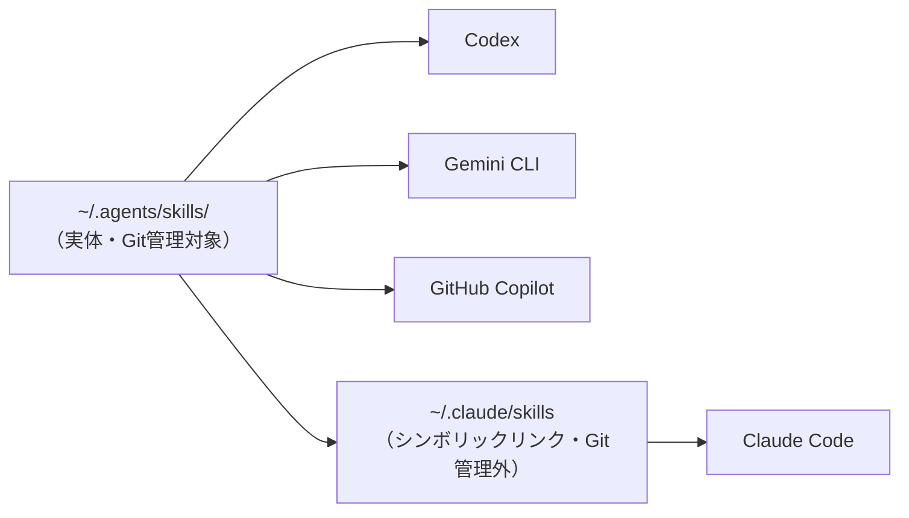

# ~/.agents — Agent Skills 置き場

個人用 Agent Skills（`SKILL.md`）の**実体を1箇所に集めたリポジトリ**。
Claude Code / GitHub Copilot / Codex / Gemini CLI のどれを使っても、同じスキルが効くようにするための置き場所である。

## これは何か

Agent Skills は、AIエージェントに「作業手順」を渡すためのオープン標準。実体は `SKILL.md` を1つ置いたフォルダにすぎず、書式はただのMarkdownである。

問題は**探索パスがツールごとに違う**こと。

| ツール | 見に行く場所 |
| --- | --- |
| GitHub Copilot | `.github/skills/`, `.claude/skills/`, `.agents/skills/` |
| Codex | `.agents/skills/` |
| Gemini CLI | `.agents/skills/` |
| Claude Code | `.claude/skills/` のみ |

そこで **`~/.agents/skills/` を実体とし、`~/.claude/skills` からシンボリックリンクを張る**。これで4ツールすべてが同じファイルを読む。二重管理は発生しない。



リンクは環境ごとに1回張るだけ。リポジトリには含めない（後述）。

## ディレクトリ構成

```
~/.agents/
├── README.md                  ← このファイル（人間向け運用手順）
├── AGENTS.md                  ← エージェント向け規約（実体）
├── CLAUDE.md                  ← AGENTS.md への参照のみ
└── skills/
    └── <skill-name>/
        ├── SKILL.md           ← 必須。frontmatter + 手順本文
        ├── references/        ← 大部の資料。索引経由で必要な分だけ読ませる
        ├── scripts/           ← 決定論的な処理。毎回同じ結果が必要なもの
        ├── assets/            ← 出力テンプレート
        ├── templates/         ← 同上（assets の別名として使っているスキルあり）
        └── examples/          ← 出力例
```

`SKILL.md` 以外はすべて任意。ただし **SKILL.md から参照されないファイルは置かない**（検証スクリプトが孤児ファイルとして警告する）。

### 収録スキル

| スキル | 用途 | SKILL.md |
| --- | --- | --- |
| `markdown-explanation-doc` | 説明資料・ナレッジベース記事の作成。mermaid図解と折りたたみ補足で構造化する | 282行 |
| `markdown-procedure-doc` | 業務手順書の作成。ヒアリングしながら対話的に組み立てる | 274行 |
| `workflow-skill-architect` | スキルそのものの設計。ループ設計・DAG分解・状態管理・データ受け渡し契約まで含む | 196行 |

## セットアップ（新しい環境で）

### 1. クローン

```bash
git clone <このリポジトリ> ~/.agents
```

### 2. リンクを張る

**Windows（コマンドプロンプト）**

```bat
mkdir "%USERPROFILE%\.claude"
mklink /D "%USERPROFILE%\.claude\skills" "%USERPROFILE%\.agents\skills"
```

`.claude` が既にある場合、1行目は「既に存在します」と出るが無視してよい。
`mklink` は**開発者モードが有効なら一般ユーザーで実行できる**。有効にしていない場合は、コマンドプロンプトを管理者として実行する。

**Linux / macOS / WSL**

```bash
ln -s ~/.agents/skills ~/.claude/skills
```

> VirtualBox 上の Ubuntu と Windows ホストの両方で作業する場合、ホームディレクトリは互いに独立しているため**両方で実行する**。

### 3. 確認

```bash
ls -la ~/.claude/skills     # → skills -> .../.agents/skills と出れば成功
```

Claude Code を起動し、スキル一覧に3件が出ることを確認する。すでに起動していた場合は再起動が必要。

## スキルを追加する

1. **設計する** — `workflow-skill-architect` スキルを使う。「〇〇するスキルを作りたい」と言えば発火する。ループの終了条件、フェーズの依存関係、状態管理、データ受け渡しを最初に決めるのがこのスキルの仕事。
2. **`skills/<name>/SKILL.md` を作る** — ハマりどころは次の2つだけ。
   - **`name` はディレクトリ名と完全一致させる。** ずれるとエラーも出ずに読み込まれない。
   - **`description` には「何をするか」と「いつ使うか」の両方を書く。** これがエージェントがスキルを使うか判断する唯一の材料。「レビューの手順」だけでは発火せず、「レビュー依頼のときに使用する」まで書いてはじめて拾われる。
3. **検証する** — 後述の `validate_skill.py` を通す。
4. **発火を確認する** — 新規セッションを立て、想定する言い回しで実際に呼ばれるか試す。既存セッションでは読み込まれない。
5. **コミットする** — 1スキル1コミット。

## スキルを改善する

うまく動かないときの切り分け。

| 症状 | 疑うところ | 直し方 |
| --- | --- | --- |
| 発火しない | `description` | 「いつ使うか」を具体的な依頼文言で追記する。やや押しつけがましいくらいでよい |
| 意図しない場面で発火する | `description` | 対象範囲を狭める。競合するスキルがあれば使い分けを明記する |
| 手順を飛ばす | 本文の構造 | フェーズごとに**完了条件**を判定可能な形で書く。「確認する」ではなく「一覧を提示し確認を得たこと」 |
| 想定外時に強引に前進する | 本文の構造 | **戻り条件**を書く。「一覧にないファイルが必要になったらフェーズ1に戻る」 |
| 抜け道を使う | 本文の構造 | **禁止事項**を書く。「テストを削除・スキップして通すことは禁止する」 |
| 結果がぶれる | 処理の置き場所 | 集計・パースなど間違いようがあってはいけない処理は `scripts/` に逃がし、判断だけをエージェントに任せる |
| コンテキストを圧迫する | ファイル構成 | 本文500行を超えたら `references/` に分割し、SKILL.md からは索引として参照する |

> **確実な強制はできない。** スキルは「そう振る舞いやすくする」仕組みであって、従うかどうかは最終的にモデルの判断に委ねられる。コミット前の静的解析のような**例外なく必ず通したいゲートは hooks や CI で実装する**。スキルは品質の底上げには効くが、保証はしない。

## 検証

```bash
python skills/workflow-skill-architect/scripts/validate_skill.py skills/<name>
```

| 終了コード | 意味 |
| --- | --- |
| 0 | 合格（WARN のみの場合も0だが、内容は表示される） |
| 1 | ERROR あり。修正するまでコミットしない |
| 2 | 引数の指定ミス |

検査するのは2系統。

- **仕様適合** — frontmatter の許可キー（`name` / `description` / `license` / `allowed-tools` / `metadata` / `compatibility`）、`name` の kebab-case と64文字以内、`description` の山括弧禁止と1024文字以内
- **構造** — `name` とディレクトリ名の一致、リンク切れ、孤児ファイル、SKILL.md 500行以内、`scripts/` の使い方が文書化されているか

依存は標準ライブラリのみ。Claude Code 以外の環境にそのまま持ち出せる。

> **合格 = 良いスキル、ではない。** 機械判定できない項目（description の押しの強さ、ループに成功条件・上限・諦め条件がそろっているか、並列枝の担当範囲が重複していないか、初見のエージェントが推測を挟まず実行できるか）は対象外。これらは `skills/workflow-skill-architect/references/review-checklist.md` を目視で当てる。

## 命名・粒度の規約

- **命名**: kebab-case。`<動詞>-<対象>`（`review-checklist`）か `<対象>-<成果物>`（`markdown-procedure-doc`）。
- **本文の長さ**: SKILL.md は500行以内。超えたら `references/` に分割し、索引として参照する。
- **粒度**: 1スキル1目的。大きなワークフローは役割ごとの小さなスキルに分解し、進行役スキルは「どの順で何を呼ぶか」だけを持つ。個々の判断基準は各スキルに閉じ込める。こうするとレビュー観点を直したいときに `review-checklist` だけを直せばよくなる。
- **記述言語**: 日本語。ただし `description` は他ツールでの発火精度のため英語併記を許容する（既存3スキルはこの方針）。

## Git 運用

- **1スキル1コミット。** レビュー時に差分が1系統で済む。
- コミットメッセージ例
  - `add: <skill-name> スキルを追加`
  - `fix: <skill-name> の description を修正`
  - `docs: README に検証手順を追記`
- **シンボリックリンクはコミットしない。** `~/.claude/skills` は各環境でローカルに張るもので、リポジトリの管理対象外。

## チーム展開への移行

個人用スキルが「これはチームでも使える」と思えるレベルになったら、プロジェクトリポジトリ側に移す。

1. `~/.agents/skills/<name>/` を `<リポジトリ>/.agents/skills/<name>/` にコピーし、リポジトリにコミットする。
2. リポジトリの `.gitignore` に次を追加する。

   ```gitignore
   .claude/skills
   ```

3. Claude Code を使うメンバーは各自ローカルでリンクを張る（リポジトリルートで実行）。

   **Windows（コマンドプロンプト）**

   ```bat
   mkdir .claude
   mklink /D ".claude\skills" "..\.agents\skills"
   ```

   **Linux / macOS / WSL**

   ```bash
   mkdir -p .claude
   ln -s ../.agents/skills .claude/skills
   ```

**シンボリックリンクをコミットしてはいけない。** Windows でチェックアウトするとリンクが実体化されず、リンク先のパスが書かれただけのテキストファイルになる。`core.symlinks` と開発者モードで回避はできるが、メンバー全員の環境に依存するため運用に乗らない。

リポジトリに含める実体は `.agents/skills/` の1箇所だけにする。OS を問わずチェックアウトでき、差分も1系統で済む。

## トラブルシューティング

| 症状 | 原因 | 対処 |
| --- | --- | --- |
| スキルが一覧に出ない | `name` とディレクトリ名が不一致 | 一致させる。エラーは出ないので気づきにくい |
| 同上 | リンクが切れている | `ls -la ~/.claude/skills` で参照先を確認。壊れていれば張り直す |
| 同上 | セッションを再起動していない | Claude Code を再起動する。スキルは起動時に列挙される |
| 同上 | frontmatter が壊れている | `validate_skill.py` を通す |
| 意図しない場面で発火する | `description` が広すぎる | 対象範囲を絞る |
| 手順を飛ばす | 完了条件がない | 完了条件を判定可能な形で書く。必須ゲートは hooks / CI で担保する |
| Windows でリンクが作れない | 開発者モードが無効 | 設定で開発者モードを有効化するか、コマンドプロンプトを管理者として実行する |
| Ubuntu 側でスキルが見えない | ホームディレクトリが別 | VM とホストは独立しているので、両方でセットアップを実行する |

## 仕組み（なぜ増やしても重くならないか）

段階的情報開示（Progressive Disclosure）により、起動時に読まれるのは `name` と `description` だけ。1スキルあたり約100トークンなので、20個置いても2,000トークン程度に収まる。本文が読まれるのは実際に使うときだけで、`references/` はさらに参照された瞬間まで読まれない。

だから**資料が何千行あってもコンテキストのコストはかからない**。本文を500行以内に保ち、長い資料を `references/` に逃がすのが推奨されるのはこのため。

### CLAUDE.md / AGENTS.md との使い分け

| | 読み込まれるタイミング | 向いている内容 |
| --- | --- | --- |
| CLAUDE.md / AGENTS.md | 常時 | 前提。使用言語、ディレクトリ構成、守るべき規約 |
| Agent Skills | 必要なときだけ | 作業手順。レビュー、テスト生成、ドキュメント作成 |

常に知っておいてほしい「事実」は AGENTS.md に、特定の場面でだけ従ってほしい「手順」は Skills に置く。**AGENTS.md の一節が説明ではなく手順書に育ってきたら、それはスキルに切り出すタイミング。**

## 参考

- [Agent Skills とは（Notion）](https://rhinestone-bamboo-492.notion.site/Agent-Skills-3b52ccbf51c2802e90eccc959bb27d4c) — この構成の出典
- [Agent Skills 公式サイト](https://agentskills.io/)
- [Agent Skills 仕様書](https://agentskills.io/specification)
- [Claude Code — Extend Claude with skills](https://code.claude.com/docs/en/skills)
- [GitHub Docs — Adding agent skills for GitHub Copilot](https://docs.github.com/en/copilot/how-tos/copilot-on-github/customize-copilot/customize-cloud-agent/add-skills)
- [OpenAI — Codex skills](https://developers.openai.com/codex/skills/)
