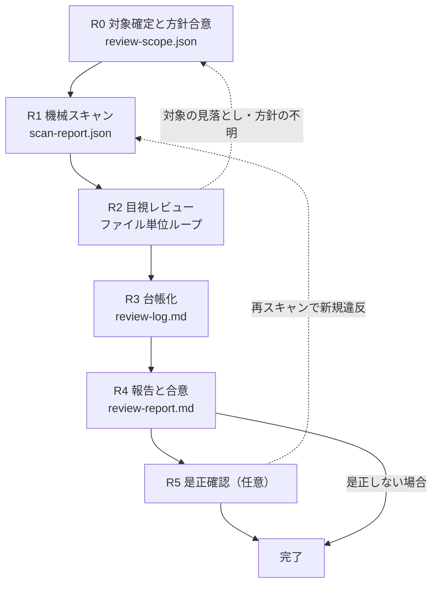

# 組込み C++14 コードレビュー

既存の C++ コードに対するレビューを、毎回同じ観点・同じ完了条件で当てるためのスキル。

設計上の勘所は4つ。(1) **機械で判定できるものはスキャナに逃がす** — C スタイルキャスト、ブレース省略、`switch` の `default` 欠落のような「見れば分かるのに見落とす」類が指摘の大半を占める。人間とエージェントは判断が要る観点に集中する。(2) **スキャナは候補しか出さない** — 正規表現に誤検知は必ずある。採否はレビュー工程で決め、**不採用も理由付きで残す**。黙って捨てると次回また同じ議論をする。(3) **差分の指摘と、周辺に元からある問題を分けて記録する** — 混ぜるとレビューが荒れて、直すべき差分の話が流れる。(4) **指摘を ID 付き台帳に載せ、全件クローズするまで完了としない** — 「確認しました」で終わったレビューは、していないのと同じ。

---

## ワークフロー



| # | フェーズ | 入力 | 出力 |
|---|---|---|---|
| 0 | 対象確定と方針合意 | git 差分の指定 or パス | `work/review-scope.json` |
| 1 | 機械スキャン | `work/review-scope.json` | `work/scan-report.json` |
| 2 | 目視レビュー | 対象ファイル + スキャン結果 | 観点別の所見（ファイル単位） |
| 3 | 台帳化 | R1・R2 の結果 | `work/review-log.md` |
| 4 | 報告と合意 | 台帳 | `work/review-report.md` |
| 5 | 是正確認（任意） | 修正後のコード | 更新された台帳 |

**R2 の単位はファイル**。対象が5ファイルを超える場合のみ `work/state.json` に進捗を持つ（「作業の再開」の節を参照）。5ファイル以下なら state は作らず一気に通す。

---

## 手順

### R0: 対象の確定とレビュー方針の合意

1. 作業開始時に `work/review-scope.json` の有無を確認する。存在する場合は「作業の再開」の節に従い、無い場合はこのまま続ける。
2. レビュー対象の指定方法を判別する。**指定が読み取れなければ推測せず尋ねる。**

   | 指定 | mode | 対象ファイルの取り方 |
   |---|---|---|
   | 「差分を見て」「このブランチを」「PRを」 | `diff` | `git diff --name-only <base>...HEAD` |
   | 「このファイルを」「このディレクトリを」 | `path` | 指定パスを再帰的に走査 |
   | 指定なし | — | 尋ねる。既定に倒さない |

   `diff` の場合、比較元（`<base>`）を確認する。既定は `main`。変更行の範囲は次で取り、`@@ -a,b +c,d @@` の `+c,d` を `[c, c+d-1]` に直して `changed_lines` に入れる。**これが無いと差分の指摘と差分外の指摘を分けられない。**

   ```
   git diff --unified=0 <base>...HEAD -- <file>
   ```
3. `assets/templates/review-scope.json.template` をコピーして `work/review-scope.json` を作り、対象ファイル一覧と**プロジェクト方針3点**を埋める。方針は設計や既存コードから読み取れなければユーザーに確認する。**推測で決めない。**
   - 例外を使ってよいか（`-fno-exceptions` か）
   - 動的メモリ確保を使ってよいか。使える場合、初期化後も可か
   - 仮想関数・RTTI を使ってよいか
4. 静的解析ツール（clang-tidy / PC-lint / Coverity）の有無と、実行済みログの場所を確認する。**無い場合は「ツールなし」と記録する。** 後の報告で伏せない。
5. 次をユーザーに提示し、**レビュー範囲の合意を得る**。
   - 対象ファイル一覧と件数、mode（`diff` の場合は比較元と変更行数）
   - プロジェクト方針3点
   - 静的解析ツールの有無

**完了条件**: `work/review-scope.json` が作られ、対象ファイルが1件以上あり、方針3点が `unknown` でなく、範囲の合意が取れていること。
**戻り条件**: 対象ファイルが0件、または C/C++ 以外しか含まれない場合は、対象の指定を求めて止まる。無理に近いファイルを拾わない。

### R1: 機械スキャン

1. `references/scan-rules.md` を読む。ルールIDと確度の意味、誤検知パターンがここにある。
2. スキャナを実行する。

   ```
   python scripts/scan_cpp_rules.py --scope work/review-scope.json -o work/scan-report.json
   ```

   パスを直接渡すこともできる（`--scope` を使わない場合、方針依存ルールは確度 `policy` として出る）。使い方と終了コードの詳細は `references/scan-rules.md` の「スクリプトの使い方」にある。
3. 静的解析ツールのログがあれば `--tidy-log <path>` で同じレポートに統合する。複数指定してよい。
4. 出力された件数（確度別）を確認する。**この時点では指摘を確定させない。** すべて候補である。

**完了条件**: `scan_cpp_rules.py` が終了コード 0 で終わり、`work/scan-report.json` が生成されていること。静的解析ツールがある場合は取り込み済み、無い場合は scope に「ツールなし」が記録されていること。
**戻り条件**: 終了コード 1（解析不能）の場合、対象の指定が誤っている可能性が高い。R0 に戻って対象を確認する。スキャンを飛ばして目視だけで進めることは禁止する。

### R2: 目視レビュー（ファイル単位ループ）

スキャナが拾えない観点を当てる工程。**ここがレビューの本体**であり、スキャン結果の確認だけで済ませてはならない。

1. `references/review-perspectives.md` と `references/autosar-cert-rules.md` を読む。
2. 対象ファイルごとに次を回す。

```
for ファイル in 対象ファイル一覧:
    ファイル全体を読む（diff モードでも、差分行の前後だけで判断しない）
    scan-report.json の当該ファイルの候補を確認し、confidence が medium / policy のものは採否を判定する
    references/review-perspectives.md の各観点を当て、
      「どこを見てそう判断したか」を1行で書ける状態にする
    所見を差分内 / 差分外に分けて控える
    state.json を使っている場合はここで done に更新する
```

3. 自己レビューではなく**他人の成果物として読む**。次の形で当てる。

   > **これは他人が書いたものである。** 観点表に照らして、**不合格な箇所を列挙する**。問題がないことを確認するのではなく、問題を探す。

   「特に問題ありません」で終わった観点は、当てていないのと同じ。全観点について、見た箇所を1行で言えること。

**完了条件**: 対象全ファイルについて、`references/review-perspectives.md` の全観点に対する所見（指摘 or 「見た結果問題なし + 根拠」）が控えられ、スキャン候補の `medium` / `policy` すべてに採否の判断が付いていること。
**戻り条件**: 判断にレビュー範囲外のファイル（呼び出し元、基底クラス、設計書）が必要になったら、R0 に戻って対象への追加をユーザーに確認する。**範囲外のファイルを勝手に読んで指摘の根拠にしない。**

### R3: 指摘の台帳化

1. `references/finding-writing.md` を読む。指摘の書き方と重大度の判定基準がここにある。
2. `assets/templates/review-log.md` をコピーして `work/review-log.md` を作る。
3. R1 の採用候補と R2 の所見を、1指摘1行で登録する。ID は `RV-<連番3桁>`。**一度振った ID は振り直さない。**
4. スキャン候補のうち**不採用にしたもの**も登録する。状態 `rejected`、対応/理由に**なぜ違反でないか**を書く。空欄にしない。
5. 差分外の問題は `区分` 列を `差分外` にする。差分の指摘と混ぜない。
6. 指摘が0件だった観点も、当てた事実を1行残す（`RV-000 / — / 全体 / 指摘なし / — / fixed / review-perspectives.md を全観点適用`）。

**完了条件**: R1 の全候補と R2 の全所見が台帳に登録され、`rejected` に理由が入っていること。
**戻り条件**: 「わかりにくい」「良くない」としか書けない所見が残っていたら R2 に戻る。基準と根拠を示せない指摘は登録しない。

### R4: 報告と合意

1. `assets/templates/review-report.md` をコピーして `work/review-report.md` を作り、集計と所見を埋める。
2. 台帳の未クローズを機械判定する。

   ```
   python scripts/check_review_log.py work/review-log.md
   ```

3. ユーザーに次を提示する。**都合の悪い項目を省かない。**
   - 対象ファイル数、レビューした行数、mode と比較元
   - 指摘の重大度別・区分別の集計
   - **重大度「高」の指摘は全件を個別に列挙する**
   - スキャン候補の採用 / 不採用の件数と、不採用の代表理由
   - 静的解析ツールの結果（実施した場合）。していない場合は「ツールなし」と明記
   - 当てられなかった観点と、その理由（範囲外のファイルが必要だった 等）
4. 逸脱承認（`accepted`）の判断を仰ぐ。**自分で承認しない。** 重大度「高」を `accepted` にする場合は、その場で個別に提示して了承を得る。

**完了条件**: `check_review_log.py` が終了コード 0（`open` が残っていない）で、報告をユーザーに提示し確認を得ていること。
**戻り条件**: `open` が残っている状態で完了として報告することは禁止する。残っている場合は残課題として明示する。

### R5: 是正確認（任意）

修正が行われた場合のみ実施する。

1. 修正後のコードに対して R1 のスキャンを再実行する。
2. 対象の指摘が解消されているかを台帳上で確認し、状態を `fixed` に更新する。
3. **再スキャンで新規の違反が出ていないか**を確認する。出ていれば新規 ID を振って登録し、R3 に戻る。

**完了条件**: 対象指摘が全件 `fixed` または `accepted` で、再スキャンで新規の `high` 候補が0件であること。
**戻り条件**: 修正によって新規違反が増え続ける（2周連続で新規 `high` が出る）場合は、修正を続けずに止まり、方針をユーザーに相談する。

---

## 作業の再開

進捗は `work/review-scope.json` の `files[].status`（`pending` / `running` / `done`）に持つ。**state 専用のファイルを増やさない。** 対象が5ファイル以下なら `status` 自体を省略してよい。

作業開始時に `work/review-scope.json` が既に存在した場合:

1. 対象ファイル一覧と更新時刻をユーザーに提示し、続きから再開してよいか確認する
2. `done` のファイルは再レビューしない。ただし**控えた所見が `work/review-log.md` に実在するか**を確認する。無ければ `pending` に戻す
3. `running` のまま残っているファイルは中断されたものとみなし、`pending` に戻して再実行する
4. `work/scan-report.json` が無い、または対象ファイルの更新時刻より古い場合は R1 から再実行する
5. R0 で確定したはずの `policy` に `unknown` が残っていたら R0 からやり直す

`status` の更新は、R2 のループでファイルに着手した時点で `running`、所見を控え終えた時点で `done` にする。**まとめて最後に書かない。** 途中で中断されたときに何も残らない。

---

## 禁止事項

- **スキャンを飛ばして目視だけで進めること。** 見落としの多い項目こそ機械に当てる。
- **スキャン結果の確認だけでレビューを終えること。** スキャナは規約の表層しか見ない。
- **スキャン候補を理由なく捨てること。** 不採用は `rejected` + 理由で台帳に残す。
- **自分で逸脱を承認すること。** `accepted` はユーザーの了承を得たときだけ。
- **レビュー範囲外のファイルを勝手に読んで指摘の根拠にすること。** 範囲の追加は R0 に戻って合意する。
- **指摘のついでにコードを直すこと。** このスキルはレビューであって修正ではない。修正は R5 で、ユーザーの依頼を受けてから行う。
- **`open` の指摘を残したまま完了として報告すること。**

---

## 参照ファイル

必要になったときに読む。全部読む必要はない。

| ファイル | 読むタイミング |
|---|---|
| `references/scan-rules.md` | R1 の直前（毎回）。ルールIDと確度、誤検知パターン、スクリプトの使い方 |
| `references/autosar-cert-rules.md` | R2 の直前（毎回）。規約観点を「見る側」の視点で整理したもの |
| `references/review-perspectives.md` | R2 の直前（毎回）。機械で拾えない観点の本体 |
| `references/finding-writing.md` | R3 の直前（毎回）。指摘の書き方と重大度の判定基準 |

出力の実例は `examples/example-review-report.md` にある。R4 で報告の粒度に迷ったら見る。

## スクリプト

| スクリプト | 使うフェーズ |
|---|---|
| `scripts/scan_cpp_rules.py` | R1・R5。規約違反候補の静的スキャンと外部ツール出力の統合 |
| `scripts/check_review_log.py` | R4。台帳に `open` が残っていないかの判定と集計 |

引数・終了コード・出力形式は `references/scan-rules.md` の「スクリプトの使い方」にまとめてある。

## テンプレート

| ファイル | 使うフェーズ |
|---|---|
| `assets/templates/review-scope.json.template` | R0。対象と方針の確定形式。state としても使う |
| `assets/templates/review-log.md` | R3。指摘台帳 |
| `assets/templates/review-report.md` | R4。報告書 |
