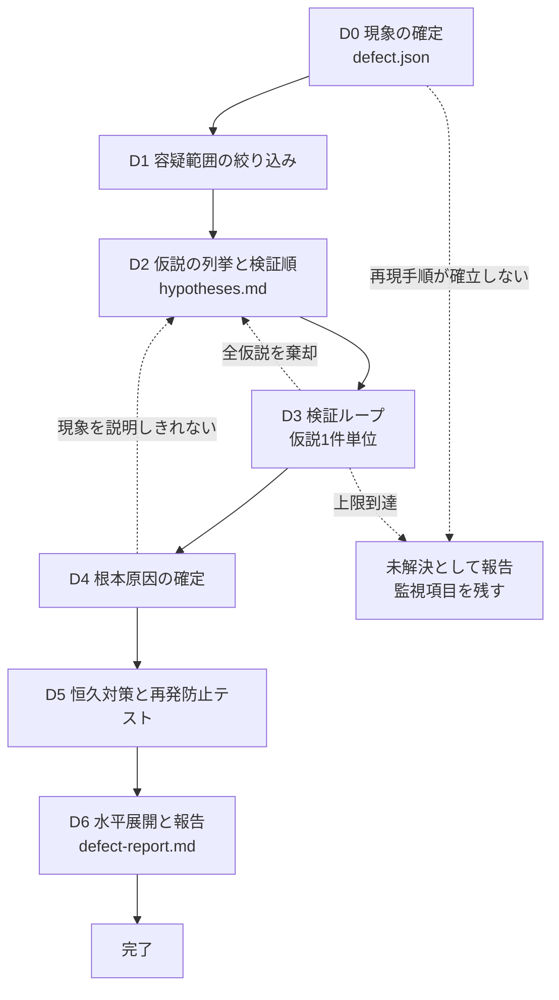

# 組込み C++14 不具合原因解析

動いているはずのコードが期待どおり動かないときに、**当て推量で直し始めないための**工程スキル。

設計上の勘所は4つ。(1) **再現できない不具合は解析できない** — 再現手順の確立を D0 のゲートに置く。ここを飛ばすと以降の全工程が「たぶん直った」で終わる。ただし再現しないまま終える分岐も用意し、無限に粘らせない。(2) **仮説は確度と切り分けコストで並べてから潰す** — 思いついた順に検証すると、高コストな仮説から始めて時間を溶かす。(3) **「直ったから原因だった」を根本原因の証明として認めない** — 組込みでは、コードを触ってタイミングが変わっただけで症状が引っ込むことが日常的に起きる。特定した原因が**観測された現象を全て説明できるか**を完了条件にする。(4) **水平展開まで含めて完了とする** — 未初期化にせよ割込み競合にせよ、1箇所で起きた原因パターンは他所にもある。1件直して終わらせない。

---

## ワークフロー



| # | フェーズ | 入力 | 出力 |
|---|---|---|---|
| 0 | 現象の確定 | 不具合報告・ログ・実機 | `work/defect.json` |
| 1 | 容疑範囲の絞り込み | D0 + git 履歴 | `work/defect.json` 更新 |
| 2 | 仮説の列挙と検証順の決定 | D0・D1 | `work/hypotheses.md` |
| 3 | 検証ループ（仮説1件単位） | 仮説台帳 | 台帳更新（採否と根拠） |
| 4 | 根本原因の確定 | 台帳 | `work/defect.json` 更新 |
| 5 | 恒久対策と再発防止テスト | D4 | 修正コード + 追加テスト |
| 6 | 水平展開と報告 | D4・D5 | `work/defect-report.md` |

**D3 の単位は仮説1件**。進捗は `work/hypotheses.md` の状態列と `work/defect.json` の `phase` に持つ（「作業の再開」の節を参照）。

---

## 手順

### D0: 現象の確定

**このフェーズのゲートを通すまで、コードを直し始めてはならない。**

1. 作業開始時に `work/defect.json` の有無を確認する。存在する場合は「作業の再開」の節に従い、無い場合はこのまま続ける。
2. `assets/templates/defect.json.template` をコピーして `work/defect.json` を作る。
3. 次を埋める。**読み取れない項目を推測で埋めない。** 分からないものは `unknown` のまま残し、ユーザーに尋ねる。

   | 項目 | 中身 | 埋まらないと何が困るか |
   |---|---|---|
   | `symptom.expected` / `symptom.actual` | 期待動作と実動作を**観測可能な形で**書く | 「おかしい」では検証の合否が判定できない |
   | `symptom.frequency` | 常時 / 間欠（発生率）/ 特定条件下のみ | 間欠なら検証1回のパスを成功とみなせない |
   | `symptom.first_observed` | いつから出ているか。前は出ていなかったか | D1 で差分と照合できるかが決まる |
   | `environment` | ターゲット・ツールチェーンとバージョン・最適化レベル・ビルド構成・RTOS | 最適化レベル差やビルド構成差は組込みの主要因のひとつ |
   | `repro.steps` | 手順を上から順に。他人が同じ結果を出せる粒度 | これが無いと修正の効果を確認できない |

4. 再現を実際に試み、結果を `repro.confirmed_at` と `symptom.reproducible`（`yes` / `intermittent` / `no` / `unknown`）に記録する。**「報告どおりのはず」で埋めない。** 自分の手で観測していないなら `unknown`。
5. 可能なら**最小再現ケース**を作り、`repro.minimal_case` に書く。範囲が狭いほど D3 が速くなる。手法は `references/isolation-techniques.md`。
6. 現象・環境・再現手順をユーザーに提示し、**認識が合っているか確認を得る**。

**完了条件**: `work/defect.json` の `symptom` と `environment` に `unknown` が残っておらず、`symptom.reproducible` が `yes` または `intermittent` で、`repro.steps` が1件以上あり、ユーザーの確認を得ていること。

**戻り条件（未解決分岐）**: 再現の試行を**3通り**（報告どおりの手順・環境を報告に合わせた手順・条件を振った手順）行っても `reproducible` が `no` のままなら、**そこで止まる**。D2 以降へ進まない。次をまとめて報告し、監視項目（追加すべきログ・アサート・トレース点）を提案して終える。無限に粘らない。

- 試した再現手順と、それぞれの結果
- 報告された環境と手元の環境の差分
- 「再現しないので原因未特定」であることの明示

### D1: 容疑範囲の絞り込み

現象が「前は出ていなかった」なら、**原因はほぼ確実に差分の中にある**。ここを飛ばしてコードを読み始めない。

1. `symptom.first_observed` から遡り、その間に入った変更を洗う。

   ```
   git log --oneline --since=<日付> -- <疑わしいパス>
   ```

2. 変更の対象を**コードに限定しない**。次も差分として扱う。
   - ビルド設定（最適化レベル、`-D` マクロ、リンカスクリプト、セクション配置）
   - ツールチェーンのバージョン
   - 外部ライブラリ・ベンダ提供ドライバ・BSP
   - ハードウェア（ボードリビジョン、実装部品、配線）
3. 再現手順が自動で回せるなら `git bisect` を使う。手順は `references/isolation-techniques.md` の「二分探索で差分を絞る」にある。**間欠不具合には bisect を使わない**（1回のテストで判定できないため誤った結論に着地する）。
4. 絞り込んだ結果を `work/defect.json` の `suspect_range` に書く。`method`（`bisect` / `log` / `code-reading` / `none`）、該当コミット、ファイル一覧を残す。

**完了条件**: `suspect_range.method` が埋まり、容疑範囲がファイル単位以下に絞られているか、絞れなかった事実（`method` が `none` + 理由）が記録されていること。

**戻り条件**: `first_observed` が「最初から」または不明で差分と照合できない場合、絞り込みは行わず `method` を `none` として D2 へ進む。**存在しない差分を探して時間を使わない。**

### D2: 仮説の列挙と検証順の決定

1. `references/defect-patterns.md` を読む。組込み特有の原因パターンがここにある。**「よくある原因」を先に見てから仮説を立てる**ほうが、コードを眺めて思いつくより網羅性が高い。
2. `assets/templates/hypotheses.md` をコピーして `work/hypotheses.md` を作る。
3. 仮説を登録する。ID は `HY-<連番3桁>`。**一度振った ID は振り直さない。**
4. 各仮説に **確度**（`高` / `中` / `低`）と **切り分けコスト**（`低` / `中` / `高`）を付ける。判断材料は次。

   | | 確度を上げる材料 | 切り分けコストを下げる材料 |
   |---|---|---|
   | 1 | 症状のパターンがそのパターンの典型と一致する | 単体テストで再現できる |
   | 2 | 容疑範囲の差分に該当する変更がある | ログを1行足せば判定できる |
   | 3 | 発生条件（最適化レベル、割込み負荷、経過時間）が一致する | 実機を止めずに観測できる |

5. **検証順を決める。** 並べ替えの規則は「確度が高く、切り分けコストが低いものから」。同順位は切り分けコストが低いほうを先にする。**思いついた順のまま検証しない。**
6. 仮説が3件未満なら、`references/defect-patterns.md` の各パターンを機械的に当てて追加する。1〜2件しか出ていない状態で D3 に進むと、その仮説に合う証拠だけを集めることになる。

**完了条件**: `work/hypotheses.md` に仮説が3件以上登録され、全件に確度・切り分けコスト・検証順が付いていること。

**戻り条件**: 仮説を立てるのに現象の情報が足りない（どのタスクから呼ばれているか不明、ログが足りない）と分かったら D0 に戻り、観測を追加してから再開する。**情報が足りないまま推測で仮説を増やさない。**

### D3: 検証ループ（仮説1件単位）

```
for 周回 in 1..8:
    未検証（open）の仮説のうち検証順が最小のものを1件取る
    references/isolation-techniques.md から検証方法を決め、
      台帳の「検証方法」に先に書く（何を観測すれば白黒つくかを決めてから手を動かす）
    検証を実行し、観測結果をそのまま台帳の「検証結果」に書く
    if 仮説が支持された:
        状態を confirmed にして D4 へ抜ける（成功として終了）
    状態を rejected にし、棄却の根拠を「検証結果」に残す
    if 棄却の過程で新しい事実が出た:
        D2 に戻って仮説を追加し、検証順を引き直す
    if 直近2周の検証で新しい事実が1つも得られていない:
        同じ観測手段を続けない。手段を変える（ログ から デバッガ、実機 から 単体テスト）か、
        ここまでの観測事実をまとめてユーザーに相談する
else:
    8件検証しても confirmed が出ない → 未解決として報告する。勝手に続行しない
```

- **検証方法を先に書く。** 「見てみる」は検証ではない。何をどこで観測して、どうなれば支持・どうなれば棄却かを、実行前に台帳に書く。
- **棄却した仮説を台帳から消さない。** 消すと次回また同じ仮説を検証する。
- **1周で仮説を2件まとめて検証しない。** 同時に2つ変えると、どちらが効いたか分からなくなる。
- 検証のために**一時的にコードへ手を入れた場合は、その場で戻す**。デバッグ用の変更を残したまま次に進まない。

**完了条件**: `confirmed` の仮説が1件以上あり、全仮説の状態が `confirmed` / `rejected` / `deferred` のいずれかで、`rejected` と `deferred` に理由が入っていること。

**戻り条件（未解決分岐）**: 上限8件に達した、または手段を変えても新しい事実が得られない場合は止まる。**達成したかのように報告しない。** 検証した仮説一覧、観測できた事実、次に試すべきことをまとめて報告する。

### D4: 根本原因の確定

**「修正したら直った」を根本原因の証明として扱ってはならない。**

1. `confirmed` の仮説を `work/defect.json` の `root_cause.summary` に、**なぜその挙動になるのかの因果**まで含めて書く。「〜が原因」ではなく「〜が〜のとき〜になるため、〜という現象が出る」の形。
2. 自己検査を当てる。**他人が書いた解析報告として読み、次の各項に反証を試みる。**

   | 検査 | 不合格なら |
   |---|---|
   | 観測された現象を**全て**説明できるか。説明できない観測が1つでも残っていないか | D2 に戻る。複合要因の可能性がある |
   | 発生頻度を説明できるか。「常時なのに条件付きの原因」「間欠なのに常時成立する原因」になっていないか | D2 に戻る |
   | なぜ**今まで出ていなかった**のかを説明できるか（D1 で差分が特定できている場合） | 差分と原因の関係を再確認する |
   | 環境依存（最適化レベル・ボード個体・温度）を説明できるか | 原因が別にある可能性を疑う |

3. 全項を満たしたら `root_cause.status` を `confirmed`、`root_cause.explains_all_symptoms` を `true` にし、根拠（観測ログ、逆アセンブル、テスト結果）を `root_cause.evidence` に列挙する。

**完了条件**: `root_cause.status` が `confirmed` で `explains_all_symptoms` が `true`、`evidence` が1件以上あること。

**戻り条件**: 説明できない観測が残っている場合は D2 に戻る。**「主要因はこれで、残りは別件」と切り分けて先へ進めるのは、残りを別の不具合として起票したときだけ。** 黙って落とさない。

### D5: 恒久対策と再発防止テスト

1. **テストを先に書く。** 修正前のコードに対して**失敗する**テストを追加し、RED を実際に確認する。ここで落ちなければ、そのテストは原因を捉えていない。テストを書き直す。
2. RED を確認したら `work/defect.json` の `fix.red_confirmed` を `true` にし、テストのパスを `fix.test_added` に記録する。
3. 修正を入れ、テストが GREEN になることと、**既存テストが壊れていない**ことを確認する。
4. 対症療法を恒久対策として扱わない。次は**すべて暫定処置**であり、入れる場合は暫定であることと根本原因の状態を明示する。
   - ディレイやリトライの追加で症状が出にくくなっただけのもの
   - 根拠なしの `volatile` 付与
   - 最適化レベルの引き下げ
   - 例外的な値の握りつぶし

**完了条件**: `fix.red_confirmed` が `true`、追加テストが GREEN、既存テストが全パスしていること。

**戻り条件**: 修正前にテストが落ちない場合は D4 に戻る。原因の理解が誤っている。

### D6: 水平展開と報告

**ここを省略して完了としてはならない。** 1箇所で起きた原因パターンは他所にもある。

1. `references/defect-patterns.md` で、確定した原因に対応するパターンの **grep パターン**を確認する。
2. リポジトリ全体に当てて候補を洗う。ヒットは候補であって違反ではない。1件ずつ該当するか判断する。
3. 結果を `work/defect.json` の `horizontal` に記録する。使ったパターン、ヒット件数、該当と判断した箇所を残す。**ヒット0件だった場合も「0件だった」と記録する。** 空欄と区別がつかなくなる。
4. 該当箇所が見つかったら、**別の不具合として起票する**。このスキルの対象は1件の不具合なので、ここで一緒に直し始めない。
5. `work/hypotheses.md` に未クローズが残っていないかを機械判定する。

   ```
   python scripts/check_defect_log.py work/hypotheses.md
   ```

   未解決として終える場合は `--unresolved` を付ける。
6. `assets/templates/defect-report.md` をコピーして `work/defect-report.md` を作り、ユーザーに提示する。**都合の悪い項目を省かない。**
   - 現象と再現条件、確定した根本原因とその因果
   - 検証した仮説の件数と、棄却したものの代表理由
   - 恒久対策と追加したテスト（RED 確認の有無）
   - **水平展開の結果**。ヒット0件ならその旨
   - 説明できずに残った観測、暫定処置として入れたもの、別途起票した件

**完了条件**: `check_defect_log.py` が終了コード 0 で終わり、`horizontal.done` が `true`、報告をユーザーに提示して確認を得ていること。

**戻り条件**: `open` の仮説を残したまま完了として報告することは禁止する。残る場合は残課題として明示する。

---

## 作業の再開

進捗は `work/defect.json` の `phase`（`D0` から `D6`）と `work/hypotheses.md` の状態列に持つ。**state 専用のファイルを増やさない。**

作業開始時に `work/defect.json` が既に存在した場合:

1. 現象・`phase`・更新時刻をユーザーに提示し、続きから再開してよいか確認する
2. `phase` が `D3` 以降なのに `work/hypotheses.md` が無ければ `D2` に戻す
3. `symptom` または `environment` に `unknown` が残っていたら `D0` に戻す。ここが埋まっていない状態で先へ進んだ形跡なので、そのまま続けない
4. `hypotheses.md` の状態が `running`（検証途中）のまま残っている仮説は中断されたものとみなし、`open` に戻して検証し直す。**途中の観測結果を根拠に採否を決めない**
5. D3 の周回数は `rejected` と `confirmed` の合計件数で数える。**再開時にリセットしない**
6. デバッグ用にコードへ手を入れたまま中断された可能性がある。`git status` を確認し、意図しない変更が残っていればユーザーに提示する

`phase` の更新は各フェーズの完了条件を満たした時点で行う。**まとめて最後に書かない。**

---

## 途中経過の報告

黙って最後まで走らない。逆に、1周ごとに実況もしない。次の粒度で報告する。

| 報告する | しない |
|---|---|
| D0 の完了時（現象・環境・再現手順の確認を得る） | 仮説1件ごとの成功報告 |
| D2 の完了時（仮説一覧と検証順を提示する） | ログを1行足した、ビルドし直した等の実況 |
| D3 で `confirmed` が出た時点 | |
| **検証のためにコードへ手を入れるとき**（実行前に断る） | |
| **方針を変えるとき**（観測手段の変更、D2 への差し戻し） | |
| 未解決分岐に入ると判断した時点 | |

失敗と方針変更は**即時に**報告する。まとめて最後に出さない。

---

## 禁止事項

- **再現手順が確立していないまま D2 以降へ進むこと。** 再現できないなら未解決として報告する。
- **「修正したら直った」を根本原因の証明として扱うこと。** D4 の自己検査を通すこと。
- **棄却した仮説を台帳から消すこと。** 理由付きで残す。
- **1周で複数の仮説を同時に検証すること。** どちらが効いたか分からなくなる。
- **RED を確認せずに修正を入れること。** 落ちないテストは原因を捉えていない。
- **対症療法を恒久対策として報告すること。** 暫定処置なら暫定と明示し、根本原因が未確定であることを併記する。
- **D6 の水平展開を省略して完了とすること。** ヒット0件でも記録を残す。
- **`open` の仮説を残したまま完了として報告すること。**
- **解析のついでに関係のないコードを直すこと。** このスキルは原因究明と当該不具合の是正であって、リファクタリングではない。
- **デバッグ用に入れた一時的な変更を残したまま次のフェーズへ進むこと。**

---

## 参照ファイル

必要になったときに読む。全部読む必要はない。

| ファイル | 読むタイミング |
|---|---|
| `references/defect-patterns.md` | D2 の直前（毎回）。組込み特有の原因パターンと、D6 の水平展開に使う grep パターン |
| `references/isolation-techniques.md` | D0 の最小再現、D1 の二分探索、D3 の検証方法を決めるとき |

## スクリプト

| スクリプト | 使うフェーズ |
|---|---|
| `scripts/check_defect_log.py` | D6。仮説台帳に未クローズが残っていないかの判定と集計 |

```
python scripts/check_defect_log.py work/hypotheses.md [--unresolved]
```

`--unresolved` は、根本原因を特定できずに終える場合に付ける。`confirmed` 0件を ERROR ではなく WARN に落とす。**未解決であることを報告に明記した場合にだけ使う。** 終了コードは 0（合格）/ 1（ERROR あり）/ 2（引数の指定ミス）。依存は標準ライブラリのみ。

## テンプレート

| ファイル | 使うフェーズ |
|---|---|
| `assets/templates/defect.json.template` | D0。現象・環境・再現手順の記録形式。state としても使う |
| `assets/templates/hypotheses.md` | D2。仮説台帳 |
| `assets/templates/defect-report.md` | D6。報告書 |
