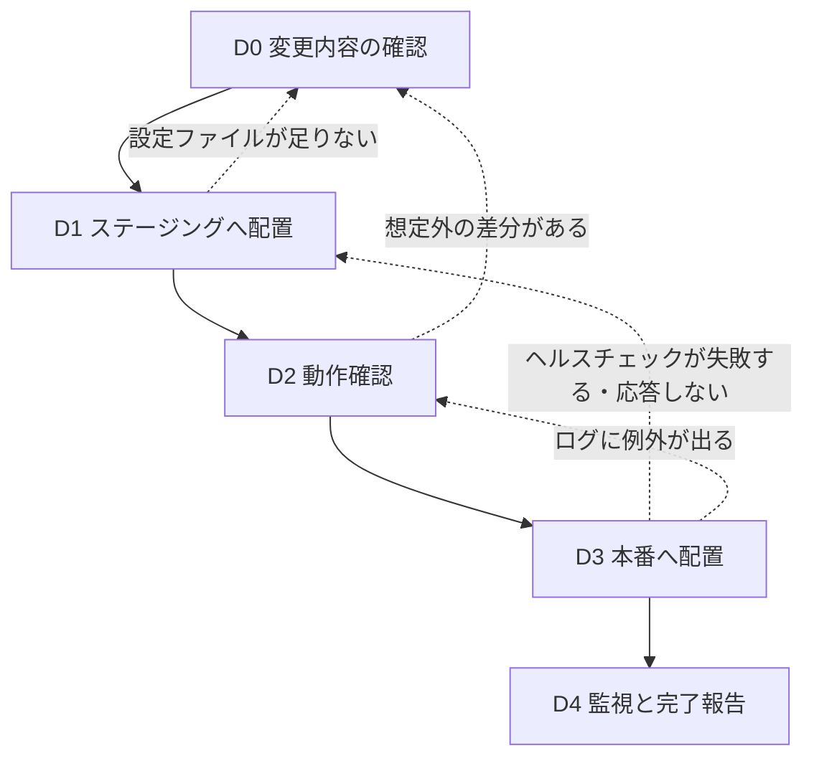

## 全体の流れ

```mermaid
flowchart TD
    D0["D0 変更内容の確認"] --> D1["D1 ステージングへ配置"]
    D1 --> D2["D2 動作確認"]
    D2 --> D3["D3 本番へ配置"]
    D3 --> D4["D4 監視と完了報告"]
    D1 -.設定ファイルが足りない.-> D0
    D3 -.ヘルスチェックが失敗する・応答しない.-> D1
    D2 -.想定外の差分がある.-> D0
    D3 -.ログに例外が出る.-> D2
```

配置は D0 から D4 の順に進め、失敗したら点線の矢印の先に戻る。
