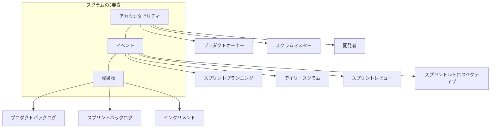
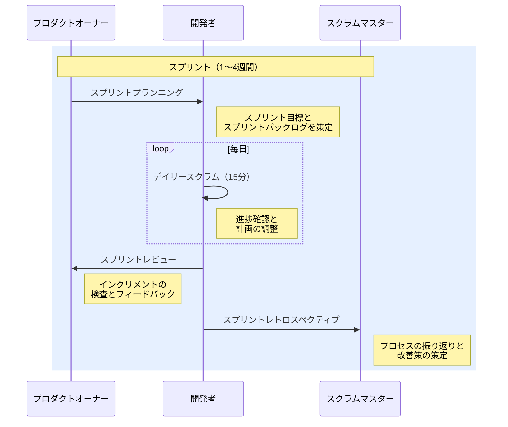

# はじめに

本資料は、スクラム開発の基本的な概念と進め方について整理したものである。チームでスクラムを導入するにあたり、関係者全員が共通認識を持つことを目的とする。

**対象読者**：入門者。アジャイル開発の経験がなく、これから初めてスクラムに参加するチームメンバーを想定する。

スクラムはアジャイル開発手法の一つであり、短い反復サイクルを通じて段階的に成果物を構築する枠組みである。本資料ではスクラムを構成するアカウンタビリティ・イベント・成果物の3つの柱を中心に解説する。

# インプット資料

| 資料名 | 種別 | URL / パス | 備考 |
|---|---|---|---|
| スクラムガイド2020 | 公式ドキュメント | https://scrumguides.org/scrum-guide.html | 2020年11月版 |

# 概要

スクラムは「アカウンタビリティ（責任）」「イベント」「成果物」の3つの要素で構成されるフレームワークである。チームはスプリントと呼ばれる固定期間の反復サイクルを繰り返し、各スプリントの終わりに動作する成果物のインクリメントを生み出す。

上図はスクラムを構成する3つの要素と、それぞれの具体的な構成を示している。これらが有機的に連携することでスクラムのフレームワークが機能する。

# 詳細説明

## アカウンタビリティ

スクラムチームは、プロダクトオーナー、スクラムマスター、開発者の3つのアカウンタビリティ（責任）で構成される。スクラムガイド2020では、それ以前の版で用いられていた「役割（role）」という語と「開発チーム」という単位が廃され、チーム内にサブチームや階層を持たない1つのスクラムチームとして再定義された。それぞれが明確な責務を担い、チーム全体として自己管理的に活動する。

プロダクトオーナーはプロダクトの価値を最大化する責任を持つ。プロダクトバックログの管理と優先順位付けが主な責務である。スクラムマスターはスクラムの理論と実践の促進に責任を持ち、チームや組織がスクラムを正しく理解・実行できるよう支援する。開発者はスプリントごとに利用可能なインクリメントを作成する専門家集団である。

補足：プロダクトオーナーとプロジェクトマネージャーの違い

プロダクトオーナーは「何を作るか（What）」に責任を持ち、プロジェクトマネージャーは「どう進めるか（How）」に責任を持つ点が大きな違いである。スクラムにはプロジェクトマネージャーという役割は定義されておらず、進め方の管理はチーム全体の自己管理に委ねられている。

## イベント

スクラムのイベントはすべてスプリントの中で実施される。各イベントには明確な目的とタイムボックス（制限時間）が設定されている。

上図はスプリント内で行われるイベントの流れを示している。プランニングで計画を立て、デイリースクラムで日々調整し、レビューで成果を検査し、レトロスペクティブでプロセスを改善するというサイクルを繰り返す。

補足：タイムボックスの目安

各イベントのタイムボックスは、1か月スプリントの場合の上限値として以下のように定められている。スプリント期間が短い場合はこれよりも短くなるのが一般的である。

- スプリントプランニング：8時間
- デイリースクラム：15分
- スプリントレビュー：4時間
- スプリントレトロスペクティブ：3時間

## 成果物

スクラムの成果物は3つ存在し、それぞれが「確約（コミットメント）」と紐づいている。

プロダクトバックログはプロダクトの改善に必要な項目の順序付きリストであり、プロダクトゴールを確約として持つ。スプリントバックログはスプリント内で取り組む項目の計画であり、スプリントゴールが確約となる。インクリメントはスプリントの成果として生み出される動作する成果物であり、完成の定義（Definition of Done）が確約として機能する。

補足：完成の定義（Definition of Done）とは

完成の定義とは、インクリメントが「完成した」と見なすための品質基準を明文化したものである。例えば「コードレビュー済み」「ユニットテスト通過」「ドキュメント更新済み」といった条件を定める。チーム全体で合意し、すべてのインクリメントに一貫して適用する必要がある。

# まとめ

スクラムはアカウンタビリティ・イベント・成果物の3要素で構成されるシンプルなフレームワークである。スプリントという固定サイクルの中で計画・実行・検査・適応を繰り返し、段階的に価値を届ける。フレームワーク自体はシンプルであるが、実践においてはチームの自己管理と継続的な改善が不可欠となる。
