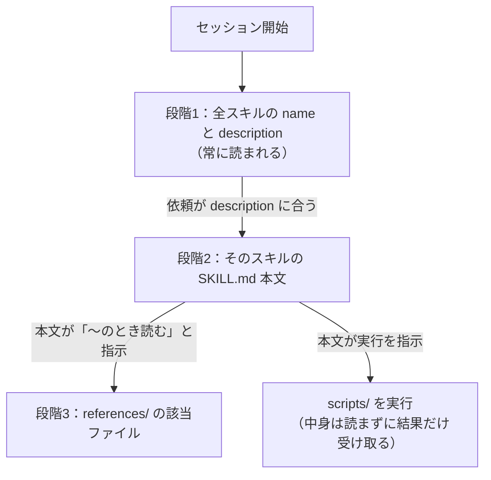

# はじめに

本資料は、Agent Skills の段階的情報開示（Progressive Disclosure）の仕組みを説明する。スキルを書くときの「description は200文字以内」「本文は500行以内」「長い資料は `references/` へ」という規約は、すべてこの仕組みから来ている。理由を知らずに規約だけ守ると、守る意味の薄いところで削り、効くところを見落とす。

# 一言で言うと

**スキルは3段階に分けて読まれる。常に読まれるのは `name` と `description` だけで、本文は使うと決まったとき、`references/` はさらに本文から指示されたときにだけ読まれる。** だから資料をいくら足してもコストは増えないが、description は1文字増やすごとに毎セッションの固定費が増える。

# 全体像

```mermaid
flowchart TD
    S[セッション開始] --> L1["段階1：全スキルの name と description<br/>（常に読まれる）"]
    L1 -->|依頼が description に合う| L2["段階2：そのスキルの SKILL.md 本文"]
    L2 -->|本文が「〜のとき読む」と指示| L3["段階3：references/ の該当ファイル"]
    L2 -->|本文が実行を指示| X["scripts/ を実行<br/>（中身は読まずに結果だけ受け取る）"]
```

上図のとおり、下の段階ほど読まれる回数が少ない。費用がかかるのは段階1だけで、段階2以降は使ったときにしか費用がかからない。

# 各段階の中身

## 段階1：name と description

エージェントは、どのスキルを使うかを description だけで判断する。本文はこの時点では読まれないので、**発火するかどうかは description で決まる。**

このリポジトリの実測値（2026-10-03 時点、`~/.agents/skills` の35本。git 管理外の取り込みスキルを含む）:

| 項目 | 値 |
|---|---|
| description の合計 | 5,599 文字（200文字以内へ統一する前は 8,605 文字） |
| 1本あたり | 最短 99 文字 / 最長 570 文字（570 文字は git 管理外の取り込みスキル） |
| SKILL.md 本文の合計 | 5,544 行 |
| `references/` の合計 | 7,485 行 |

毎セッション必ず読まれるのは、このうち description の 5,599 文字だけである。本文と references の約1万3千行は、使われたスキルの分しか読まれない。

## 段階2：SKILL.md 本文

依頼が description に合ったときに初めて読まれる。ここには手順と、`references/` のどれを**いつ**読むかの索引を置く。

## 段階3：references/ と scripts/

- `references/` は、本文が「〜のときに読む」と指示したときだけ読まれる。たとえば `markdown-doc` の references は合計 1,028 行あるが、本文が「種別が決まったら該当する1つだけを読む」と指示しているので、1回の利用で読まれるのはそのうち1本である
- `scripts/` は中身を読まずに実行し、出力だけを受け取る。決定的な処理をスクリプトに逃がすと、手順の説明を本文に書くより軽く、結果も毎回同じになる

# よくある誤解

| 誤解 | 実際 |
|---|---|
| スキルを増やすと、そのぶん重くなる | 増えるのは description の分だけ。本文と references は使ったときしか読まれない |
| references/ に置けば必要なときに読まれる | 本文から「いつ読むか」を添えて指示されないと読まれない。指示の無いファイルは無いのと同じ |
| 本文に書いておけば発火する | 発火の判断に本文は使われない。「いつ使うか」は description に書く |
| description は詳しいほど発火しやすい | 発火に効くのは依頼の言い回しに近い語句。長くしても固定費が増えるだけで、「明示的な言及がなくても使う」の類の定型句は効かない |

## CLAUDE.md / AGENTS.md との違い

| | 読まれるタイミング | 向いている内容 |
|---|---|---|
| CLAUDE.md / AGENTS.md | 常に全文 | 常に知っておいてほしい事実と規約（言語、構成、守るべきこと） |
| Agent Skills | description は常に、本文は必要なときだけ | 特定の場面でだけ従ってほしい手順 |

AGENTS.md の一節が説明ではなく手順書に育ってきたら、スキルに切り出す合図である。全文が毎回読まれるファイルに手順を置き続けると、使わないセッションでも費用がかかる。

# スキルを書くときに効くところ

| 規約 | この仕組みとの関係 |
|---|---|
| description は200文字以内。隣のスキルの名指しは、実際に取り違えが起きる相手だけ | 段階1の固定費を抑える。35本あると1本あたり100文字の差が合計3,500文字の差になる |
| description に「何をするか」と「いつ使うか」の両方を書く | 段階1しか発火の判断材料が無い |
| 本文は500行以内。超えたら references/ に分ける | 段階2で読む量を抑える |
| references/ へのリンクには「いつ読むか」を添える | 段階3は指示が無いと読まれない |
| 決定的な処理は scripts/ に置く | 中身を読まずに実行できる |

補足：claude.ai（WEB 版）の description は200文字まで

claude.ai は description の上限が200文字である。このリポジトリでは CLI 用と WEB 用を分けず、description を200文字以内の1本にしている。以前は CLI 用の長い description と、`metadata.web-description` に置いた短縮版を使い分けていたが、2026-10-03 に統一した。

# 参考資料

- リポジトリの `README.md`「仕組み（なぜ増やしても重くならないか）」「CLAUDE.md / AGENTS.md との使い分け」
- リポジトリの `AGENTS.md`「SKILL.md の規約」
- `skills/workflow-skill-architect/SKILL.md`「ステップ3〜4：骨組みを生成する」
- [Agent Skills 仕様書](https://agentskills.io/specification)（本資料の作成時には読んでいない）
