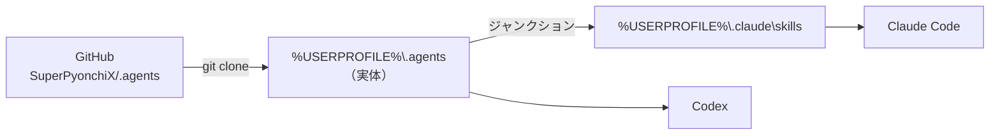

# はじめに

新しい PC に個人用スキル置き場 `~/.agents` を導入し、Claude Code と Codex から同じスキルを使える状態にする。作業はコマンド1回と Claude Code の再起動だけである。

| 項目 | 内容 |
|---|---|
| 終わるとできること | Claude Code の `/` メニューと Codex に、`~/.agents/skills` のスキルが出る |
| 対象環境 | Windows 11、コマンドプロンプト |
| 動作確認日 | 2026-10-03（作業用フォルダで clone・リンク作成・削除を確認。Claude Code での表示はジャンクションでは未確認） |

# 始める前に

| 必要なもの | 用途 | 確認方法 |
|---|---|---|
| Git | リポジトリの取得 | `git --version` |
| Claude Code または Codex | スキルを使う側 | 起動できること |
| Python 3（任意） | 一部スキルのスクリプト実行。導入自体には不要 | `python --version` |

まとめて確認するなら、コマンドプロンプトで次を実行する。両方のバージョンが表示されればよい。

```bat
git --version && python --version
```

管理者権限・開発者モードは要らない。リンクにジャンクション（`mklink /J`）を使うためである。

# 全体の流れ



Claude Code は `~/.claude/skills` しか見ないので、そこから実体へリンクを張る。Codex は `~/.agents/skills` を直接読むので、リンクは要らない。全2ステップである。

# 手順

## ステップ1：取得とリンクを一度に行う

コマンドプロンプト（PowerShell ではない）に、次の1行を貼って実行する。

```bat
git clone https://github.com/SuperPyonchiX/.agents.git "%USERPROFILE%\.agents" && (if not exist "%USERPROFILE%\.claude" mkdir "%USERPROFILE%\.claude") && mklink /J "%USERPROFILE%\.claude\skills" "%USERPROFILE%\.agents\skills"
```

この1行がしていることは3つである。

1. リポジトリを `%USERPROFILE%\.agents` に取得する
2. `%USERPROFILE%\.claude` が無ければ作る
3. `%USERPROFILE%\.claude\skills` から `%USERPROFILE%\.agents\skills` へジャンクションを張る

**完了条件**：最後に `... <<===>> ...\.agents\skills` の形で「Junction created for」と表示されること。

<details>
<summary>補足：なぜシンボリックリンク（mklink /D）ではないのか</summary>

`mklink /D` は開発者モードか管理者権限が無いと `You do not have sufficient privilege to perform this operation.` で失敗する。ジャンクションは同じ PC 内のフォルダ同士なら権限なしで作れ、読む側からは普通のフォルダに見える。

</details>

## ステップ2：Claude Code を再起動して確認する

スキルは起動時にしか読み込まれない。起動中の Claude Code があれば終了し、起動し直す。

1. 次を実行し、`<JUNCTION>` の行に `skills` が出ることを確かめる

   ```bat
   dir "%USERPROFILE%\.claude" | findstr skills
   ```

2. Claude Code を起動し、`/` を打つ

**完了条件**：`/` の候補に `markdown-doc` などのスキルが並ぶこと。

# うまくいかないとき

| 症状 | 原因 | 対処 |
|---|---|---|
| `Cannot create a file when that file already exists.`（既に存在します） | `%USERPROFILE%\.claude\skills` が既にある | 中身を確かめる。古いリンクなら下の「元に戻す」で消してから、ステップ1の `mklink /J ...` の部分だけを再実行する。実フォルダなら退避してから消す |
| `fatal: destination path ... already exists` | `%USERPROFILE%\.agents` が既にある | 既存のものが同じリポジトリなら `git -C "%USERPROFILE%\.agents" pull` で更新し、`mklink /J` だけを実行する |
| スキルが `/` に出ない | Claude Code を再起動していない | 終了してから起動し直す |
| 同上 | frontmatter が壊れている | `python "%USERPROFILE%\.agents\skills\workflow-skill-architect\scripts\validate_skill.py" "%USERPROFILE%\.agents\skills\<スキル名>"` で検査する |

# 元に戻す

リンクだけを消す。スキルの実体（`%USERPROFILE%\.agents`）は残る。

```bat
rmdir "%USERPROFILE%\.claude\skills"
```

**`rmdir /S` を付けない。** 付けるとリンク先の実体まで消える危険がある。実体も不要なら、リンクを消した後に `%USERPROFILE%\.agents` をエクスプローラーで削除する。

# 参考資料

- リポジトリの [README.md](https://github.com/SuperPyonchiX/.agents/blob/main/README.md)：Linux / macOS / WSL でのリンクの張り方（`ln -s`）、Obsidian の無い PC での使い方、claude.ai への反映手順
