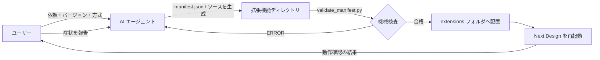
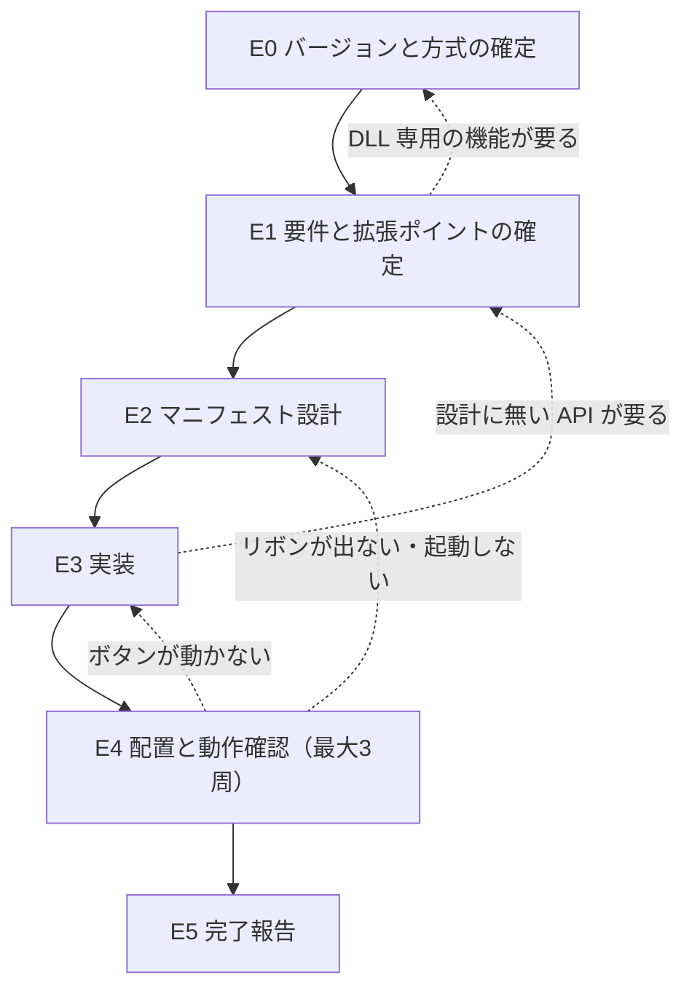

# はじめに

本文書は `nextdesign-extension` スキルの紹介である。Next Design の拡張機能を、AI エージェントとの対話で作って実機で動かすところまで進めるためのエージェントスキルである。

Next Design の拡張機能は、バージョンごとにマニフェストの仕様が違い、しかもマニフェストを誤ると Next Design がエラーを出さずに起動しなくなる。このスキルは、最初にバージョンを確定させ、配置前にマニフェストを機械検査することで、この事故を防ぐ。

# 何ができるようになるか

Next Design の拡張機能（リボンのボタン、イベントで動く処理）を、AI エージェントに依頼して作れるようになる。作り方は2通りある。

| 方式 | 作るもの | 向いている場面 |
|---|---|---|
| C# スクリプト | `manifest.json` + `main.cs` | 小さく試したい。利用者にソースを見せたい・直させたい |
| DLL | `.csproj` + `.cs` を .NET SDK でビルド | コードが大きくなる。補完・デバッガを使いたい。DLL でしかできない機能を使う |

DLL でしかできない機能は、ユーザー操作をトリガとするイベント、条件付き書式、動的制約、独自 UI の4つである。DLL 方式でも Visual Studio は要らない。.NET SDK と VS Code で開発でき、どちらも商用利用で費用はかからない（根拠は `references/dll-license.md`。最終判断は組織に委ねる）。

依頼の例:

- 「Next Design のリボンに、選択中モデルの検査ボタンを追加したい」
- 「保存時にモデルを検証する拡張を DLL で作りたい」
- 「作ったエクステンションが動かない」

## できないこと

- **動作確認はエージェントにはできない。** エージェントは Next Design を起動できないので、配置後の確認はユーザーが行い、結果を伝える
- **Python スクリプトの拡張は扱わない。** V4.x 以降で Python も選べるが、このスキルは C# だけを書く
- **V2.x 以前は限定的にしか扱えない。** ドキュメントの構成が別系統で、DLL 方式は扱わない
- **実機で確認したのは V3.x だけ。** DLL の雛形（TargetFramework `net6.0-windows`、NuGet `3.1.3`）は V3.1.9 で動作を確認した値で、V4.x 以降はその版のドキュメントで値を確かめてから書き換える

# 全体像



上図のとおり、エージェントが書いたものは必ず `validate_manifest.py` を通してから配置する。マニフェストの誤りは Next Design を**エラーを出さずに起動不能にする**ので、配置前にしか捕まえられない。配置後の確認だけはユーザーの手に残る。

スキルを構成するファイルは次のとおり。

```
skills/nextdesign-extension/
├── SKILL.md                     ← 手順の本体（E0〜E5）
├── references/                  ← 必要になったときだけエージェントが読む資料
│   ├── doc-map.md               ← バージョン別の公式ドキュメント URL と仕様差異
│   ├── manifest-spec.md         ← manifest.json のキー・リボン制御・イベント名
│   ├── csharp-script.md         ← スクリプト方式の書き方と落とし穴
│   ├── dll-extension.md         ← DLL 方式の環境構築・ビルド・よくある失敗
│   ├── dll-license.md           ← VS なし開発のライセンス根拠
│   └── troubleshooting.md       ← 症状別の切り分け表
├── scripts/validate_manifest.py ← 配置前の機械検査
└── assets/templates/            ← 生成物の雛形（後述のカスタマイズ対象）
```

# 環境構築

スキル自体の導入（リポジトリの clone と `~/.claude/skills` へのリンク）は全スキル共通なので リポジトリ直下の `README.md` の「セットアップ」節を参照する。ここではこのスキル固有のものだけを書く。

| 必要なもの | 用途 | 方式 |
|---|---|---|
| Next Design | 拡張機能を動かす本体 | 両方 |
| Python 3 | `validate_manifest.py` の実行。標準ライブラリのみで動く | 両方 |
| .NET SDK（LTS の最新。2026年9月時点で .NET 10） | DLL のビルド | DLL のみ |
| VS Code の「C#」拡張（`ms-dotnettools.csharp`） | 補完・デバッグ | DLL のみ（任意） |

DLL 方式で使う場合は、PowerShell で次を実行する。

```powershell
# .NET SDK（管理者権限が必要）
winget install Microsoft.DotNet.SDK.10
# VS Code の C# 拡張（C# Dev Kit は入れない。商用で6名以上だと有償ライセンスが要る）
code --install-extension ms-dotnettools.csharp
# 確認：新しいターミナルで SDK が表示されれば完了
dotnet --list-sdks
```

スクリプト方式だけなら、Python 3 が入っていれば追加の導入は要らない。

<details>
<summary>管理者権限が無い場合の .NET SDK の入れ方</summary>

公式スクリプト `https://dot.net/v1/dotnet-install.ps1` を `-Channel 10.0 -InstallDir "$env:LOCALAPPDATA\Microsoft\dotnet"` で実行し、インストール先をユーザー環境変数 PATH に追加する。利用状況の送信を止めたい場合は、ユーザー環境変数 `DOTNET_CLI_TELEMETRY_OPTOUT=1` を設定する。

</details>

<details>
<summary>VS Code の C# 拡張が「spawn UNKNOWN」を出す場合</summary>

VS Code のユーザー設定（JSON）に次を足し、自動ダウンロードしたランタイムの代わりに入れた SDK を使わせる。`path` は SDK の場所に合わせる。

```json
"dotnetAcquisitionExtension.existingDotnetPath": [
  { "extensionId": "ms-dotnettools.csharp", "path": "C:\\Program Files\\dotnet\\dotnet.exe" }
]
```

</details>

# 使い方

1. エージェントに作りたいものを伝える（「〜するボタンをリボンに追加したい」）
2. **バージョンを聞かれるので答える。** Next Design の ヘルプ > バージョン情報 で確認できる。「たぶん最新」では先に進まない
3. 新規作成なら方式（スクリプト / DLL）を聞かれる。推奨が1つ添えられるので、それで良ければそのまま答える
4. 拡張機能名・ボタンと処理の対応・`lifecycle`・作らないものの一覧が提示されるので、合意する
5. 生成されたファイルを配置先にコピーし、Next Design を**終了してから**起動し直す

   | 配置先 | 適用範囲 |
   |---|---|
   | `%LOCALAPPDATA%\DENSO CREATE\Next Design\extensions\<拡張機能名>\` | 自分だけ |
   | `C:\ProgramData\DENSO CREATE\Next Design\extensions\<拡張機能名>\` | その PC の全ユーザー |

6. 提示された確認手順を実行し、結果を伝える。エラーが出ていたら文面をそのまま貼る

作業の途中で中断しても、進捗は `work/extension-spec.json` に残る。次のセッションで「続きをやって」と伝えれば、記録された状態から再開する。

# ベストプラクティス

- **出力ウィンドウの System カテゴリを必ず見る。** スクリプト方式の C# コンパイルエラーは、ボタンを最初に押した時点でここにしか出ない（表示 > 出力）
- **迷ったら `lifecycle` は `project` にする。** `application` だと、`using` 不足やマニフェストの誤りが Next Design 自体の起動失敗に直結する
- **ボタンの画像を用意しないなら、`manifest.json` から `imageLarge` の行を消す。** 実在しない画像を指していると、ボタンがリボンに出ない
- **Next Design が起動しなくなったら、`manifest.json` を一時的にリネームして起動してみる。** 起動すればマニフェストが原因と切り分けられる
- **DLL 方式では、配置先に publish の出力の中身だけを置く。** ソースや `NextDesign.Core.dll` / `NextDesign.Desktop.dll` を置くと本体と競合する
- **直したのに変わらないときは、まず再起動を疑う。** 拡張機能は起動時にしか読み込まれない

# ワークフロー



## 担当と機械検査

| フェーズ | AI が行うこと | ユーザーが行うこと | 機械検査 |
|---|---|---|---|
| E0 バージョン・方式 | バージョンに対応するドキュメントを選び、方式の推奨を出す | バージョンを答える。新規なら方式を選ぶ | なし |
| E1 要件 | 何を・いつ・どう見せるかを聞き出し、拡張ポイントと `lifecycle` を決める | 提示された一覧に合意する | なし |
| E2 マニフェスト | 雛形から `manifest.json` を作る | なし | `validate_manifest.py`（スクリプト方式） |
| E3 実装 | ハンドラを書き、DLL ならビルドする | dotnet を実行できない環境ならビルドを代行する | `validate_manifest.py`（DLL はソースと publish 出力の2回）、`dotnet publish`（警告もエラー扱い） |
| E4 動作確認 | 確認手順を出し、報告された症状から原因を切り分けて直す | 配置・再起動・確認を行い、結果を伝える | なし（人の目） |
| E5 完了報告 | ファイル一覧・配置先・確認できた範囲と**できていない範囲**を出す | 確認する | なし |

**AI は、ユーザーから「期待どおり動いた」という報告を受けるまで完了と言わない。** 3周直しても動かなければ、試した修正と残った症状を並べて未達として報告する。

## 機械で見ているもの・見ていないもの

`validate_manifest.py` が見るもの:

| 対象 | 検査内容 |
|---|---|
| 共通 | 必須キー（`name` / `main` / `lifecycle`）、`lifecycle` の値、**そのバージョンに存在しないキー**、リボン要素 ID の重複、ボタンからコマンドへの参照切れ、画像ファイルの実在 |
| スクリプト | `main` の実在、`execFunc` とイベントハンドラ名が `main.cs` に実装されているか |
| DLL | `.csproj` の有無、`IExtension` 実装クラスが1つか、ハンドラが public メソッドとして実装されているか |
| DLL の publish 出力 | `manifest.json`・DLL・画像があるか、`NextDesign.*.dll` やソースが混ざっていないか |

見ていないもの（人の確認に残る）:

- スクリプトの C# の構文とコンパイル可否（Next Design 上でしか分からない）
- API メンバーがそのバージョンに実在するか
- イベント名がそのバージョンに実在するか（**綴り違いは Next Design も黙って無視する**）
- 拡張機能が要件を満たしているか

# カスタマイズ

パスはすべて `skills/nextdesign-extension/` からの相対パスである。リポジトリの実体を直接書き換えるので、変えたら `python skills/workflow-skill-architect/scripts/validate_skill.py skills/nextdesign-extension` を通す。

| ファイル | 現状 | 変えたくなる場面と編集方法 |
|---|---|---|
| `assets/templates/manifest.json.template` | `publisher` が `組織名`、`lifecycle` が `project`、ボタン1つ（`imageLarge` に `resources/run32.png`） | 組織名やタブ構成を毎回同じにしたいとき。`publisher` を自組織名に書き換える。ID の接頭辞 `MyExtension.` はエージェントが拡張機能名に置き換えるので残す |
| `assets/templates/main.cs.template` | `NextDesign.Core` / `Desktop` / `Extension` と `System` 系の `using`、`Run` ハンドラ1つ、ログカテゴリ `MyExtension` | 社内共通のログ書式や例外処理があるとき。`Run` の try/catch 部分を書き換える |
| `assets/templates/dll/Extension.csproj.template` | **V3.x の値**。TargetFramework `net6.0-windows`、NuGet `NextDesign.Core` / `Desktop` `3.1.3.30714`、警告をエラー扱い | V4.x 以降を主に使うとき。その版の `docs/getting-started/dev-with-vs/create-vs-project` で値を確かめ、`TargetFramework` と `PackageReference` の `Version` を書き換える |
| `references/doc-map.md` | V5.x〜V1.1 の公式ドキュメント URL と、確認済みのバージョン差異 | 新しいメジャーバージョンが出たとき。「ドキュメント基点」の表に行を足し、差異を確認したら「確認済みのバージョン差異」表にも足す |
| `scripts/validate_manifest.py` | `VERSION_KEYS`（70行目付近）に V3〜V5 で許可するキー | `doc-map.md` の差異表を更新したとき。同じ内容を `VERSION_KEYS` に反映する。片方だけ直すと検査と資料が食い違う |

<details>
<summary>実機で確認した値を足すときの注意</summary>

`dll-extension.md` と `csproj` の雛形は「V3.x で実機確認した」ことを前提に書いてある。別のバージョンで確認した値を足すときは、どのバージョンで確認したかを併記する。確認していない値を雛形に入れると、エージェントはそれを確認済みとして扱う。

</details>

# 困ったとき

| 症状 | まず見るところ |
|---|---|
| Next Design 自体が起動しない | `manifest.json` を一時的にリネームして起動できるか |
| リボンにタブが出ない | マニフェストの構造、DLL が配置先の直下にあるか |
| ボタンを押しても何も起きない | 出力ウィンドウの System カテゴリ |
| 直したのに変わらない | Next Design を再起動したか |

症状別の詳しい切り分けは `references/troubleshooting.md` にあり、症状を伝えればエージェントがこれに沿って切り分ける。

# 関連スキル

- `nextdesign-cpp14-implementation`：Next Design の設計データから C++14 のコードを作る。拡張機能そのものを作るのはこのスキル
- `manual-test-sheet`：確認項目が3件以上になるとき、E4 の動作確認をまとめて依頼するのに使う
