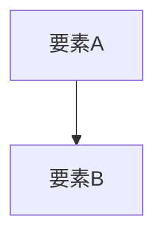

# はじめに

| 項目 | 内容 |
|---|---|
| 対象読者 | [入門者 / 中級者 / 上級者 / 非専門家のいずれかと、その具体像] |
| 最終更新日 | [YYYY-MM-DD] |
| タグ | [検索用キーワードをカンマ区切りで。掲載先の検索・ラベル機能で使う] |
| 記事の管理者 | [問い合わせ先となる担当者やチーム] |

本記事は、[テーマ] に関するナレッジを共有するものである。

# インプット資料

| # | 資料名 | リンク / 格納場所 | 備考 |
|---|--------|------------------|------|
| 1 | [資料名] | [URL or パス] | [任意の補足] |
| 2 | [資料名] | [URL or パス] | [任意の補足] |

# 概要

[テーマの全体像を記述する]

上図は [概要] を示している。

# 詳細説明

## [トピック1]

[説明を記述する]

用語解説：[用語名]

[用語の解説を記述する]

## [トピック2]

[説明を記述する]

# 関連ナレッジ

- [関連記事タイトル1](URL or 掲載先のパス)
- [関連記事タイトル2](URL or 掲載先のパス)
