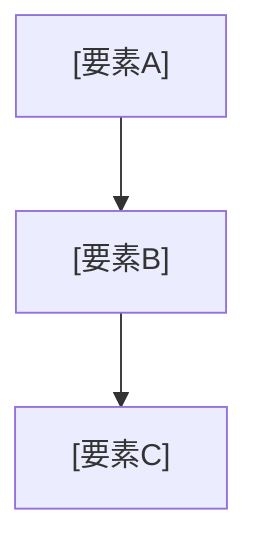

# はじめに

| 項目 | 内容 |
|---|---|
| 最終更新日 | [YYYY-MM-DD] |
| タグ | [検索用キーワードをカンマ区切りで。掲載先の検索・ラベル機能で使う] |
| 記事の管理者 | [問い合わせ先となる担当者やチーム] |

本記事は、[テーマ] を説明する。[読者がなぜ知っておくべきか。知らないと何で困るかを1〜2文]

# 一言で言うと

**[結論を1〜2文で書く]** [結論から導かれる帰結を1文添えてよい]

# 全体像

```mermaid
flowchart TD
    A["[要素A]"] --> B["[要素B]"]
    B --> C["[要素C]"]
```

上図は [何を示しているか]。[図の読み方や要点を補足する]

# [中身を表す章名]

## [要素A]

[説明を記述する。数値は実測値か出典つきの値だけを使う]

補足：[補足タイトル]

[補足情報を記述する]

## [要素B]

[説明を記述する]

# よくある誤解

| 誤解 | 実際 |
|---|---|
| [よくある思い込み] | [実際どうなっているか] |

## [似たもの]との違い

| | [観点1] | [観点2] |
|---|---|---|
| [このテーマ] | [内容] | [内容] |
| [似たもの] | [内容] | [内容] |

# [実務でどう効くか]

| [規約・行動] | この仕組みとの関係 |
|---|---|
| [読者がすること] | [なぜそうするのか] |

# 参考資料

- [資料名](URL or 掲載先のパス)：[何が書いてあるか。読んでいなければその旨]

# 関連ナレッジ

- [関連記事タイトル1](URL or 掲載先のパス)
- [関連記事タイトル2](URL or 掲載先のパス)
