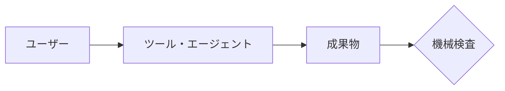
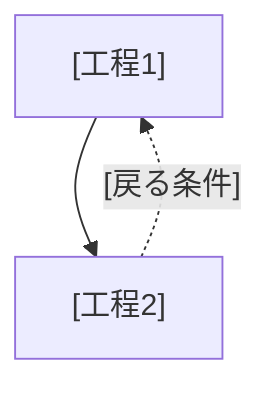

# はじめに

本文書は [対象の名前] の紹介である。[対象の一言の正体]。

[なぜ作ったか。どんな困りごとを解くのかを1〜2文で書く]

# 何ができるようになるか

[使うと何ができるようになるかを1〜2文で書く]

| 方式 | 作るもの | 向いている場面 |
|---|---|---|
| [方式A] | [成果物] | [場面] |

依頼の例:

- 「[依頼文1]」
- 「[依頼文2]」

## できないこと

- **[できないこと1]。** [理由・代わりにどうするか]

# 全体像



[図の要点を1〜2文で書く]

```
[ルートディレクトリ]/
├── [ファイル]   ← [役割]
└── [ファイル]   ← [役割]
```

# 環境構築

[全ツール共通の導入があれば、正本へのリンクを1文で書く]

| 必要なもの | 用途 | 方式 |
|---|---|---|
| [ツール名とバージョン] | [何に使うか] | [両方 / 方式Aのみ] |

```powershell
# [何を入れるか]
[コマンド]
# 確認：[何が表示されれば完了か]
[確認コマンド]
```

[1発で済まない部分があれば、理由と別手順を書く]

<details>
<summary>[別経路・よくある失敗]</summary>

[内容]

</details>

# 使い方

1. [ユーザーが言うこと・すること]
2. **[聞き返される内容]を答える。** [答え方]
3. [以降同様]

# ベストプラクティス

- **[利用者がすること]。** [理由1文]

# ワークフロー



## 担当と機械検査

| 工程 | AI（ツール）が行うこと | ユーザーが行うこと | 機械検査 |
|---|---|---|---|
| [工程1] | [内容] | [内容 / なし] | [検査名 / なし] |

[完了の判定条件を1文で書く]

## 機械で見ているもの・見ていないもの

[検査名] が見るもの:

| 対象 | 検査内容 |
|---|---|
| [対象] | [内容] |

見ていないもの（人の確認に残る）:

- [項目]

# カスタマイズ

パスはすべて `[起点]` からの相対パスである。[編集後に通す検証コマンドがあれば書く]

| ファイル | 現状 | 変えたくなる場面と編集方法 |
|---|---|---|
| `[パス]` | [実際の値。未検証なら明記] | [場面]。[編集方法] |

# 困ったとき

| 症状 | まず見るところ |
|---|---|
| [症状] | [見るところ] |

# 関連

- `[隣のツール]`：[何をするか。取り違えやすい点]
