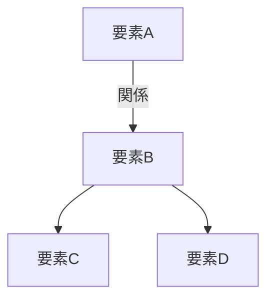
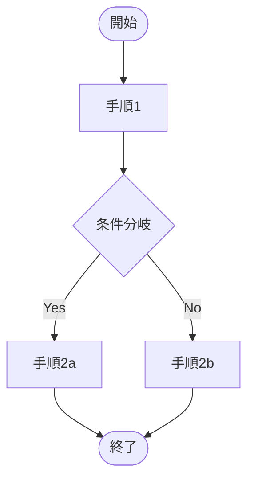
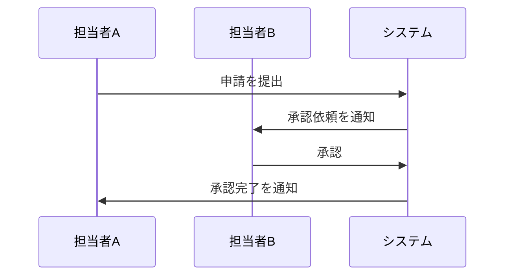
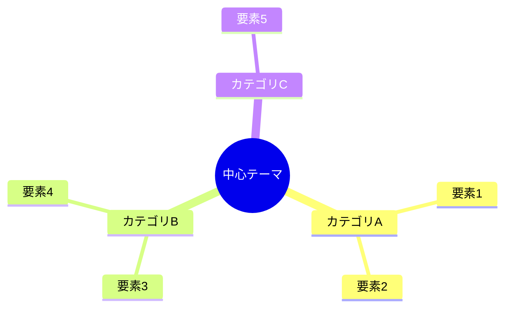
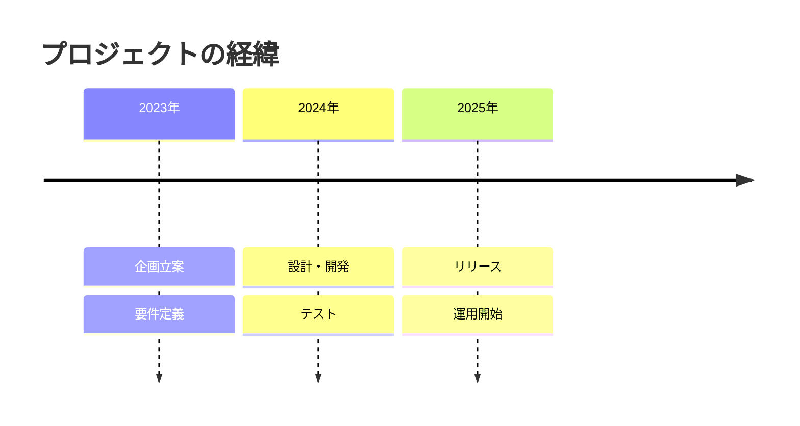

# Markdown 説明資料作成スキル

Markdown形式で説明資料・ナレッジベース記事を作成するスキル。
技術・非技術を問わず、あらゆるテーマの概念・仕組み・制度・プロセス・背景を「構造化された文書」として整理する。mermaid図解を積極的に活用して視覚的理解を促進し、`<details>` / `<summary>` タグによる折りたたみで補足情報を階層化する。

## 使用タイミング

以下のいずれかに該当する場合にこのスキルを使用する：

- 何らかのテーマについて説明資料を作成するとき
- Confluence等のナレッジベースに投稿する記事を作成するとき
- 概念・仕組み・アーキテクチャ・設計思想・制度・プロセス・ルールなどを他者に伝える資料が必要なとき
- 既存の資料やドキュメントの内容を噛み砕いて説明する資料を作成するとき
- 「〜について説明資料を作って」「〜をまとめて」「〜をわかりやすく整理して」といった依頼を受けたとき

## markdown-procedure-doc との使い分け

「まとめて」「ドキュメント化して」という依頼は両スキルに該当しうる。**読者にさせたいこと**で判定する。

| 依頼の主眼 | 使うスキル | 例 |
|---|---|---|
| 読者に**理解**させる（概念・仕組み・制度・背景・設計思想） | **このスキル** | 「スクラムの考え方をまとめて」「認証基盤の仕組みを説明して」 |
| 読者に**作業を再現**させる（操作・コマンド・設定を順に実行させる） | `markdown-procedure-doc` | 「VPN接続のやり方をまとめて」「デプロイ手順を書いて」 |
| どちらとも取れる | ユーザーに**どちらが目的か1問だけ聞く**。答えが得られなければ理解が目的とみなし、このスキルで進める | 「CI/CD についてドキュメント化して」 |

**両方必要な場合は1本にまとめず、資料を2本に分けて相互リンクする。** 説明資料の中に実行手順を書き下すと、どちらの読者にとっても読みにくくなる。

## 資料作成前の必須ヒアリング

資料作成に着手する前に、必ず以下をユーザーに確認すること。不明な項目がある場合は質問して解消する。

**進め方のルール**：

- **すでに会話に出ている項目は質問しない。** 「先ほどの話を資料にして」のような依頼では、まず会話から抽出し、「テーマは〇〇、読者レベルは△△と理解した」と**確認として提示**する。足りない項目だけを質問する。
- **各ターンの質問は最大3つまで。** 一度に全部並べない。
- **完了条件**：必須確認事項の3項目すべてについて、ユーザーの回答または上記の確認提示への同意が得られたこと。3項目が埋まらないうちは資料生成に進まない。
- 読者レベルの回答が得られない場合は「中級者」を採用し、その旨を明示して進める（後述のトラブルシューティング参照）。

### 必須確認事項

1. **テーマ**：何について説明する資料か
2. **読者レベル**：以下から選択してもらう
   - **入門者**：対象テーマにほぼ触れたことがない（前提知識の説明を厚くし、専門用語には都度補足を入れる）
   - **中級者**：基本概念は理解している（前提知識は簡潔に、本題を中心に記述する）
   - **上級者**：対象テーマに精通している（前提は省略し、深い考察や応用的な内容を中心に記述する）
   - **非専門家**：対象分野のバックグラウンドがない読者（専門用語を極力避け、比喩や具体例で説明する）
3. **インプット資料**：参照すべき仕様書、公式ドキュメント、URL、既存資料があるか

### 任意確認事項（必要に応じて質問）

- 特に重点的に説明してほしい箇所はあるか
- 記載不要・スコープ外の内容はあるか
- 想定される掲載先（Confluence、GitLabのWiki、README、社内ポータルなど）

## 文書構成テンプレート

以下の構成を標準とする。テーマによってセクションの増減・順序変更は可。

```
# はじめに
- この資料の目的と背景を述べる
- 読者が「なぜこの資料を読む必要があるのか」を理解できるようにする
- **ヒアリングで確認した対象読者を明示する**（後から読む人・改訂する人が想定読者を知れるようにする）

# インプット資料
- 参照した資料・関連資料をリストアップする
- URL・ファイルパス・バージョン情報を含める

# 概要
- テーマの全体像を簡潔に説明する
- **ここにmermaid図解を必ず配置する**
- 図解の種類はテーマに応じて最適なものを選択する
- 図解の直後に、図の読み方や要点を簡潔に補足する

# 詳細説明
- 概要で示した各要素を掘り下げて説明する
- 必要に応じてサブセクションに分割する
- 補足的な情報は<details>/<summary>タグで折りたたむ
- 必要に応じて追加のmermaid図解を配置する

# まとめ（任意）
- 要点の整理が有効な場合に配置する
```

**資料タイトルの見出しは付けない。** ファイル名で判別できるため不要である。文書は `# はじめに` から始める。

テンプレートは掲載先で選ぶ。**ヒアリング完了後、資料の骨組みを作る直前に該当するほうだけを読む。**

| テンプレート | 使うとき |
|---|---|
| [標準テンプレート](./templates/standard-template.md) | 単発の説明資料。掲載先が決まっていない、または README・共有ドキュメントとして配布する |
| [ナレッジベーステンプレート](./templates/knowledge-base-template.md) | Confluence・社内Wiki・社内ポータルへ記事として投稿する。**継続的に更新・検索される前提の記事**に使う |

両者の実質的な差は**メタ情報と関連記事の有無**である。ナレッジベース版は冒頭に対象読者・最終更新日・タグ・管理者の表を持ち、末尾に関連ナレッジのリンク集を持つ。**掲載先で検索され、他の記事から参照され、後から誰かが更新する**ならこちらを使う。書きっぱなしの単発資料に付けると保守されないメタ情報が残るだけなので、標準テンプレートを使う。

判断がつかない場合は標準テンプレートを使う。

リンクは**通常の Markdown リンク記法**（角括弧に表示名、続く丸括弧に URL）で書く。`[[記事名]]` の wikilink 記法は Obsidian や Notion の独自記法であり、Confluence や GitLab Wiki では機能しない。

## 記述の根拠

説明資料は誤情報が最も混入しやすい成果物である。**「常体で断定的に書く」という文体ルールは、根拠のないことまで断定してよいという意味ではない。** 次を守る。

- **インプット資料に基づく記述と、一般論・自分の知識による記述を書き分ける。** 前者は出典（資料名・章・バージョン）を示す
- **出典のバージョンと本文の用語を必ずつき合わせる。** 版が変わって用語が改められている場合は、出典の版の用語に合わせる（例：スクラムガイドは2020年版で「役割（role）」を廃してアカウンタビリティに、「開発チーム」を「開発者」に改めている。2020年版を出典に挙げながら旧版の用語で書くのは誤りである）
- **数値・日付・固有名詞・バージョン番号・URL は、インプット資料にない限り書かない。** 「だいたいこのくらい」で埋めない
- **確認できない事柄は断定しない。** 「〜と思われる」で濁すのではなく、その箇所を挙げてユーザーに確認する。確認が取れないまま資料に残す場合は、未確認であることを資料上に明示する

## 文体・表記ルール

### 文体

- **常体（である調）** を使用する。「〜である。」「〜となる。」「〜を示す。」
- 「です・ます調」は使用しない
- 簡潔で断定的な表現を心がける
- 一文は長くなりすぎないようにする（目安：60〜80文字以内）

### 表記

- 専門用語は初出時に正式名称と略称を併記する（例：「プロセス間通信（IPC: Inter-Process Communication、以下IPC）」）
- 読者レベルが「入門者」「非専門家」の場合は、専門用語に簡潔な補足を添える
- 略語や頭字語は初出時に展開する

### 見出しレベル

- 資料タイトルの見出しは**付けない**。ファイル名で判別できるため不要である
- `#` ：主要セクション（はじめに、インプット資料、概要、詳細説明など）
- `##` ：サブセクション
- `###` ：必要に応じて使用するが、深くなりすぎないよう注意する

## mermaid図解ガイドライン

### 基本方針

mermaid図解はすべての資料で積極的に活用する。概要セクションには必ず1つ以上配置し、詳細説明でも理解の助けになる場合は追加する。図解があることで読者の理解度は大きく向上する。

### 選択基準

テーマの性質に応じて最適な図の種類を選択する。以下は判断の目安である。

| 説明したい内容 | 推奨する図の種類 |
|---|---|
| 構成要素と関係性 | `graph TD` / `graph LR`（構成図） |
| 処理・手続き・ワークフローの流れ | `flowchart TD` / `flowchart LR` |
| 関係者・コンポーネント間のやり取り | `sequenceDiagram` |
| 状態の遷移 | `stateDiagram-v2` |
| クラス構造・データ構造・概念の関係 | `classDiagram` |
| 時系列の工程・スケジュール | `gantt` |
| 概念の包含関係・グループ化 | `graph` + `subgraph` |
| 要件と機能の対応 | `requirementDiagram` |
| ユーザー操作の流れ | `journey` |
| 円グラフ的な割合の可視化 | `pie` |
| Git等のブランチ戦略 | `gitgraph` |
| 時系列イベントの整理 | `timeline` |
| 思考の整理・要素の洗い出し | `mindmap` |

### 作成ルール

- 概要セクションには必ず1つ以上のmermaid図を配置する
- ノードやラベルは日本語で記述する
- 複雑になりすぎる場合は図を分割する（1つの図のノード数は目安15個以内）
- 図の直後に「上図は〜を示している。」のように要点を1〜2文で補足する
- 色分けやスタイリングは可読性向上に有効な場合のみ使用する
- テーマに最もふさわしい図の種類を選択する（上記の表は目安であり、柔軟に判断する）

### mermaid記述例

#### 構成図の例

~~~

~~~

#### フローチャートの例

~~~

~~~

#### シーケンス図の例

~~~

~~~

#### マインドマップの例

~~~

~~~

#### タイムラインの例

~~~

~~~

## 折りたたみ補足の活用ガイドライン

### 使用場面

以下のような補足情報は `<details>` / `<summary>` タグで折りたたむ。

- 用語解説や前提知識の補足
- 具体的なコマンド例・設定例・手順の詳細
- トラブルシューティング情報
- 参考リンク集
- 発展的な内容・応用的な話題
- 歴史的経緯・背景の深掘り
- 他の方法との比較情報

### 記述例

```html
<details>
<summary>用語解説：アジャイル開発とは</summary>

アジャイル開発とは、短い開発サイクル（イテレーション）を繰り返しながら、
段階的にソフトウェアを構築していく開発手法の総称である。
2001年に発表された「アジャイルソフトウェア開発宣言」がその基盤となっている。

</details>
```

### ルール

- 本文の流れを阻害する補足情報に使用する
- summaryには折りたたみの内容が推測できるタイトルを付ける
- 資料の核心部分は折りたたまない（読者が必ず読むべき内容は本文に記載する）
- 読者レベルが「入門者」の場合は折りたたみを多めに活用し、本文をシンプルに保つ
- 読者レベルが「上級者」の場合は基本的な用語解説を折りたたみに格納する
- 読者レベルが「非専門家」の場合は専門用語の解説を折りたたみではなく本文中に含める

## 品質チェックとレビュー

資料を生成したら、まず `japanese-prose-polish` スキルを**業務文書モード**で当て、AIくさい言い回しを除去する。
そのうえで **生成 → セルフチェック → 指摘箇所のみ修正**を反復する。
mermaid のノードラベル、コードブロック、テンプレとして定めた章立ては書き換え対象外として渡すこと。

```
for 周回 in 1..2:
    下記チェックリストを、他人が書いた資料として当てる
    if 未達項目がゼロ:
        break（ドラフト完成）
    未達だった項目に対応する箇所のみを修正する（資料全体を書き直さない）
    if 今回の未達項目が前回と同一:
        同じ直し方を繰り返さない。構成そのものを疑い、ユーザーに方針を確認する
else:
    2周しても未達 → 残っている未達項目を明示して報告する。
    解消したかのように報告しない
```

チェックを通過したら**ドラフトとしてユーザーに提示し、フィードバックを受けて修正する**。完成として渡さない。ユーザーからの修正依頼への対応も上限3周とし、3周を超えても収束しない場合は、指摘の食い違いを整理して方針をユーザーに確認する。

### チェックリスト

- [ ] 「はじめに」で資料の目的と背景が明確に述べられているか
- [ ] 対象読者が資料上に明示されているか（ヒアリングで確認した読者レベル）
- [ ] リンクが通常の Markdown リンクで書かれているか（`[[記事名]]` の wikilink を使っていないか）
- [ ] 「インプット資料」に参照元が漏れなく記載されているか（参照資料がない場合はその旨を記載）
- [ ] インプット資料にない数値・日付・固有名詞・バージョン番号を書いていないか
- [ ] 出典を挙げた記述が、その出典の版の用語と一致しているか
- [ ] 未確認の事柄を断定していないか（未確認なら資料上に明示されているか）
- [ ] 「概要」にmermaid図解が配置されているか
- [ ] mermaid図解の直後に要点の補足があるか
- [ ] mermaid図解の種類がテーマに対して適切か
- [ ] 読者レベルに合った説明の粒度になっているか
- [ ] 文体が「である調」で統一されているか
- [ ] 補足情報が適切に折りたたまれているか
- [ ] 資料タイトルの見出しを付けていないか（文書が `# はじめに` から始まっているか）
- [ ] 主要セクションが `#`、サブセクションが `##` になっているか
- [ ] 見出しの階層が論理的に整理されているか
- [ ] 一文が長すぎないか（目安60〜80文字以内）
- [ ] 専門用語の初出時に説明があるか（読者レベルに応じて）
- [ ] 資料全体を通して論理的な流れが維持されているか

## トラブルシューティング

### mermaid図がレンダリングされない場合

- コードブロックの言語指定が `mermaid` になっているか確認する
- ノード名に特殊文字（`(`, `)`, `[`, `]` など）が含まれている場合はクォートで囲む
- 掲載先のプラットフォームがmermaid記法に対応しているか確認する
- mermaidのバージョンによって対応していない図の種類がある場合は代替の図を検討する

### 資料が長くなりすぎる場合

- 詳細説明の一部を折りたたみにする
- 資料を複数に分割し、相互リンクで参照する構成を検討する
- 「この資料のスコープ」を「はじめに」で明示して範囲を絞る

### 読者レベルの判断が難しい場合

- 迷った場合は「中級者」をデフォルトとする
- 重要な前提知識は折りたたみで補足し、必要な読者だけが展開できるようにする

### テーマが広範囲すぎる場合

- ユーザーにスコープの絞り込みを提案する
- 全体像を概要で示した上で、詳細説明では重要な部分にフォーカスする
- 残りの部分は「関連テーマ」や「今後の補足資料」として言及するにとどめる

## 出力例

構成・分量・図解の入れ方の完成形を確認したいときに読む（毎回読む必要はない）。

- [説明資料の例：スクラム開発の基本と進め方](./examples/example-output.md)
