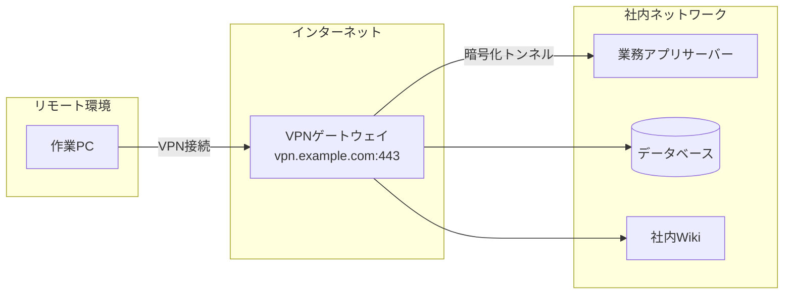
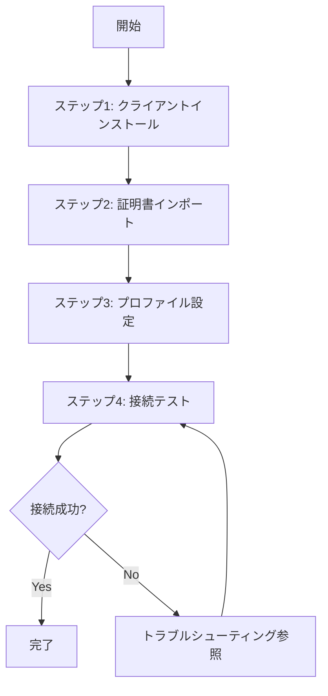

# Markdown 業務手順書作成スキル

## 概要

社内の汎用的な業務手順書を、構造化されたMarkdown形式で対話的に作成するスキルである。
ユーザーへのヒアリングを通じて段階的に手順書を組み立て、Mermaid記法による視覚的な図解、
`<details>` タグによる折りたたみ補足、トラブルシューティングセクションを含む
わかりやすい手順書を生成する。

## 使用タイミング

以下のいずれかに該当する場合にこのスキルを使用すること：

- 「〇〇の手順書を作って」「〇〇のやり方をまとめて」と依頼されたとき
- 既存のメモや箇条書きから手順書を整形するよう求められたとき
- 業務フローのドキュメント化を依頼されたとき
- 作業手順の標準化やナレッジ化が目的のとき

## markdown-explanation-doc との使い分け

「まとめて」「ドキュメント化して」という依頼は両スキルに該当しうる。**読者にさせたいこと**で判定する。

| 依頼の主眼 | 使うスキル | 例 |
|---|---|---|
| 読者に**作業を再現**させる（操作・コマンド・設定を順に実行させる） | **このスキル** | 「VPN接続のやり方をまとめて」「デプロイ手順を書いて」 |
| 読者に**理解**させる（概念・仕組み・制度・背景・設計思想） | `markdown-explanation-doc` | 「スクラムの考え方をまとめて」「認証基盤の仕組みを説明して」 |
| どちらとも取れる | ユーザーに**どちらが目的か1問だけ聞く**。答えが得られなければ作業の再現が目的とみなし、このスキルで進める | 「CI/CD についてドキュメント化して」 |

**両方必要な場合は1本にまとめず、資料を2本に分けて相互リンクする。** 手順書に背景説明を書き下すと、手を動かしたい読者にとって読みにくくなる。背景は「はじめに」を2〜3文に保ったうえで、説明資料側へリンクする。

## 手順書テンプレート構造

作成する手順書は、以下のセクション構成に従うこと。
ヒアリング完了後、ドラフトを書き始める直前に [手順書テンプレート](./templates/procedure-template.md) を読み、その構造に沿って埋める。

### セクション構成

```
# 1. はじめに
  - 目的・背景を簡潔に記述（2〜3文程度）
  - 長くなりすぎないこと。導入としての役割に徹する
  - 対象環境・動作確認日・想定読者を表で明示する

# 2. インプット資料
  - 事前に読むべき資料、参考リンク、関連ドキュメント

# 3. 前提条件
  - 環境要件、必要なツール、権限、事前準備

# 4. 手順
  ## 4.1 概要
    - Mermaid図解で手順全体の流れやシステム構成を視覚化
    - 図の後に、全体の流れを簡潔にテキストでも補足
    - 総ステップ数と所要時間の目安を記載
  ## 4.2 ステップ1：[ステップ名]
    - 具体的な操作手順
    - 完了条件（何が表示されれば成功か）
  ## 4.3 ステップ2：[ステップ名]
    - ...以降同様
  ## 4.N 完了確認（必要に応じて）

# 5. トラブルシューティング
  - よくあるエラーと対処法
```

### 見出しレベル

- 手順書タイトルの見出しは**付けない**。ファイル名で判別できるため不要である。文書は `# 1. はじめに` から始める
- `#` ：主要セクション（はじめに、インプット資料、前提条件、手順、トラブルシューティング）
- `##` ：サブセクション（各ステップ、症状ごとの見出しなど）
- `###` ：必要に応じて使用するが、深くなりすぎないよう注意する

### 「はじめに」の記述方針

「はじめに」は手順書の導入部であり、**簡潔さを最優先**とする。
目的と対象読者が一目で把握できる程度にとどめること。
図解や詳細な背景説明はここには含めない。

導入文に続けて、**対象環境・動作確認日・想定読者の表を必ず置く**こと。手順書は文書のなかで最も陳腐化が速く、特に UI 操作の手順はツールのバージョンが変われば通用しなくなる。**「いつ時点の、何を対象にした情報か」が書かれていない手順書は、読者がそれを信じてよいか判断できない。**

良い例：

```markdown
# 1. はじめに

本手順書は、新規メンバーが社内VPNに接続するための初期セットアップ手順をまとめたものである。
本手順を完了すると、リモート環境から社内ネットワークへ安全にアクセスできるようになる。

| 項目 | 内容 |
|---|---|
| 対象環境 | Windows 11 / macOS 14、VPNクライアント v3.2 以降 |
| 動作確認日 | 2026-08-11 |
| 想定読者 | 入社直後の新規メンバー |
```

動作確認日は、**手順を実際に確認した日**を書く。確認していない場合は日付を書かず、未確認であることを明示してユーザーに確認する（後述の「記述の根拠」参照）。

### 「手順 > 概要」の記述方針

手順セクションの冒頭に必ず「概要」サブセクションを設け、
**これから行う作業の全体像を視覚的に示す**こと。
ここが手順書の"地図"の役割を果たす。

Mermaid図は**内容に最も適した図の種類**を選択する：

| 図の種類 | 適しているケース | Mermaid記法 |
|---------|----------------|-------------|
| フローチャート | 作業手順の流れ、分岐のある判断プロセス | `flowchart TD` / `flowchart LR` |
| システム構成図 | サーバー構成、ネットワーク構成、ツール間の関係 | `graph TD` / `graph LR` でブロック構成を表現 |
| シーケンス図 | 複数の人・システム間のやりとりの順序 | `sequenceDiagram` |
| 状態遷移図 | 状態の変化を伴うプロセス | `stateDiagram-v2` |
| C4コンテキスト図 | システム全体の俯瞰、外部連携の把握 | `C4Context` |
| ブロック図 | アーキテクチャ、レイヤー構造 | `block-beta` |

**図の選択基準**：

- 「作業の流れ・順序」が主題 → フローチャート
- 「何と何がどう繋がるか」が主題 → システム構成図 / ブロック図
- 「誰が誰に何を渡すか」が主題 → シーケンス図
- 複数の観点が必要な場合は、**2つ以上の図を組み合わせてもよい**（例：構成図＋フロー図）

例（システム構成図）：

~~~markdown

~~~

例（フローチャート）：

~~~markdown

~~~

Mermaid図の後には、図を補足する簡潔なテキスト説明を必ず添えること。
**あわせて総ステップ数と所要時間の目安を書く**（例：「全4ステップで、所要時間は約15〜20分である」）。読者が着手前に「今やれるか」を判断できるようにするためで、待ち時間（申請の承認待ち、ビルド完了待ちなど）が含まれる場合はその旨も書く。

### 手順書の文体

手順書全体の文体は「である・となる」調（常体）で統一すること。
「です・ます」調（敬体）は使用しない。

良い例：
- 「〇〇をインストールする」
- 「以下のコマンドを実行する」
- 「正常に完了した場合、△△が表示される」
- 「本手順は〇〇を対象としたものである」

悪い例：
- 「〇〇をインストールします」
- 「以下のコマンドを実行してください」
- 「正常に完了した場合、△△が表示されます」

## ヒアリングプロセス

ユーザーから手順書作成を依頼されたら、**一度に全てを聞かず**、以下のフェーズに分けて対話的に情報を収集すること。各ターンの質問は **最大3つ** までとする。

**ヒアリング開始前に、会話・提示された資料・既存メモから埋まる項目を先に抽出すること。** 埋まった項目は質問せず、「タイトルは〇〇、想定読者は△△と理解した」と**確認として提示**し、足りない項目だけを質問する。既にすべてのフェーズ分の材料が揃っているなら、ヒアリングを飛ばしてフェーズ4のドラフト生成に進む。

各フェーズの完了条件は、そのフェーズの項目すべてについて回答または確認提示への同意が得られたこと。埋まらないまま次のフェーズに進まない。

### フェーズ1：基本情報の収集

まず以下を確認する：

1. **手順書のタイトル・対象作業**：何の手順書を作るのか
2. **想定読者**：誰が読むのか（新人、チームメンバー、他部署など）
3. **作業のゴール**：この手順を完了すると何が達成されるのか

### フェーズ2：詳細情報の収集

基本情報をもとに、以下を深掘りする：

1. **インプット資料**：参照すべきドキュメント、URL、社内Wikiなどがあるか
2. **前提条件と対象環境**：必要なアカウント・権限に加え、**OS とツールのバージョン、手順を確認した日**。手順書の陳腐化を読者が判断する材料になるため、前提条件とは分けて聞く
3. **大まかな作業ステップ**：ざっくりとした流れ

### フェーズ3：手順の詳細化

大まかな流れをもとに、各ステップを詳細化する：

1. **具体的なコマンドや操作**：各ステップで実行する具体的な内容
2. **注意点・ハマりポイント**：経験上つまずきやすい箇所。**元に戻しにくい操作が含まれるか、含まれる場合の戻し方**もここで聞く
3. **確認方法**：各ステップの完了条件（何が表示されれば成功か）と、最終的な完了確認の方法
4. **所要時間**：全体の目安。待ち時間（承認待ちなど）が含まれるか

### フェーズ4：ドラフト提示とレビュー

収集した情報をもとに手順書のドラフトを生成する。ユーザーに提示する前に、後述の「出力品質チェックリスト」を当て、未達項目に対応する箇所のみを修正すること。

チェックを通過したらユーザーにレビューを依頼し、フィードバックを受けて修正する。この対話ループには終了条件を守ること。

```
for 周回 in 1..3:
    ドラフトを提示してレビューを依頼する
    if ユーザーから修正指示がない（合意が得られた）:
        break（完成）
    指摘された箇所のみを修正する（手順書全体を再生成しない）
    if 今回の指摘が前回と同趣旨:
        同じ直し方を繰り返さない。ヒアリングで取り違えた前提を疑い、
        どこを誤解していたかを挙げてユーザーに確認する
else:
    3周しても合意に至らない → 残っている論点と試した修正を整理して報告する。
    完成したかのように報告しない
```

## 記述ルール

### 記述の根拠

手順書は読者がそのとおりに手を動かす文書である。**間違ったコマンドやパスを書けば、読者の環境が壊れる。** 次を守る。

- **確認していないコマンド・パス・UI の遷移を、確認済みであるかのように書かない。** ヒアリングでユーザーが述べた内容、インプット資料に書かれている内容、実際に実行して確かめた内容のいずれかに基づくこと
- **インプット資料にないコマンドやオプションを推測で補わない。** 「たぶんこのオプションだろう」で書かず、不明な箇所を挙げてユーザーに確認する
- バージョン番号・URL・ファイルパス・画面上のメニュー名は、裏が取れているものだけを書く
- 確認が取れないまま手順書に残す場合は、その箇所に**未確認であることを明記する**（例：「※ v3.2 での画面名。以降のバージョンでは異なる可能性がある」）

### 各ステップの完了条件

各ステップの末尾に **完了条件** を書く。「操作したこと」ではなく **「何が表示されれば成功か」** を書くこと。これがないと、読者は失敗に気づかないまま次のステップに進み、原因が分からなくなる。

```markdown
**完了条件**：VPNクライアントの証明書一覧に、受領した証明書が「有効」と表示されること。
```

判定材料が画面に出ない場合は、確認用のコマンドを添える。

### 失敗時の戻し方

**元に戻しにくい操作を含むステップには、戻し方を書く。** 対象となるのは、インストール、設定ファイルの上書き、再起動、権限やアカウントの変更、データの削除・移行など。

- 戻せる場合：戻す手順を折りたたみ補足として添える（例：「アンインストール手順」「変更前の設定に戻す方法」）
- 戻せない場合：**戻せないことをステップの冒頭で明示する。** 「この操作は取り消せない。実行前に [対象] のバックアップを取ること」のように、事前にすべきことをセットで書く

途中で中断してよいステップの区切りが決まっている場合は、それも書く（例：「ステップ2まで完了していれば、ここで中断して翌日に再開してよい」）。

### 折りたたみ補足（details / summary）

初心者向けの用語解説、背景情報、コマンドの詳細オプション説明など、
本筋の手順を読む上では必須ではないが知っておくと理解が深まる補足情報は、
`<details>` / `<summary>` タグで折りたたみにすること。

```html
<details>
<summary>補足：〇〇とは？</summary>

ここに補足情報を記載する。
コードブロックや箇条書きも使用可能。

</details>
```

**重要**：`<details>` タグの開始タグ直後と `</details>` 閉じタグ直前には**空行を入れる**こと。
空行がないとMarkdownパーサーによっては内部のMarkdown記法が正しくレンダリングされない。

### コマンド・コード記載

- コマンドは必ずコードブロック（` ``` `）で囲み、言語識別子を付与する
- 長いコマンドは改行して可読性を確保する
- 変更すべきパラメータは `[角括弧]` で囲んでプレースホルダーとして明示する

```bash
# 例：接続確認コマンド
ping -c 4 [対象サーバーのIPアドレス]
```

**山括弧（`<対象サーバー>` の形）は本文中で使わないこと。** Markdown では生の HTML タグとして解釈され、レンダリング時に丸ごと消える掲載先がある。コードブロック内は安全だが、表記が2系統に割れると読者が混乱するため、**プレースホルダーは角括弧に統一する**。

### トラブルシューティング

トラブルシューティングセクションは、以下の形式で記載する：

```markdown
# 5. トラブルシューティング

## 症状：〇〇エラーが表示される

**原因**：△△が正しく設定されていない可能性がある。

**対処法**：

1. □□を確認する
2. ××を修正する
3. 再度手順を実行する
```

症状ごとに見出しを分け、原因と対処法をセットで記載すること。

## 出力品質チェックリスト

手順書のドラフトを生成したら、以下の観点でセルフチェックを行うこと：

- [ ] 手順書タイトルの見出しを付けていないか（文書が `# 1. はじめに` から始まっているか）
- [ ] 主要セクションが `#`、各ステップなどのサブセクションが `##` になっているか
- [ ] 「はじめに」が簡潔に目的・導入を述べているか（2〜3文以内）
- [ ] 「はじめに」に図解や詳細説明を含めていないか
- [ ] インプット資料セクションに参照先が記載されているか（なければ「特になし」と明記）
- [ ] 「はじめに」に対象環境・動作確認日・想定読者の表があるか
- [ ] 前提条件が漏れなく記載されているか
- [ ] 「手順 > 概要」にMermaid図が含まれているか
- [ ] 「手順 > 概要」に総ステップ数と所要時間の目安が書かれているか
- [ ] 各ステップに完了条件（何が表示されれば成功か）が書かれているか
- [ ] 元に戻しにくい操作を含むステップに、戻し方または「戻せない」旨が明記されているか
- [ ] 確認していないコマンド・パス・メニュー名を断定していないか（未確認なら手順書上に明示されているか）
- [ ] Mermaid図の種類が内容に適しているか（フロー、構成図、シーケンスなど）
- [ ] Mermaid図の後にテキストによる補足説明があるか
- [ ] 各手順ステップに番号が振られ、1ステップ1操作になっているか
- [ ] コマンドやコードがコードブロックで囲まれているか
- [ ] 変更すべきパラメータがプレースホルダー（`[角括弧]`）で明示されているか（山括弧を使っていないか）
- [ ] 補足情報が `<details>` タグで折りたたまれているか
- [ ] トラブルシューティングに最低1つ以上の事例が記載されているか
- [ ] 文体が「である・となる」調で統一されているか（「です・ます」が混在していないか）

## 入出力例

### 入力例

```
VPN接続の手順書を作ってください
```

### 出力の流れ

1. フェーズ1のヒアリングを開始（タイトル確認、読者、ゴール）
2. フェーズ2で詳細を収集（インプット、前提、ステップ概要）
3. フェーズ3で各ステップを深掘り
4. ドラフトを生成し、レビューを依頼

### 生成される手順書の例

完成例は [VPN接続セットアップ手順書の例](./examples/example-vpn-setup.md) を参照。
