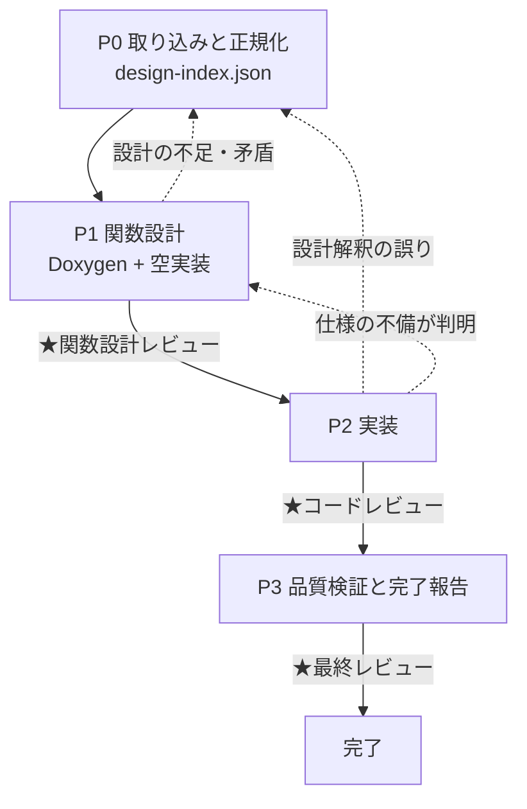

# Next Design → 組込み C++14 実装構築

Next Design の詳細設計から、Doxygen 付きの関数設計と実装を、毎回同じ順序・同じ完了条件で組み上げるためのスキル。単体テストの作成は範囲外（別スキルの担当）だが、後工程がテストを書ける状態を作ることは本スキルの責務に含む。

設計上の勘所は4つ。(1) **設計をその場読みしない** — 入力形式が何であれ先に `work/design-index.json` へ正規化し、以降の全工程はこれを唯一の設計の出典にする。(2) **Doxygen を関数仕様の正本にする** — 入力条件・戻り値の成立条件・異常時の振る舞い・内部状態変化（副作用）を実装前に書き切る。ここが曖昧なまま実装に入ると、後工程の単体テスト設計が実装を正にしてしまう。(3) **レビューを工程として置く** — 指摘は `work/review-log.md` に ID を振って記録し、全件クローズするまで完了としない。(4) **設計 ⇔ 宣言を機械的に突き合わせる** — 実装漏れは目視では必ず取りこぼす。

---

## ワークフロー



| # | フェーズ | 入力 | 出力 |
|---|---|---|---|
| 0 | 取り込みと正規化 | 任意形式の詳細設計 | `work/design-index.json`、対象クラス一覧 |
| 1 | 関数設計 | `work/design-index.json` | `.h` / `.cpp`（Doxygen 付き宣言 + 空実装） |
| 2 | 実装 | `work/design-index.json` + ヘッダ | `.cpp` の実装本体（警告0ビルド） |
| 3 | 品質検証と完了報告 | 全成果物 | 突合結果、完了報告 |

**サイクルの単位はクラス**。P1〜P2 はクラス単位で回す。対象クラスが5個を超える場合は `work/state.json` に進捗を持たせる（「作業の再開」の節を参照）。5個以下なら state は作らず一気に通す。

---

## 手順

### P0: 設計インプットの取り込みと正規化

1. 作業開始時に `work/state.json` の有無を確認する。存在する場合は「作業の再開」の節に従い、無い場合はこのまま続ける。
2. `references/design-input.md` を読み、渡された入力の**形式を判別して経路を選ぶ**。形式が示されていなければ推測せず尋ねる。HTML の場合のみ次を実行する。

   ```
   python scripts/extract_nextdesign_html.py <html> -o work/raw-export.json
   ```

3. `references/design-input.md` の対応づけ手順に従い、`work/design-index.json` を組み立てる。形式は `assets/templates/design-index.schema.json` に従う。**どの入力形式でも出力はこの1つに揃える**。後続フェーズは入力形式を一切意識しない。
4. プロジェクトのログAPI（マクロ名・引数形式・レベル定義）を確認する。無い場合は、仮マクロ（`LOG_DEBUG` / `LOG_INFO` / `LOG_ERROR`）を置く方針をここで合意する（方針の詳細は `references/logging-policy.md`）。
5. 次をユーザーに提示し、**実装スコープの合意を得る**。
   - クラス名・関数シグネチャ・件数の一覧
   - 読み取れなかった箇所、矛盾していた箇所（`open_questions`）
   - 使用するログAPI（または仮マクロ方針）

**完了条件**: `work/design-index.json` が作られ、`open_questions` が解消され、スコープの合意が取れていること。
**戻り条件**: 関数シグネチャが1つも取れない場合は、より詳細な形式での再出力をユーザーに依頼して止まる。自力で補完しない。

### P1: 関数設計（Doxygen + クラスと関数の箱）

1. `references/function-design.md` と `references/autosar-cert-rules.md` を読む。
2. `assets/templates/header-template.h` を雛形に、全クラスのヘッダを書く。全関数の宣言と Doxygen コメントをここで確定させる。**この時点で仕様（入力条件・戻り値の成立条件・異常時の振る舞い・副作用としての内部状態変化）を文章として書き切る**。必須タグは `@brief` / `@param`（方向指定つき）/ `@retval`（値ごとに成立条件を併記。値返しの関数は `@return`）/ `@sideeffect`（副作用が無い場合も「なし」と明記）。後工程はこの記述を仕様の出典として扱う。
3. 対応する `.cpp` を作り、各関数を**空実装**にする。戻り値のある関数は設計上の失敗側の既定値を返し、`// TODO: P2で実装` を残す。
4. ビルド構成（CMakeLists.txt）を用意し、空実装のままビルドする。
5. 次を実行して Doxygen の記述漏れを検査する。

   ```
   python scripts/validate_doxygen.py <ヘッダファイル or ディレクトリ>
   ```

6. **★関数設計レビュー**を行う。`references/review-gates.md` の「1. 関数設計レビュー」のチェックリストを当て、指摘を `work/review-log.md` に記録し、ユーザーに提示して確認を得る。

**完了条件**: `validate_doxygen.py` が終了コード 0、空実装のままビルドが警告0で通り、設計レビューの指摘がすべて記録され、ユーザーの確認を得ていること。
**戻り条件**: 設計に無い型・関数が必要になったら P0 に戻り、ユーザーに設計の確認を求める。勝手に追加しない。

### P2: 実装

`references/logging-policy.md` を読む。Doxygen コメントを仕様として、そのとおりに実装し、ログ方針どおりに DEBUG / INFO / ERROR ログを入れる。以下のループを回す。

```
for 周回 in 1..3:
    実装本体を書く or 直す（ログ含む。Doxygen コメントには触れない）
    cmake --build <build> を実行する
    if 警告0でビルドが通り、全関数の TODO と static_cast<void> 抑止が消えている:
        break（成功として終了）
    エラー・警告の原因を「実装の欠陥」「宣言の誤り」「設計解釈の誤り」に切り分ける
    切り分け結果と加えた変更を work/progress.md に追記する
    実装の欠陥なら該当関数のみを修正する
    宣言の誤り（仕様の不備）なら P1 に戻る（review-log に記録してからヘッダを直す）
    設計解釈の誤りなら修正せず、P0 に戻ってユーザーに確認する
    if 今回の失敗が前回と同一:
        同じ直し方を繰り返さない。前提（設計の読み取り、仕様の解釈）を疑い、
        変えられる方針があれば明記して再開し、無ければユーザーに相談する
else:
    3周しても未達 → 残っているエラー・警告と、周回ごとに試した修正を列挙して報告する。
    成功したかのように報告しない
```

実装が通ったら、コードを整理してからレビューに入る。

1. `references/autosar-cert-rules.md` のルール表を当て、逸脱を直す。
2. 重複、長すぎる関数、意図の読めない命名を整理する。整理のたびにビルドし直し、警告0を保つ。
3. **★コードレビュー**を行う。`references/review-gates.md` の「2. コードレビュー」を当て、指摘を `work/review-log.md` に記録して対応する。
4. 静的解析ツールが環境にある場合は実行し、結果を記録する。無ければ「ツールなし」と記録する（必須ではない）。

**完了条件**: 警告0でビルドが通り、実装から `TODO` と P1 の `static_cast<void>` 抑止が消え、実装が Doxygen の仕様（@retval の成立条件・@sideeffect）と一致し、ログが `references/logging-policy.md` の方針と一致し、コードレビューの指摘が「修正済」または「逸脱承認待ち」として記録されていること。
**戻り条件**: 実装してみて Doxygen の仕様に不備（成立条件の漏れ・矛盾）が見つかったら、実装を仕様に合わせて曲げず、P1 に戻って仕様を直してから実装し直す。

### P3: 品質検証と完了報告

1. 設計 ⇔ 宣言の突合とレビュー指摘のクローズ状況を検査する。

   ```
   python scripts/check_traceability.py --index work/design-index.json --sources <ヘッダディレクトリ> --review-log work/review-log.md
   ```

2. 終了コード 1 なら、欠落・未クローズの指摘を該当フェーズに戻って埋め、再度実行する。
3. `references/autosar-cert-rules.md` のセルフチェック表を当てる。
4. **★最終レビュー**を行う。`references/review-gates.md` の「3. 最終レビュー」に従い、次を提示してユーザーの受け入れ判定を得る。
   - 実装したクラス・関数の件数（設計の件数と一致しているか）
   - レビュー指摘の件数と内訳（修正済 / 逸脱承認済）
   - 逸脱として残したルールとその理由
   - ユーザーに確認を残した事項

**完了条件**: `check_traceability.py` が終了コード 0、セルフチェック表に未対応が無く、ユーザーの受け入れ判定を得ていること。

---

## 禁止事項

- `work/design-index.json` に無い関数・クラス・機能を追加することを禁止する。必要になったら P0 に戻る。
- P1 のゲート（Doxygen 検査・ビルド通過・設計レビュー）を飛ばして実装に入ることを禁止する。
- **P2 以降で Doxygen コメントを実装に合わせて書き換えることを禁止する。** 仕様と実装がずれたら直すのは実装側。仕様そのものを変える必要があるなら、ユーザーの確認を経て P1 に戻る。
- 警告を抑止オプションやプラグマで消して「警告0」とすることを禁止する。原因を直す。
- レビューを「確認しました」で済ませることを禁止する。指摘ゼロの場合も、当てたチェックリストと結論を `work/review-log.md` に残す。
- 設計から仕様（戻り値の成立条件・異常時の振る舞い）が決まらない箇所を、推測で埋めて先に進むことを禁止する。

---

## 作業の再開

対象クラスが5個を超える場合、P0 の終わりに `assets/templates/state.json.template` を雛形として `work/state.json` を作り、クラス単位で進捗を持たせる。更新はクラスの処理開始時（`running`）と完了直後（`done` + 生成物のパス）に行い、最後にまとめて書かない。

作業開始時に `work/state.json` が存在する場合:

1. 内容と更新時刻をユーザーに提示し、続きから再開してよいか確認する。
2. `done` のフェーズは再実行しない。ただし記録された生成物が実在するかを確認し、消えていれば `pending` に戻す。
3. `running` のまま残っているものは中断されたものとみなし、`pending` に戻して再実行する。
4. `failed` は試行回数を確認し、3回に達していれば再試行せずユーザーに相談する。
5. `work/review-log.md` に `open` の指摘が残っていないかを確認し、残っていれば再開前に提示する。

進捗の報告粒度は、フェーズの切り替わりとクラスの区切りで1〜2行。失敗・方針変更・レビュー指摘は即時に報告する。クラス1個ごとの成功報告は不要。

---

## 参照ファイル

必要になったときに読む。全部読む必要はない。

| ファイル | 読むタイミング |
|---|---|
| `references/design-input.md` | P0 で入力形式を判別し `work/design-index.json` に正規化するとき |
| `references/function-design.md` | P1 で Doxygen 付きの宣言と空実装を書くとき |
| `references/logging-policy.md` | P2 で実装にログを入れるとき（P0 のログAPI確認でも方針を参照する） |
| `references/review-gates.md` | P1・P2・P3 の各★レビューを行うとき（毎回） |
| `references/autosar-cert-rules.md` | P1・P2 で実装方針を決めるとき、P3 でセルフチェックするとき |

## スクリプト

いずれも Python 3 標準ライブラリのみで動く。スキルディレクトリからの相対パスで示している。

```
python scripts/extract_nextdesign_html.py <html> -o <出力json>
```
P0 で入力が HTML のときだけ使う。見出し階層・表・図のテキストを構造を保ったまま JSON に落とす。意味づけはしない。終了コード: 0=成功 / 1=読み込みまたはパース失敗 / 2=引数誤り。

```
python scripts/validate_doxygen.py <ヘッダファイル or ディレクトリ> [--quiet]
```
P1 のゲートで使う。各関数宣言に `@brief`、全引数分の `@param`、戻り値がある場合の `@return` または `@retval`、全関数の `@sideeffect` がそろっているかを判定する。終了コード: 0=合格 / 1=ERROR あり / 2=引数誤り。

```
python scripts/check_traceability.py --index <design-index.json> --sources <ヘッダディレクトリ> [--review-log <review-log.md>]
```
P3 のゲートで使う。設計上の関数 ⇔ ヘッダの宣言を突き合わせ、欠落を列挙する。`--review-log` を渡すと、状態が `open` のレビュー指摘が残っていないかも検査する。終了コード: 0=欠落なし / 1=欠落あり / 2=引数誤り。

## テンプレート

コピーして埋める。

| ファイル | 使うとき |
|---|---|
| `assets/templates/design-index.schema.json` | P0 で `work/design-index.json` を組み立てるとき |
| `assets/templates/header-template.h` | P1 でヘッダを書き始めるとき |
| `assets/templates/review-log.md` | P1 の最初のレビューで `work/review-log.md` を作るとき |
| `assets/templates/state.json.template` | 対象クラスが5個を超え、進捗管理を入れるとき |
