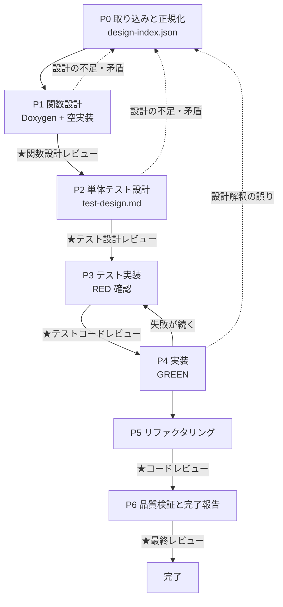

# Next Design → 組込み C++14 SW 構築（TDD）

Next Design の詳細設計から、Doxygen 付きのコードと GoogleTest 一式を**テストファースト**で組み上げる工程を、毎回同じ順序・同じ完了条件で回すためのスキル。

設計上の勘所は4つ。(1) **設計をその場読みしない** — 入力形式が何であれ先に `work/design-index.json` へ正規化し、以降の全工程はこれを唯一の設計の出典にする。(2) **RED を機械判定する** — 「テストを書いた」だけでは、そのテストが何も検証していないことに気づけない。実装前に全件が確かに失敗することを証拠として残す。(3) **レビューを工程として置く** — 指摘は `work/review-log.md` に ID を振って記録し、全件クローズするまで完了としない。(4) **設計 ⇔ 宣言 ⇔ テスト観点 ⇔ テストコードを機械的に突き合わせる** — 実装漏れ・テスト漏れは目視では必ず取りこぼす。

---

## ワークフロー



| # | フェーズ | 入力 | 出力 |
|---|---|---|---|
| 0 | 取り込みと正規化 | 任意形式の詳細設計 | `work/design-index.json`、対象クラス一覧 |
| 1 | 関数設計 | `work/design-index.json` | `.h` / `.cpp`（Doxygen 付き宣言 + 空実装） |
| 2 | 単体テスト設計 | `work/design-index.json` + ヘッダ | `work/test-design.md` |
| 3 | テスト実装 | `work/test-design.md` | `test_*.cpp`、`work/red-evidence.txt` |
| 4 | 実装 | 上記すべて | `.cpp` の実装本体（全テストパス） |
| 5 | リファクタリング | 上記 | 整理済みのコード（グリーン維持） |
| 6 | 品質検証と完了報告 | 全成果物 | カバレッジ、完了報告 |

**サイクルの単位はクラス**。P1〜P5 はクラス単位で回す。対象クラスが5個を超える場合は `work/state.json` に進捗を持たせる（「作業の再開」の節を参照）。5個以下なら state は作らず一気に通す。

---

## 手順

### P0: 設計インプットの取り込みと正規化

1. 作業開始時に `work/state.json` の有無を確認する。存在する場合は「作業の再開」の節に従い、無い場合はこのまま続ける。
2. `references/design-input.md` を読み、渡された入力の**形式を判別して経路を選ぶ**。形式が示されていなければ推測せず尋ねる。HTML の場合のみ次を実行する。

   ```
   python scripts/extract_nextdesign_html.py <html> -o work/raw-export.json
   ```

3. `references/design-input.md` の対応づけ手順に従い、`work/design-index.json` を組み立てる。形式は `assets/templates/design-index.schema.json` に従う。**どの入力形式でも出力はこの1つに揃える**。後続フェーズは入力形式を一切意識しない。
4. カバレッジ目標値をユーザーに確認する。既定は C0 100% / C1 100%。計測ツールの有無もここで確認する。
5. 次をユーザーに提示し、**実装スコープの合意を得る**。
   - クラス名・関数シグネチャ・件数の一覧
   - 読み取れなかった箇所、矛盾していた箇所（`open_questions`）
   - カバレッジ目標と計測手段

**完了条件**: `work/design-index.json` が作られ、`open_questions` が解消され、スコープとカバレッジ目標の合意が取れていること。
**戻り条件**: 関数シグネチャが1つも取れない場合は、より詳細な形式での再出力をユーザーに依頼して止まる。自力で補完しない。

### P1: 関数設計（Doxygen + クラスと関数の箱）

1. `references/function-design.md` と `references/autosar-cert-rules.md` を読む。
2. `assets/templates/header-template.h` を雛形に、全クラスのヘッダを書く。全関数の宣言と Doxygen コメントをここで確定させる。**この時点で仕様（事前条件・事後条件・エラー時の戻り値）を文章として書き切る**。後工程はこの記述を仕様の出典として扱う。
3. 対応する `.cpp` を作り、各関数を**空実装**にする。戻り値のある関数は設計上の失敗側の既定値を返し、`// TODO: P4で実装` を残す。
4. ビルド構成（CMakeLists.txt）を用意し、空実装のままビルドする。
5. 次を実行して Doxygen の記述漏れを検査する。

   ```
   python scripts/validate_doxygen.py <ヘッダファイル or ディレクトリ>
   ```

6. **★関数設計レビュー**を行う。`references/review-gates.md` の「1. 関数設計レビュー」のチェックリストを当て、指摘を `work/review-log.md` に記録し、ユーザーに提示して確認を得る。

**完了条件**: `validate_doxygen.py` が終了コード 0、空実装のままビルドが警告0で通り、設計レビューの指摘がすべて記録され、ユーザーの確認を得ていること。
**戻り条件**: 設計に無い型・関数が必要になったら P0 に戻り、ユーザーに設計の確認を求める。勝手に追加しない。

### P2: 単体テスト設計

1. `references/unit-test-design.md` を読む。
2. `assets/templates/test-design-template.md` をコピーして `work/test-design.md` を作る。
3. 全 public 関数について、テスト観点を導出する。1関数あたり最低でも正常系1件、境界値1件、異常系1件を検討し、該当しない区分は「該当なし」と理由を書く（空欄にしない）。
4. 各観点行に一意な**テストID**（`UT_<クラス名>_<関数名>_<連番>`）を振る。P3 のテスト名はこの ID をそのまま使う。
5. **★テスト設計レビュー**を行う。`references/review-gates.md` の「2. テスト設計レビュー」を当て、観点表をユーザーに提示して過不足の確認を得る。

**完了条件**: 全 public 関数に1行以上の観点があり、各行の「事前条件 / 入力 / 期待結果 / 区分 / 根拠」がすべて埋まり、レビューの確認を得ていること。
**戻り条件**: 期待結果が設計から決まらない関数があれば、その関数を一覧にしてユーザーに確認する。期待結果を実装都合で決めない。

### P3: テスト実装と RED 確認

**この時点で実装は空実装のまま**。実装に手を付けずにテストコードを書き切る。

1. `references/gtest-implementation.md` を読む。
2. `assets/templates/gtest-template.cpp` を雛形に、`work/test-design.md` の**全行**に対応する `TEST` / `TEST_F` を書く。テスト名はテストIDと一致させる。
3. 依存クラスは gmock でモック化する。モック化のために本体の設計を変える必要が出たら、P0 に戻って設計側（依存注入の可否）を確認する。
4. CMake にテストターゲットを登録し、ビルドして実行し、**出力をファイルに残す**。

   ```
   cmake --build <build>
   ctest --test-dir <build> --output-on-failure > work/red-evidence.txt 2>&1
   ```

5. RED を機械判定する。

   ```
   python scripts/check_red_state.py --design work/test-design.md --log work/red-evidence.txt
   ```

6. **★テストコードレビュー**を行う。`references/review-gates.md` の「3. テストコードレビュー」を当て、指摘を `work/review-log.md` に記録する。

**完了条件**: `check_red_state.py` が終了コード 0（＝ビルドは成功し、観点表の全テストが実行され、全件が失敗している）かつテストコードレビューの指摘が記録されていること。
**戻り条件**: ビルドが通らない場合は RED ではない。テストコードかヘッダの誤りなので直す。実装を書いて通すことは禁止する。

**実装前に通ってしまうテストがあったら、それは何も検証していない。** 期待値を実装の既定値に合わせて書いてしまった疑いがあるので、観点表の期待結果に立ち返って書き直す。

### P4: 実装（GREEN）

以下のループを回す。**このフェーズではテストコードを修正しない。**

```
for 周回 in 1..3:
    実装本体を書く or 直す（テストコードには触れない）
    cmake --build <build> を実行する
    ctest --test-dir <build> --output-on-failure を実行する
    if 全テストパス:
        break（成功として終了）
    失敗したテストのみを対象に、原因を「実装の欠陥」「テストの誤り」「設計解釈の誤り」に切り分ける
    切り分け結果と加えた変更を work/progress.md に追記する
    実装の欠陥なら該当関数のみを修正する
    テストの誤りなら実装を曲げず、P3 に戻る（review-log に記録してからテストを直す）
    設計解釈の誤りなら修正せず、P0 に戻ってユーザーに確認する
    if 今回の失敗が前回と同一:
        同じ直し方を繰り返さない。前提（設計の読み取り、テストの期待値）を疑い、
        変えられる方針があれば明記して再開し、無ければユーザーに相談する
else:
    3周しても未達 → 残っている失敗テストと、周回ごとに試した修正を列挙して報告する。
    成功したかのように報告しない
```

**完了条件**: 全テストがパスし、実装から `TODO` が消え、警告0でビルドが通ること。

### P5: リファクタリング

**グリーンを保ったまま**コードを整理する。振る舞いを変える変更はここでは行わない。

1. `references/autosar-cert-rules.md` のルール表を当て、逸脱を直す。
2. 重複、長すぎる関数、意図の読めない命名を整理する。
3. P1 の暫定措置（未使用引数の `static_cast<void>` による抑止）が残っていないか確認して消す。
4. **変更のたびに ctest を実行し、グリーンが保たれていることを確認する。** 1件でも落ちたら、その変更を戻してから別の方法を採る。
5. **★コードレビュー**を行う。`references/review-gates.md` の「4. コードレビュー」を当て、指摘を `work/review-log.md` に記録して対応する。
6. 静的解析ツールが環境にある場合は実行し、結果を記録する。無ければ「ツールなし」と記録する（必須ではない）。

**完了条件**: 全テストがパスしたまま、警告0でビルドが通り、コードレビューの指摘が「修正済」または「逸脱承認待ち」として記録されていること。
**禁止**: リファクタリング中に機能を追加・変更すること。必要になったら P0 に戻る。

### P6: 品質検証と完了報告

1. カバレッジを取得する（計測手段がある場合）。P0 で合意した目標に未達なら、未達の行・分岐を一覧化し、**観点を追加して P2 に戻る**か、除外理由を `work/review-log.md` に記録する。計測手段が無い環境では「計測不可」と報告に明記する。
2. トレーサビリティとレビュー指摘を検査する。

   ```
   python scripts/check_traceability.py --index work/design-index.json --design work/test-design.md --tests <テストディレクトリ> --sources <ソースディレクトリ> --review-log work/review-log.md
   ```

3. 終了コード 1 なら、欠落・未クローズの指摘を該当フェーズに戻って埋め、再度実行する。
4. `references/autosar-cert-rules.md` のセルフチェック表を当てる。
5. **★最終レビュー**を行う。`references/review-gates.md` の「5. 最終レビュー」に従い、次を提示してユーザーの受け入れ判定を得る。
   - 実装したクラス・関数の件数、テスト件数とパス数
   - カバレッジ（目標値と実測、未達箇所とその扱い）
   - レビュー指摘の件数と内訳（修正済 / 逸脱承認済）
   - 逸脱として残したルールとその理由
   - ユーザーに確認を残した事項

**完了条件**: `check_traceability.py` が終了コード 0、セルフチェック表に未対応が無く、ユーザーの受け入れ判定を得ていること。

---

## 禁止事項

- テストの削除・`DISABLED_` 化・`GTEST_SKIP()`・アサーションの弱体化・期待値の実測値への書き換えによって「パス」させることを禁止する。
- **P3 の前に実装を書くことを禁止する。** 空実装のまま RED を確認するまで実装に触れない。
- **P4 でテストコードを修正することを禁止する。** テスト側の誤りだと判断した場合は P3 に戻り、`work/review-log.md` に記録してから直す。
- `work/design-index.json` に無い関数・クラス・機能を追加することを禁止する。必要になったら P0 に戻る。
- P1 のゲート（Doxygen 検査・ビルド通過・設計レビュー）を飛ばして先に進むことを禁止する。
- P4 以降で Doxygen コメントを書き換えて実装に合わせることを禁止する。仕様を変えるのはユーザーの確認を経てからにする。
- レビューを「確認しました」で済ませることを禁止する。指摘ゼロの場合も、当てたチェックリストと結論を `work/review-log.md` に残す。
- 設計から期待結果が決まらない箇所を、推測で埋めて先に進むことを禁止する。

---

## 作業の再開

対象クラスが5個を超える場合、P0 の終わりに `assets/templates/state.json.template` を雛形として `work/state.json` を作り、クラス単位で進捗を持たせる。更新はクラスの処理開始時（`running`）と完了直後（`done` + 生成物のパス）に行い、最後にまとめて書かない。

作業開始時に `work/state.json` が存在する場合:

1. 内容と更新時刻をユーザーに提示し、続きから再開してよいか確認する。
2. `done` のフェーズは再実行しない。ただし記録された生成物が実在するかを確認し、消えていれば `pending` に戻す。
3. `running` のまま残っているものは中断されたものとみなし、`pending` に戻して再実行する。
4. `failed` は試行回数を確認し、3回に達していれば再試行せずユーザーに相談する。
5. `work/review-log.md` に `open` の指摘が残っていないかを確認し、残っていれば再開前に提示する。

進捗の報告粒度は、フェーズの切り替わりとクラスの区切りで1〜2行。失敗・方針変更・レビュー指摘は即時に報告する。クラス1個ごとの成功報告は不要。

---

## 参照ファイル

必要になったときに読む。全部読む必要はない。

| ファイル | 読むタイミング |
|---|---|
| `references/design-input.md` | P0 で入力形式を判別し `work/design-index.json` に正規化するとき |
| `references/function-design.md` | P1 で Doxygen 付きの宣言と空実装を書くとき |
| `references/unit-test-design.md` | P2 でテスト観点を導出するとき |
| `references/gtest-implementation.md` | P3 で gtest / gmock のコードと CMake を書くとき、P5 でリファクタするとき |
| `references/review-gates.md` | P1・P2・P3・P5・P6 の各★レビューを行うとき（毎回） |
| `references/autosar-cert-rules.md` | P1・P5 で実装方針を決めるとき、P6 でセルフチェックするとき |

## スクリプト

いずれも Python 3 標準ライブラリのみで動く。スキルディレクトリからの相対パスで示している。

```
python scripts/extract_nextdesign_html.py <html> -o <出力json>
```
P0 で入力が HTML のときだけ使う。見出し階層・表・図のテキストを構造を保ったまま JSON に落とす。意味づけはしない。終了コード: 0=成功 / 1=読み込みまたはパース失敗 / 2=引数誤り。

```
python scripts/validate_doxygen.py <ヘッダファイル or ディレクトリ> [--quiet]
```
P1 のゲートで使う。各関数宣言に `@brief`、全引数分の `@param`、戻り値がある場合の `@return` または `@retval` がそろっているかを判定する。終了コード: 0=合格 / 1=ERROR あり / 2=引数誤り。

```
python scripts/check_red_state.py --design <test-design.md> --log <ctest の出力ログ>
```
P3 のゲートで使う。ctest / gtest の出力を解析し、観点表の全テストが実行され全件失敗しているかを判定する。実行0件、未実行のテストID、成功またはスキップしたテストがあれば不合格。終了コード: 0=正しく RED / 1=RED と認められない / 2=引数誤り。

```
python scripts/check_traceability.py --index <design-index.json> --design <test-design.md> --tests <テストディレクトリ> [--sources <ソースディレクトリ>] [--review-log <review-log.md>]
```
P6 のゲートで使う。設計上の関数 ⇔ ヘッダの宣言 ⇔ テスト観点行 ⇔ テストコードの4者を突き合わせ、欠落を列挙する。`--review-log` を渡すと、状態が `open` のレビュー指摘が残っていないかも検査する。`--sources` を省略すると宣言との突合はスキップする。終了コード: 0=欠落なし / 1=欠落あり / 2=引数誤り。

## テンプレート

コピーして埋める。

| ファイル | 使うとき |
|---|---|
| `assets/templates/design-index.schema.json` | P0 で `work/design-index.json` を組み立てるとき |
| `assets/templates/header-template.h` | P1 でヘッダを書き始めるとき |
| `assets/templates/test-design-template.md` | P2 で観点表を作るとき |
| `assets/templates/gtest-template.cpp` | P3 でテストコードを書き始めるとき |
| `assets/templates/review-log.md` | P1 の最初のレビューで `work/review-log.md` を作るとき |
| `assets/templates/state.json.template` | 対象クラスが5個を超え、進捗管理を入れるとき |
