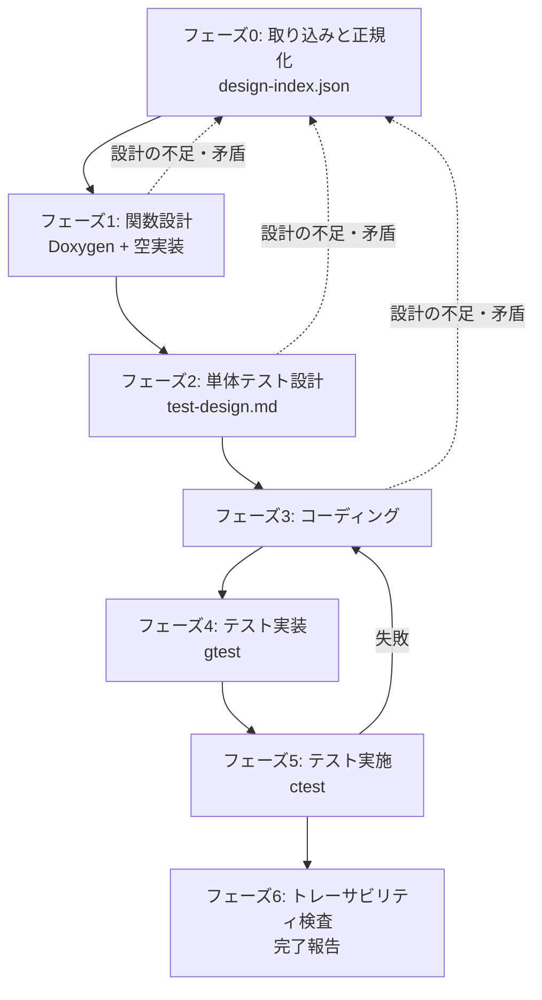

# Next Design → 組込み C++14 SW 構築

Next Design の詳細設計 HTML から、Doxygen 付きのコードと GoogleTest 一式を組み上げる工程を、毎回同じ順序・同じ完了条件で回すためのスキル。

設計上の勘所は3つ。(1) **HTML をその場読みしない** — 先に `work/design-index.json` へ正規化し、以降の全工程はこの JSON を唯一の設計の出典にする。読むたびに解釈がぶれると後工程が全部揺れる。(2) **各フェーズにビルド可能というゲートを置く** — 「箱を作る」段階でビルドを通しておかないと、実装とテストの失敗が混ざって切り分け不能になる。(3) **設計 ⇔ 宣言 ⇔ テスト観点 ⇔ テストコードの4者を機械的に突き合わせる** — 実装漏れ・テスト漏れは目視では必ず取りこぼす。

---

## ワークフロー



| # | フェーズ | 入力 | 出力 |
|---|---|---|---|
| 0 | 取り込みと正規化 | Next Design の HTML エクスポート | `work/design-index.json`、対象クラス一覧 |
| 1 | 関数設計 | `work/design-index.json` | `.h` / `.cpp`（Doxygen 付き宣言 + 空実装） |
| 2 | 単体テスト設計 | `work/design-index.json` + ヘッダ | `work/test-design.md` |
| 3 | コーディング | 上記すべて | `.cpp` の実装本体 |
| 4 | テスト実装 | `work/test-design.md` | `test_*.cpp` + CMake 登録 |
| 5 | テスト実施 | ビルド済みツリー | ctest 結果、カバレッジ |
| 6 | トレーサビリティ検査 | 全成果物 | 完了報告 |

対象クラスが5個を超える場合は、フェーズ1〜5を**クラス単位のバッチ**で回し、`work/state.json` に進捗を持たせる（「作業の再開」の節を参照）。5個以下なら state は作らず一気に通す。

---

## 手順

### フェーズ0: 設計インプットの取り込みと正規化

1. 作業開始時に `work/state.json` の有無を確認する。存在する場合は「作業の再開」の節に従い、無い場合はこのまま続ける。
2. Next Design の HTML エクスポートのパスをユーザーから受け取る。示されていなければ**推測せず尋ねる**。
3. 次を実行し、HTML を中間 JSON に落とす。

   ```
   python scripts/extract_nextdesign_html.py <html> -o work/raw-export.json
   ```

4. `references/nextdesign-input.md` を読み、`work/raw-export.json` を `work/design-index.json` へ意味づけする。クラス、属性、操作のシグネチャ、関連、シーケンス図由来の呼び出し順を拾う。形式は `assets/templates/design-index.schema.json` に従う。
5. クラス名・関数シグネチャ・件数の一覧を表でユーザーに提示し、**実装スコープの合意を得る**。同時に、読み取れなかった箇所（シグネチャが欠けている、型が不明、図と表が矛盾している）を列挙して確認する。

**完了条件**: `work/design-index.json` が作られ、スコープの合意が取れていること。
**戻り条件**: HTML から関数シグネチャが1つも取れない場合は、エクスポート設定（詳細度）の確認をユーザーに求めて止まる。自力で補完しない。

### フェーズ1: 関数設計（Doxygen + クラスと関数の箱）

1. `references/function-design.md` と `references/autosar-cert-rules.md` を読む。
2. `assets/templates/header-template.h` を雛形に、`work/design-index.json` の全クラスについてヘッダを書く。全 public / protected / private 関数の宣言と Doxygen コメントをここで確定させる。**この時点で仕様（事前条件・事後条件・エラー時の戻り値）を文章として書き切る**。後工程はこの記述を仕様の出典として扱う。
3. 対応する `.cpp` を作り、各関数を**空実装**にする。戻り値のある関数は設計上の既定値（エラー値）を返し、`// TODO: フェーズ3で実装` を残す。
4. ビルド構成（CMakeLists.txt）を用意し、空実装のままビルドする。
5. 次を実行して Doxygen の記述漏れを検査する。

   ```
   python scripts/validate_doxygen.py <ヘッダファイル or ディレクトリ>
   ```

**完了条件**: `validate_doxygen.py` が終了コード 0、かつ空実装のままビルドが警告0で通ること。
**戻り条件**: 設計に無い型・関数が必要になったらフェーズ0に戻り、ユーザーに設計の確認を求める。勝手に追加しない。

### フェーズ2: 単体テスト設計

1. `references/unit-test-design.md` を読む。
2. `assets/templates/test-design-template.md` をコピーして `work/test-design.md` を作る。
3. `work/design-index.json` の全 public 関数について、テスト観点を導出する。1関数あたり最低でも正常系1件、境界値1件、異常系1件を検討し、該当しない区分は「該当なし」と理由を書く（空欄にしない）。
4. 各観点行に一意な**テストID**（`UT_<クラス名>_<関数名>_<連番>`）を振る。フェーズ4のテスト名はこの ID をそのまま使う。
5. 観点表をユーザーに提示し、過不足の確認を得る。

**完了条件**: `work/design-index.json` の全 public 関数に1行以上の観点があり、各行の「事前条件 / 入力 / 期待結果 / 区分」がすべて埋まっていること。
**戻り条件**: 期待結果が設計から決まらない関数があれば、その関数を一覧にしてユーザーに確認する。期待結果を実装都合で決めない。

### フェーズ3: コーディング

1. `references/autosar-cert-rules.md` のルール表を参照しながら、フェーズ1で書いた Doxygen の仕様どおりに実装本体を書く。
2. Doxygen コメントは**変更しない**。実装しているうちに仕様と食い違うことに気づいたら、実装を曲げずにフェーズ0へ戻り、設計の解釈をユーザーに確認する。
3. 警告0でビルドが通ることを確認する（`-Wall -Wextra -Werror` 相当）。

**完了条件**: 全対象クラスの実装から `TODO` が消え、警告0でビルドが通ること。

### フェーズ4: 単体テスト実装

1. `references/gtest-implementation.md` を読む。
2. `assets/templates/gtest-template.cpp` を雛形に、`work/test-design.md` の**全行**に対応する `TEST` / `TEST_F` を書く。テスト名はフェーズ2で振ったテストIDと一致させる。
3. 依存クラスは gmock でモック化する。モック化のために本体の設計を変える必要が出たら、フェーズ0に戻って設計側（依存注入の可否）を確認する。
4. CMake にテストターゲットを登録し、`ctest` から見えるようにする。

**完了条件**: `work/test-design.md` の全テストIDに対応するテストがビルド対象に存在すること（フェーズ6の `check_traceability.py` で判定する）。

### フェーズ5: 単体テスト実施

以下のループを回す。

```
for 周回 in 1..3:
    cmake --build <build> を実行する
    ctest --test-dir <build> --output-on-failure を実行する
    if 全テストパス:
        break（成功として終了）
    失敗したテストのみを対象に、原因を「実装の欠陥」「テストの誤り」「設計解釈の誤り」に切り分ける
    切り分け結果と加えた変更を work/progress.md に追記する
    実装の欠陥ならフェーズ3の該当関数のみ、テストの誤りなら該当テストのみを修正する
    設計解釈の誤りなら修正せず、フェーズ0に戻ってユーザーに確認する
    if 今回の失敗が前回と同一:
        同じ直し方を繰り返さない。前提（設計の読み取り、テストの期待値）を疑い、
        変えられる方針があれば明記して再開し、無ければユーザーに相談する
else:
    3周しても未達 → 残っている失敗テストと、周回ごとに試した修正を列挙して報告する。
    成功したかのように報告しない
```

カバレッジ計測が構成に含まれている場合は、あわせて取得し、フェーズ6の報告に含める。含まれていなければ計測は省略してよい（そのことを報告に明記する）。

**完了条件**: 全テストがパスすること。

### フェーズ6: トレーサビリティ検査と完了報告

1. 次を実行する。

   ```
   python scripts/check_traceability.py --index work/design-index.json --design work/test-design.md --tests <テストディレクトリ> --sources <ソースディレクトリ>
   ```

2. 終了コード 1（欠落あり）なら、欠落した関数・テストIDを該当フェーズに戻って埋める。埋めたら再度実行する。
3. `references/autosar-cert-rules.md` のセルフチェック表を当て、逸脱があれば直すか、直せない場合は理由を Doxygen に明記する。
4. 完了報告として次を提示する: 実装したクラス・関数の件数、テスト件数とパス数、カバレッジ（取得した場合）、逸脱として残したルールとその理由、ユーザーに確認を残した事項。

**完了条件**: `check_traceability.py` が終了コード 0、かつセルフチェック表に未対応が無いこと。

---

## 禁止事項

- テストの削除・`DISABLED_` 化・アサーションの弱体化・期待値の実測値への書き換えによって「パス」させることを禁止する。テストが通らない場合は実装か設計解釈のどちらかが誤っている。
- `work/design-index.json` に無い関数・クラス・機能を追加することを禁止する。必要になったらフェーズ0に戻る。
- フェーズ1のゲート（Doxygen 検査とビルド通過）を飛ばしてフェーズ3に進むことを禁止する。
- フェーズ3で Doxygen コメントを書き換えて実装に合わせることを禁止する。仕様を変えるのはユーザーの確認を経てからにする。
- 設計から期待結果が決まらない箇所を、推測で埋めて先に進むことを禁止する。

---

## 作業の再開

対象クラスが5個を超える場合、フェーズ0の終わりに `assets/templates/state.json.template` を雛形として `work/state.json` を作り、クラス単位で進捗を持たせる。更新はクラスの処理開始時（`running`）と完了直後（`done` + 生成物のパス）に行い、最後にまとめて書かない。

作業開始時に `work/state.json` が存在する場合:

1. 内容と更新時刻をユーザーに提示し、続きから再開してよいか確認する。
2. `done` のクラスは再実行しない。ただし記録された生成物が実在するかを確認し、消えていれば `pending` に戻す。
3. `running` のまま残っているものは中断されたものとみなし、`pending` に戻して再実行する。
4. `failed` は試行回数を確認し、3回に達していれば再試行せずユーザーに相談する。

進捗の報告粒度は、フェーズの切り替わりとバッチの区切りで1〜2行。失敗と方針変更は即時に報告する。クラス1個ごとの成功報告は不要。

---

## 参照ファイル

必要になったときに読む。全部読む必要はない。

| ファイル | 読むタイミング |
|---|---|
| `references/nextdesign-input.md` | フェーズ0で HTML を `work/design-index.json` に意味づけするとき |
| `references/function-design.md` | フェーズ1で Doxygen 付きの宣言と空実装を書くとき |
| `references/unit-test-design.md` | フェーズ2でテスト観点を導出するとき |
| `references/gtest-implementation.md` | フェーズ4で gtest / gmock のコードと CMake を書くとき |
| `references/autosar-cert-rules.md` | フェーズ1・3で実装方針を決めるとき、フェーズ6でセルフチェックするとき |

## スクリプト

いずれも Python 3 標準ライブラリのみで動く。スキルディレクトリからの相対パスで示している。

```
python scripts/extract_nextdesign_html.py <html> -o <出力json>
```
フェーズ0で使う。HTML の見出し階層・表・図のテキストを構造を保ったまま JSON に落とす。意味づけはしない。終了コード: 0=成功 / 1=読み込みまたはパース失敗 / 2=引数誤り。

```
python scripts/validate_doxygen.py <ヘッダファイル or ディレクトリ> [--quiet]
```
フェーズ1のゲートで使う。各関数宣言に `@brief`、全引数分の `@param`、戻り値がある場合の `@return` または `@retval` がそろっているかを判定する。終了コード: 0=合格 / 1=ERROR あり / 2=引数誤り。

```
python scripts/check_traceability.py --index <design-index.json> --design <test-design.md> --tests <テストディレクトリ> [--sources <ソースディレクトリ>]
```
フェーズ6のゲートで使う。設計上の関数 ⇔ ヘッダの宣言 ⇔ テスト観点行 ⇔ テストコードの4者を突き合わせ、欠落を列挙する。`--sources` を省略すると宣言との突合はスキップする。終了コード: 0=欠落なし / 1=欠落あり / 2=引数誤り。

## テンプレート

コピーして埋める。

| ファイル | 使うとき |
|---|---|
| `assets/templates/design-index.schema.json` | フェーズ0で `work/design-index.json` を組み立てるとき |
| `assets/templates/header-template.h` | フェーズ1でヘッダを書き始めるとき |
| `assets/templates/test-design-template.md` | フェーズ2で観点表を作るとき |
| `assets/templates/gtest-template.cpp` | フェーズ4でテストコードを書き始めるとき |
| `assets/templates/state.json.template` | 対象クラスが5個を超え、進捗管理を入れるとき |
