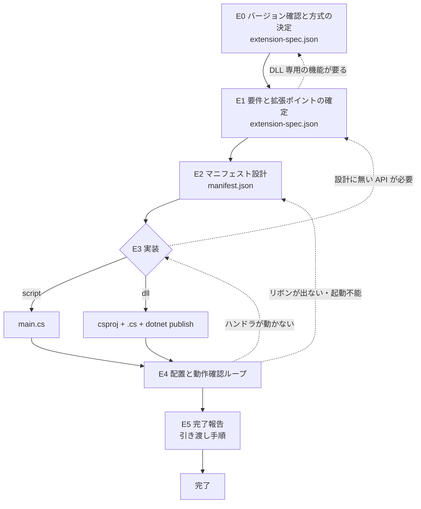

# Next Design 拡張機能の開発

Next Design のエクステンションを C# スクリプト（`manifest.json` + `main.cs`）か DLL（`.csproj` を .NET SDK でビルド）で作り、実機で動くところまで持っていくためのスキル。DLL 方式は Visual Studio を使わず、.NET SDK と VS Code で開発する。

設計上の勘所は5つ。(1) **バージョンを確定しないと何も書けない** — 公式ドキュメントはバージョンごとに別系統で、マニフェストのキーも使える言語も実際に違う。V3.x は C# のみで Python が無く、キーの綴りすら V5.x と異なる。だから最初の工程はバージョンを尋ねることで、これは確認ではなく**参照先を決めるゲート**である。(2) **新規作成では方式を先に決める** — スクリプトと DLL は処理性能が同じで、違うのは初回のコンパイル待ち、DLL でしか使えない機能、必要な環境。要件で決まるので、ユーザーに判断材料を示して選んでもらう。既存の拡張を直すときはファイルから判定し、尋ねない。(3) **マニフェストの誤りは Next Design 自体を起動不能にする** — しかもエラーを出さずに黙って落ちる。配置前に機械検査を通すのはこのため。(4) **スクリプトではデバッガが使えない** — C# のコンパイルエラーは**ハンドラが最初に呼ばれた時点**で Output ウィンドウにしか出ない。DLL ならビルド時にコンパイルエラーが出る。(5) **動作確認はユーザーの環境でしかできない** — エージェントは Next Design を起動できない。手順を提示して結果の報告を受け取るまでを工程に含める。

---

## ワークフロー



| # | フェーズ | 入力 | 出力 |
|---|---|---|---|
| 0 | バージョン確認、ドキュメント基点と方式の決定 | ユーザーへの質問 / 既存ファイル | `work/extension-spec.json`（`ndVersion`, `docBase`, `implementation`） |
| 1 | 要件と拡張ポイントの確定 | 自動化したい内容 | 同上（`requirements`, `extensionPoints`, `lifecycle`） |
| 2 | マニフェスト設計 | `extension-spec.json` | `<拡張機能名>/manifest.json` |
| 3 | 実装 | `manifest.json` | script: `<拡張機能名>/main.cs` / dll: `.csproj`・`.cs`・publish 出力 |
| 4 | 配置と動作確認ループ | 配置するファイル一式 | 動作確認の結果 |
| 5 | 完了報告 | 全成果物 | 配置先・更新手順・既知の制約 |

**スクリプト方式では、成果物を最初から配置後のディレクトリ構造そのままで作る。** `manifest.json` / `main.cs` / `resources/` を1つのディレクトリにまとめ、そのディレクトリごと extensions フォルダへコピーさせる。**DLL 方式では、ソースのディレクトリと配置するもの（publish の出力）を分ける。** 配置先でビルドさせない。

**各フェーズを終えたその場で `work/extension-spec.json` の `phase` を更新する。** まとめて最後に書かない。中断されたときに何も残らない。

### E4 のループ

```
for 周回 in 1..3:
    配置するファイルを extensions フォルダへ置き、Next Design を再起動する
      （拡張機能は起動時にしか読まれない。DLL は実行中に差し替えられない）
    ユーザーに確認手順を提示し、結果の報告を受け取る
    if 期待どおり動作した:
        break（成功として終了）
    症状から原因を切り分ける（references/troubleshooting.md、DLL は references/dll-extension.md の「よくある失敗」）
    if 今回の症状が前回と同一:
        同じ直し方を繰り返さない。前提を疑い、該当バージョンのドキュメントを読み直す
    指摘された箇所だけを直す（manifest.json とソースを書き直さない）
else:
    3周しても未達 → 症状・Output ウィンドウの出力・周回ごとに試した修正を列挙して報告する。
    動いたかのように報告しない
```

- **成功条件**: リボン要素が表示され、ハンドラが期待どおり動作し、Output ウィンドウに例外が出ていないことを**ユーザーが報告したこと**
- **上限**: 3周
- **諦め条件**: 3周未達、または同一症状が2回続いて原因の仮説が立たない場合。ドキュメントで裏が取れない挙動に当たったら、周回を消費せずに止まってユーザーに相談する

---

## 手順

### E0: バージョン確認、ドキュメント基点と方式の決定

**このスキルで最初にやることは、必ずバージョンを尋ねることである。** 他のどの作業よりも先に行う。

1. 作業開始時に `work/extension-spec.json` の有無を確認する。存在する場合は「作業の再開」の節に従い、無い場合はこのまま続ける。
2. ユーザーに尋ねる。

   > お使いの Next Design のバージョンを教えてください（例: V3.2）。Next Design の ヘルプ > バージョン情報 で確認できます。

3. 回答が得られるまで**先に進まない**。「たぶん最新」「わからない」も確定ではない。分からない場合は上記の確認手順を案内して待つ。
4. `references/doc-map.md` を読み、メジャーバージョンからドキュメント基点 URL を決定する。
5. `assets/templates/extension-spec.json.template` をコピーして `work/extension-spec.json` を作り、`ndVersion` と `docBase` を記録する。
6. バージョンから決まる制約をユーザーに伝える。
   - V3.x: スクリプトは **C# のみ**。Python は使えない。
   - V4.x / V5.x: スクリプトでは Python も選べるが、**本スキルは C# を扱う**。Python で書きたい場合はその旨を伝えて判断を仰ぐ。
   - V2.x 以前: ドキュメントが別サイトにあり、本スキルの `references/` の記載と食い違う可能性が高い。**該当ページを読んで裏を取れた項目だけを使う。** DLL 方式は扱わない。
7. 方式（`implementation`）を決める。
   - **既存の拡張を直す場合は尋ねない。** `manifest.json` の `main` が `.cs` ならスクリプト、`.dll` なら DLL と判定する。`.csproj` があるのに `main` が `.cs` など食い違う場合だけユーザーに確認する。
   - **新規作成の場合は必ず尋ねる。** `references/dll-extension.md` の「方式を尋ねるときの判断材料」を読み、要件（分かっている範囲）に照らした推奨を1つ添えて尋ねる。DLL を候補に出すときは、Visual Studio のライセンスが無くても .NET SDK と VS Code で商用開発できること（根拠は `references/dll-license.md`）も伝える。
   - 決めた値を `implementation`（`script` / `dll`）に記録する。

**完了条件**: バージョンがメジャー番号まで具体的に確定し、`work/extension-spec.json` に `ndVersion`・`docBase`・`implementation` が記録されていること。
**戻り条件**: なし（最上流）。バージョンと方式が確定しない限り E1 に進まない。
**禁止**: バージョン未確定のまま manifest.json を書き始めること。**最新版（V5.x）を既定と仮定することを禁止する。** 新規作成で方式を尋ねずにスクリプト（または DLL）と決めつけることを禁止する。

### E1: 要件と拡張ポイントの確定

1. 何を自動化したいのかを聞く。**「拡張機能を作りたい」だけでは設計できない。** 引き出すのは次の4点。
   - 何を入力に、何を出力するのか（モデルの検証、外部ファイルへの出力、外部ツール連携など）
   - **いつ動いてほしいのか**（ユーザーがボタンを押したとき / 特定の操作が起きたとき）
   - 対象がプロジェクトのモデルかどうか
   - 結果をどう見せるか（ダイアログ、Output ウィンドウ、エラー一覧、ファイル、独自の画面）
2. 「いつ動くか」から拡張ポイントを決める。

   | 動く契機 | 使う拡張ポイント |
   |---|---|
   | ユーザーがリボンのボタンを押す | `ribbon` + `commands` |
   | 他のコマンドや拡張機能から呼ぶ（UI 不要） | `commands` のみ |
   | 保存・モデル追加・プロジェクト開閉などの操作に反応する | `events` |
   | 上記の組み合わせ | 該当するものを併記する |
   | どれにも当てはまらない | 止まってユーザーに確認する。**それらしい拡張ポイントを推測で選ばない** |

3. **DLL でしか使えない機能（ユーザー操作をトリガとするイベント、条件付き書式、動的制約、独自 UI）が要件に入ったら、`implementation` を確かめる。** `script` なら E0 に戻り、理由を伝えて DLL への変更を相談する。
4. `lifecycle` を決める。

   | 値 | 有効な期間 | 選ぶ基準 |
   |---|---|---|
   | `application` | 起動から終了まで | プロジェクトに依存しない機能。常にリボンに出したい |
   | `project` | プロジェクトを開いている間 | 特定のプロファイルのモデルを扱う。プロジェクトが無いと意味がない |

   迷ったら `project` を選ぶ。**`application` は `using` 不足やマニフェストの誤りが Next Design 自体の起動失敗に直結する**ぶん事故のコストが高い。
5. 詳細は `references/manifest-spec.md` を読む。イベント名の一覧、リボン制御の種類、ID の命名規約がここにある。
6. `work/extension-spec.json` の `requirements` / `extensionPoints` / `lifecycle` / `extensionName` を埋める。
7. 次をユーザーに提示し、**合意を得る**。
   - 拡張機能名（ディレクトリ名と `name` に使う）
   - 方式（スクリプト / DLL）
   - 拡張ポイントの一覧（どのボタンが何をするか、どのイベントを拾うか）
   - `lifecycle` とその理由
   - 作らないもの（スコープ外を明示する）

**完了条件**: 拡張ポイントの一覧・方式・`lifecycle` を提示し、ユーザーの確認を得ていること。
**戻り条件**: 要件が「モデルをこう変えたい」まで具体化できない場合、E2 に進まずに聞き直す。**曖昧なまま雛形だけ作らない。**

### E2: マニフェスト設計

1. `references/manifest-spec.md` を読む。キーの一覧、バージョン差異、リボン要素の構造がここにある。
2. `assets/templates/manifest.json.template` をコピーして `<拡張機能名>/manifest.json` を作る。**UTF-8 で保存する。** `main` は方式で決まる。

   | 方式 | `main` |
   |---|---|
   | script | `main.cs` |
   | dll | `<拡張機能名>.dll`（csproj のアセンブリ名。既定はプロジェクト名） |

   雛形は `imageLarge` に `resources/run32.png` を書いてある。**画像を用意しないなら `imageLarge` の行ごと消す。** 残したまま配置すると、リボンにボタンが出ない。`validate_manifest.py` が実在しない画像を ERROR として検出する。
3. ID を決める。守るのは3つ。
   - リボン要素の `id` は**リボン全体で一意**。他の拡張機能や Next Design 本体と衝突しないよう、必ず `<拡張機能名>.` を接頭辞にする
   - `controls[].command` は `commands[].id` のいずれかと**完全一致**させる
   - `commands[].execFunc` はハンドラのメソッド名と**完全一致**させる
4. **既存のリボン要素 ID を再利用すると、新規作成ではなく既存要素へのマージになる。** 意図せず本体のタブに混ざるのを避けるため、既存 ID の流用は「既存タブにグループを足したい」と明示的に決めたときだけ行う。
5. 検証する。DLL 方式では、この時点ではまだ `.csproj` が無いので E3 で検証する。

   ```
   python scripts/validate_manifest.py <拡張機能ディレクトリ> --nd-version <メジャー番号>
   ```

   `--nd-version` には E0 で確定したメジャー番号（3 / 4 / 5）を渡す。省略すると 5 とみなされ、**V3.x では通るはずのないキーが通ってしまう**。

**完了条件**: スクリプト方式は `validate_manifest.py` が終了コード 0 で終わること（WARN のみは可）。DLL 方式は `manifest.json` を作り終えたこと（検証は E3）。
**戻り条件**: 終了コード 1 のうち、拡張ポイントの構成そのものが誤っている（イベント名が存在しない、`lifecycle` の選択が要件と合わない）場合は E1 に戻る。**ERROR を残したまま E3 に進むことを禁止する。**

### E3: 実装

`implementation` に応じてどちらか一方を行う。共通のルールは次のとおり。

- ハンドラの署名を守る。

  | 種別 | 署名 |
  |---|---|
  | コマンド | `public void 関数名(ICommandContext context, ICommandParams parameters)` |
  | イベント | `public void 関数名(IEventContext context, IEventParams eventParams)` |

- 例外を握りつぶさない。失敗しうる処理（ファイル I/O、外部プロセス、モデルの探索）は try/catch で受け、Output ウィンドウにメッセージを出す。
- ドキュメントで確認できない API を使わない。`docBase` 配下の API リファレンスで存在を確認できないメンバーは、**推測で書かずにユーザーに問う**。

#### E3-script: main.cs

1. `references/csharp-script.md` を読む。グローバルオブジェクト、`using` の扱い、頻出の落とし穴がここにある。
2. `assets/templates/main.cs.template` をコピーして `<拡張機能名>/main.cs` を作る。**UTF-8 で保存する。**
3. **エントリポイントは1ファイルだけ。** マニフェストで指定できる `main` は1つで、全ハンドラをそのファイルに実装する。
4. **使った型に対する `using` を棚卸しする。** C# スクリプトは `using` を自動で補わない。`application` ライフサイクルで `using` が足りないと、**Next Design が起動しなくなる**。最低限 `NextDesign.Core` / `NextDesign.Desktop` / `NextDesign.Extension` の要否を確認する。
5. **デバッガが使えないので、Output へのログが唯一の手がかりになる。**
6. 検証する。`validate_manifest.py` は `execFunc` とイベントハンドラ名が `main.cs` に実在するかも照合する。

   ```
   python scripts/validate_manifest.py <拡張機能ディレクトリ> --nd-version <メジャー番号>
   ```

#### E3-dll: csproj と .cs をビルドする

1. `references/dll-extension.md` を読む。開発環境、プロジェクト構成、ビルド、よくある失敗がここにある。**ユーザーの PC に .NET SDK が無ければ、その節に沿って環境構築を案内し、`references/dll-license.md` の要点を添える。**
2. V4.x 以降なら、`docBase` + `docs/getting-started/dev-with-vs/create-vs-project` を読み、TargetFramework と NuGet パッケージの版を確かめる。**V3.x の値（net6.0-windows、3.1.3）を他の版へ流用しない。**
3. `assets/templates/dll/Extension.csproj.template` を `<拡張機能名>/<拡張機能名>.csproj` に、`assets/templates/dll/Extension.cs.template` を `<拡張機能名>/<拡張機能名>.cs` にコピーし、名前空間・クラス名・ハンドラを書き換える。`IExtension` を実装したクラスはプロジェクト全体で1つだけ。ほかの処理はファイルを分けてよい。
4. ソースを検証する（`execFunc` が public メソッドとして実装されているか、エントリクラスが1つか）。

   ```
   python scripts/validate_manifest.py <プロジェクトディレクトリ> --nd-version <メジャー番号>
   ```

5. ビルドする。エージェントが dotnet を実行できる環境なら自分で実行し、できないならユーザーに手順を示して結果を受け取る。**プロジェクトディレクトリの親で実行する。**

   ```
   dotnet publish <拡張機能名> -c Release -o <出力先>
   ```

6. publish の出力を検証する。

   ```
   python scripts/validate_manifest.py <プロジェクトディレクトリ> --nd-version <メジャー番号> --publish-dir <出力先>
   ```

**完了条件**: `validate_manifest.py` が終了コード 0 で終わり、マニフェストが要求する全ハンドラが実装されていること。DLL 方式では加えて、ビルドが警告・エラーなしで通り、`--publish-dir` の検証が終了コード 0 で終わること。
**戻り条件**: 要件を満たすのに設計で決めていない拡張ポイントや API が必要になったら E1 に戻り、ユーザーに確認する。**勝手に拡張ポイントを増やさない。**

### E4: 配置と動作確認

**ここを飛ばして完了としない。** エージェントは Next Design を起動できないので、この工程はユーザーとの往復で進める。

1. 配置先を提示する。どちらか一方を選んでもらう。

   | 配置先 | 適用範囲 |
   |---|---|
   | `%LOCALAPPDATA%\DENSO CREATE\Next Design\extensions\<拡張機能名>\` | そのユーザーのみ |
   | `C:\ProgramData\DENSO CREATE\Next Design\extensions\<拡張機能名>\` | そのPCの全ユーザー |

   `AppData` と `ProgramData` は隠しフォルダなので、エクスプローラーで見えない場合は隠しファイルの表示を有効にするよう案内する。
2. **配置先に同名のディレクトリが既にある場合、上書きする前に中身を確認する。** 別物なら拡張機能名を変える。
3. 配置するものを示す。スクリプトは拡張機能ディレクトリごと、DLL は **publish の出力の中身だけ**（ソース・`bin`・`obj`・`NextDesign.*.dll` は置かない）。
4. Next Design を**終了してから**置き、起動し直すよう案内する。起動中に置いても反映されず、DLL は実行中に差し替えられない。
5. 確認手順を具体的に提示し、結果の報告を求める。丸投げしない。
   - リボンに `<タブ名>` タブが出るか
   - `<ボタン名>` を押すと何が起きるか（期待する挙動を明記する）
   - 表示 > 出力（Output ウィンドウ）の **System カテゴリ**に何か出ていないか
6. 報告された症状から原因を切り分ける。`references/troubleshooting.md` の切り分け表を使い、DLL 方式では `references/dll-extension.md` の「よくある失敗」も当てる。要点は3つ。
   - **Next Design 自体が起動しない**: マニフェストかソースが原因。`manifest.json` を一時的にリネームして起動できるか試してもらい、どちらが原因か切り分ける
   - **リボンに何も出ない**: マニフェストの問題か、DLL が配置先に無い。E2 に戻るか、配置し直す
   - **ボタンを押しても無反応・例外**: ハンドラの問題。スクリプトは**ハンドラの初回呼び出し時にコンパイルされる**ので、コンパイルエラーもここで初めて Output に出る。E3 に戻る
7. 直したら 1 に戻る。上限は3周。

**完了条件**: ユーザーが「期待どおり動作した」と報告し、Output ウィンドウに例外が出ていないことを確認していること。
**戻り条件**: マニフェスト起因なら E2、ソース起因なら E3。3周で収束しない場合は E5 に進まず、未達として報告する。
**禁止**: 動作確認を「配置しました」「動くはずです」で済ませること。**実行結果の報告を受け取っていない状態を「完了」と呼ばない。**

### E5: 完了報告

1. ユーザーに次を提示する。**都合の悪い項目を省かない。**
   - 作成したファイルの一覧と配置先のフルパス
   - 拡張機能が提供する機能（どのボタンが何をするか、どのイベントを拾うか）
   - **修正したくなったときの手順**: スクリプトはファイルを直して Next Design を再起動する。DLL はソースを直して publish し、Next Design を終了してから出力を置き直す
   - 動作確認できた範囲と、**できていない範囲**（試していない条件、エラー系のパス）
   - 既知の制約（スクリプト: デバッガ不可、エントリポイントは1ファイル。DLL: 起動時にしか読み込まれない、配置先でビルドしない。共通: `validate_manifest.py` を通してから配置する）
2. 未達がある場合は、E4 の周回で試したことと残っている症状を列挙する。**動いたかのように報告しない。**

**完了条件**: 上記を提示し、ユーザーの確認を得ていること。
**戻り条件**: 追加の機能要望が出たら E1 に戻る。E4 の成功なしに E5 を完了としない。

---

## 作業の再開

進捗は `work/extension-spec.json` の `phase`（`E0`〜`E5`）に持つ。**state 専用のファイルを増やさない。**

作業開始時に `work/extension-spec.json` が既に存在した場合:

1. `ndVersion` / `implementation` / `extensionName` / `phase` をユーザーに提示し、続きから再開してよいか確認する
2. `ndVersion` か `implementation` が空なら E0 からやり直す。**記録が無い値を推測で埋めない**
3. `phase` が `E2` 以降でも、`manifest.json` とソース（`main.cs`、または `.csproj` と `.cs`）の実在を確認する。無ければその1つ前のフェーズに戻す
4. `phase` が `E4` の場合は、まず `validate_manifest.py` を通し直してから配置手順を再提示する。DLL 方式ではビルドと `--publish-dir` の検証もやり直す
5. ユーザーが Next Design のバージョンを更新していないかを確認する。更新されていれば E0 からやり直す

進捗の報告粒度は、フェーズの切り替わりで1〜2行。ファイル1つごとの成功報告は不要。E4 の周回だけは、症状と加えた変更を毎回残す。

---

## 禁止事項

- **バージョンを尋ねずに着手することを禁止する。** 参照すべきドキュメントが決まらず、V3.x に V5.x の仕様を書き込む事故が起きる。最新版を既定と仮定するのも同じく禁止する。
- **新規作成で方式を尋ねずに着手することを禁止する。** 既存の拡張はファイルから判定し、尋ねない。
- **`validate_manifest.py` を通さずに配置することを禁止する。** マニフェストの誤りは Next Design を無言で起動不能にする。
- **`--nd-version` を省略したまま V3.x 向けのマニフェストを検証することを禁止する。** 既定は 5 なので、V3.x で使えないキーが素通りする。
- **ドキュメントで確認できない API・マニフェストキーを推測で書くことを禁止する。** 確認できないものはユーザーに問う。
- **DLL の TargetFramework・NuGet の版を、確かめていないバージョンへ流用することを禁止する。** 雛形の値は V3.x で確認したもの。
- **`NextDesign.Core.dll` / `NextDesign.Desktop.dll` を配置先に置くことを禁止する。** 本体の DLL と競合する。
- **ライセンスについて「法的に問題ない」と断定することを禁止する。** `references/dll-license.md` の根拠を示し、最終判断は組織に委ねる形で伝える。
- **動作確認の結果を受け取らずに完了と報告することを禁止する。**
- **配置先の既存ディレクトリを確認せずに上書きすることを禁止する。**
- **Next Design 本体の設定ファイルやプロジェクトファイルを直接書き換えることを禁止する。** 拡張機能は extensions フォルダに閉じる。

---

## 参照ファイル

必要になったときに読む。全部読む必要はない。

| ファイル | 読むタイミング |
|---|---|
| `references/doc-map.md` | E0（毎回）。バージョン別のドキュメント URL と、バージョン差異のある項目の一覧 |
| `references/dll-extension.md` | E0 で新規作成の方式を尋ねる直前と、E3-dll の直前。方式の判断材料、VS なしの開発環境、ビルドと配置、よくある失敗 |
| `references/dll-license.md` | DLL の開発環境を案内するとき、ユーザーがライセンスを気にしたとき。根拠の原文と上司・情シスへの説明 |
| `references/manifest-spec.md` | E1・E2 の直前（毎回）。manifest.json の全キー、リボン制御の種類、購読できるイベント名 |
| `references/csharp-script.md` | E3-script の直前（毎回）。グローバルオブジェクト、`using`、頻出の落とし穴 |
| `references/troubleshooting.md` | E4 で症状が出たとき。起動不能・無反応・コンパイルエラーの切り分け表 |

## スクリプト

```
python scripts/validate_manifest.py <拡張機能ディレクトリ> --nd-version <3|4|5> [--publish-dir <出力先>]
```

E2 と E3 で実行する。方式は `manifest.json` の `main` で判定する（`.cs` ならスクリプト、`.dll` なら DLL）。

- 共通: 必須キー、`lifecycle` の値、バージョン別に許可されないキー、リボン要素 ID の重複、`controls[].command` から `commands[].id` への参照切れ、画像ファイルの実在
- スクリプト: `main` の実在、`execFunc` とイベントハンドラ名が `main.cs` に実装されているか
- DLL: `.csproj` の有無、`IExtension` 実装クラスが1つか、`execFunc` とイベントハンドラが public メソッドとしてプロジェクトの `.cs`（`bin` / `obj` を除く）に実装されているか
- DLL + `--publish-dir`: 出力に `manifest.json` と `main` の DLL と画像があるか、`NextDesign.*.dll` やソースが混ざっていないか

終了コード: **0=合格（WARN のみも 0）/ 1=ERROR あり / 2=引数誤り**。出力は `ERROR  <位置>: <内容>` / `WARN   <位置>: <内容>` の形式で、末尾に件数を出す。

依存は Python 3 標準ライブラリのみ。引数で受け取ったパスだけで動くので、任意の場所の拡張機能ディレクトリを検査できる。

## テンプレート

コピーして埋める。

| ファイル | 使うフェーズ |
|---|---|
| `assets/templates/extension-spec.json.template` | E0。バージョン・参照先・方式・要件・進捗。state としても使う |
| `assets/templates/manifest.json.template` | E2。manifest.json の雛形 |
| `assets/templates/main.cs.template` | E3-script。エントリポイントの雛形 |
| `assets/templates/dll/Extension.csproj.template` | E3-dll。csproj の雛形（V3.x の値。NuGet 参照と直接参照の切り替え付き） |
| `assets/templates/dll/Extension.cs.template` | E3-dll。`IExtension` 実装クラスの雛形 |
