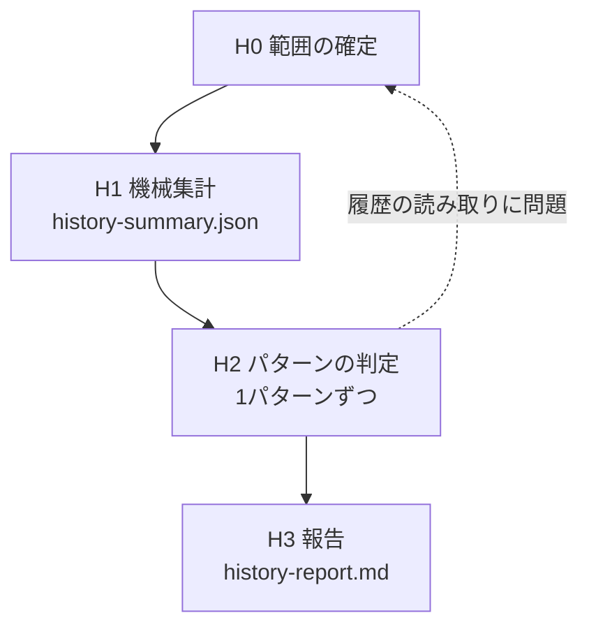

# セッション履歴からの反復・指摘の掘り起こし

人は自分が何を繰り返し頼んでいるかを覚えていない。履歴を数えれば分かる。このスキルは履歴を集計し、**実際に何度も起きたこと**だけを仕組み化の候補にする。

設計上の勘所は3つ。(1) **全発話をエージェントに読ませない** — 数百件になる。反復と指摘の候補はスクリプトで出し、エージェントが読むのは候補とその周辺だけ。(2) **新スキルは最後の手段** — 反復の多くは既存スキルの発火語不足か、常時ルール1行で済む。新スキル候補にするのは、既存スキルに足せず、**異なる3セッション以上で**起きた複数手順の作業だけ。(3) **このスキルはスキルを作らない** — 仕分けて提案するところで止まる。作るかどうかはユーザーが決め、作るなら `workflow-skill-architect` に渡す。

## ワークフロー



| # | フェーズ | 入力 | 出力 |
|---|---|---|---|
| 0 | 範囲の確定 | 履歴の場所・期間 | 合意した範囲 |
| 1 | 機械集計 | 履歴ファイル | `work/history-summary.json`、`work/prompts.jsonl` |
| 2 | パターンの判定 | H1 の出力、既存スキルの description | `work/history-report.md` の判定表 |
| 3 | 報告 | 判定表 | ユーザーへの提示と、次の一手の合意 |

## 手順

### H0: 範囲の確定

1. 読む履歴を確定する。既定の場所は次のとおり。**存在を確かめてから**提示する。

   | ツール | 既定の場所 |
   |---|---|
   | Claude Code | `~/.claude/history.jsonl` |
   | Codex | `~/.codex/sessions/`（配下の `**/*.jsonl`） |

2. 期間を確定する。既定は直近30日。発話が少なければ（50件未満）90日に広げるかを尋ねる。
3. 仕分け先として参照するスキル置き場（skills ディレクトリ）と、常時ルールの置き場所（AGENTS.md・CLAUDE.md・メモリ）のパスを確認する。
4. 範囲を1回で提示し、合意を得る。

**完了条件**: 履歴の場所・期間・スキル置き場が確定し、合意を得たこと。

**戻り条件**: 履歴が1つも見つからない場合は、場所を尋ねて止まる。**別の場所を推測で探し回らない。**

### H1: 機械集計

1. スクリプトを実行する。

   ```
   python scripts/extract_history.py --claude-history <history.jsonl> --codex-sessions <sessions ディレクトリ> --days 30 -o work/history-summary.json --dump work/prompts.jsonl
   ```

   H0 で見つからなかった側の引数は付けない。
2. 標準出力の件数（発話・セッション・反復候補・指摘候補）を控える。

**完了条件**: 終了コード 0 で `work/history-summary.json` と `work/prompts.jsonl` ができたこと。

**戻り条件**: 終了コード 1（期間内0件）なら H0 に戻って期間を広げるか尋ねる。終了コード 2 なら引数を直して1回だけ再実行し、それでも 2 なら H0 に戻る。

### H2: パターンの判定

1. `work/history-summary.json` を読む。見る順は `corrections`（指摘候補）→ `repeated`（反復候補）→ `terms`（頻出語）→ `by_project`・`with_image`。
2. 候補を**パターン**にまとめる。パターンとは「同じ種類の依頼」または「同じ種類の指摘」。語で絞り込むときは `work/prompts.jsonl` を検索し、周辺の発話を読む。**全件を通読しない。**
   - `corrections` は語句で拾った目安なので、動作確認の報告（「元に戻りました」等）が混ざる。指摘でないものは捨てる
   - 「コミットして」「続きをお願いします」のような1手で終わる定型は、パターンにしても処置は「見送り」になる
3. 既存スキルの description を読む（`<skills-dir>/*/SKILL.md` の frontmatter だけ。本文は読まない）。
4. `assets/templates/history-report.md` をコピーして `work/history-report.md` を作る。
5. 次を回す。

```
for パターン in 根拠のセッション数が多い順（最大 15 件）:
    次の順に当て、最初に当てはまった処置を採る
        a. 既存スキルの担当範囲に入るのに、そのスキルが使われていない → 既存スキルで足りる（発火語を足す）
        b. 既存スキルの担当範囲に入り、手順や観点が足りない → 既存スキルへ追記（スキル名を書く）
        c. 同じ指摘が異なる2セッション以上で出ている → 常時ルールへ（置き場所と追記文の案を書く）
        d. 既存スキルに足せず、異なる3セッション以上で起きた複数手順の作業 → 新スキル候補
        e. どれにも当たらない（回数不足・1手で終わる・一度きりの事情） → 見送り
    処置・根拠（セッション数と発話例1つ）・理由を判定表に1行で書く
    if 判定に迷うパターンが2件続いた:
        基準がこの履歴に合っていない。残りを機械的に埋めず、ここまでの結果と迷った理由を示して相談する
else:
    15 件を超えたパターンは「未判定」として件数と一覧を残す。黙って捨てない
```

判定表は1パターン判定するごとに書く。まとめて最後に書かない。

**完了条件**: 判定した全パターンに処置・根拠・理由が付き、未判定があれば件数と一覧が記録されていること。

**戻り条件**: 発話の大半が取り込めていない（プロジェクトが1つしか出ない、既知の作業が見当たらない等）と分かったら H0 に戻り、履歴の場所を確認する。

### H3: 報告

1. `work/history-report.md` を仕上げて提示する。集計の範囲、処置別の件数、新スキル候補、常時ルール候補、未判定を含める。**読めなかった履歴があれば、読めなかったと書く。**
2. 次の一手を尋ねる。選択肢は「スキルへの追記・新スキル作成（`workflow-skill-architect` に渡す）」「常時ルールへの追記」「記録だけ残す」「何もしない」。
3. 記録を残す場合、保存先はユーザーの運用に従う（ノート管理の置き場所があればそこへ）。分からなければ尋ねる。

**完了条件**: 報告を提示し、次の一手について回答を得たこと。

## 禁止事項

- **このスキルの中でスキルを作ったり、AGENTS.md・メモリを書き換えたりすること。** 仕分けて提案するところで止まる。
- **回数の根拠なしに新スキル候補にすること。** 「あったら便利そう」は候補にしない。
- **履歴の本文を外部サービス（NotebookLM・別の AI・Web）に送ること。** 貼り付けた秘密情報が含まれうる。
- **全発話を通読すること。** 周辺を読むのは候補に関係する発話だけ。
- **読めなかった履歴を「反復なし」として扱うこと。**

## スクリプト

`scripts/extract_history.py` — H1 で使う。依存は標準ライブラリのみ。

```
python scripts/extract_history.py [--claude-history <history.jsonl>] [--codex-sessions <dir>] [--days 30] [-o work/history-summary.json] [--dump work/prompts.jsonl]
```

| 引数 | 意味 |
|---|---|
| `--claude-history` | Claude Code の `history.jsonl`。1行1発話 |
| `--codex-sessions` | Codex の `sessions` ディレクトリ。サブエージェントのセッションは除外する |
| `--days` | 遡る日数。既定 30 |
| `-o` | 集計結果の JSON。既定 `work/history-summary.json` |
| `--dump` | 期間内の全発話を JSONL で書き出す先。H2 で語から周辺を検索するときに使う |

スラッシュコマンド・`!` のシェル実行・制御出力は除外し、同じ本文・同じ日の発話は1件に畳む。数字・パス・URL を伏せた発話の先頭24文字が一致し、2セッション以上に出たものを反復候補とする。終了コードは 0（集計した）/ 1（期間内の発話が0件）/ 2（引数の指定ミス）。

## テンプレート

| ファイル | 使うフェーズ |
|---|---|
| `assets/templates/history-report.md` | H2・H3。判定表を含む報告書 |
