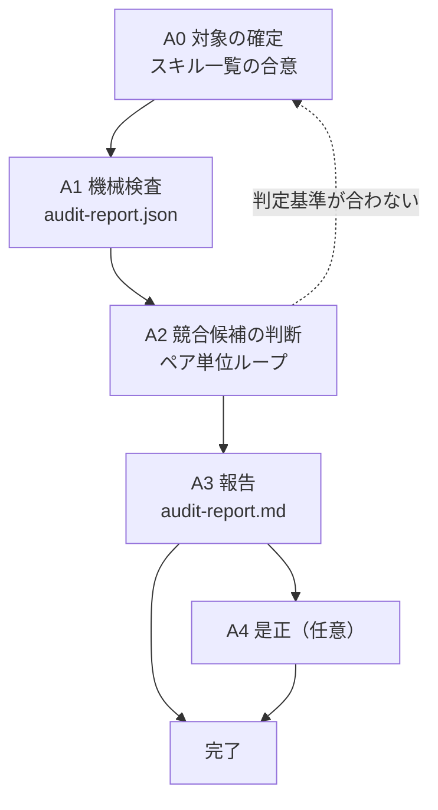

# スキル置き場の横断検査

スキルが増えたときに壊れるのは、1本1本の中身ではなく**スキル同士の関係**である。それを検査するスキル。

設計上の勘所は3つ。(1) **全スキルの SKILL.md をエージェントに読ませない** — 十数本×数百行でコンテキストが埋まる。機械判定できるものは全部スクリプトに寄せ、エージェントが読むのは**競合候補として挙がったペアの description だけ**にする。(2) **競合候補はスクリプトの目安でしかない** — トリガー文言と語の重なりで機械的に出しているので、当然の重複（同系統のスキルが隣接領域を扱う）も混ざる。採否は A2 で判断し、**「問題なし」も理由付きで記録する**。黙って流すと次回また同じ議論をする。(3) **是正は必ず確認を取ってから行う** — description を触ると既存の発火挙動が変わる。検査と是正を地続きにしない。

このスキルは `~/.agents` のような特定の配置を前提にしない。**検査対象のディレクトリは引数で受ける。**

---

## ワークフロー



| # | フェーズ | 入力 | 出力 |
|---|---|---|---|
| 0 | 対象の確定 | skills ディレクトリのパス | 対象一覧の提示と合意 |
| 1 | 機械検査 | 対象ディレクトリ | `work/audit-report.json` |
| 2 | 競合候補の判断（ペア単位） | A1 の候補一覧 | ペアごとの処置方針 |
| 3 | 報告 | A1・A2 | `work/audit-report.md` |
| 4 | 是正（任意） | 処置方針 | description / README の修正 |

**A2 の単位は候補ペア1組**。進捗は `work/audit-report.md` の判定表に持つ（「作業の再開」の節を参照）。

---

## 手順

### A0: 対象の確定

1. 作業開始時に `work/audit-report.json` の有無を確認する。存在する場合は「作業の再開」の節に従い、無い場合はこのまま続ける。
2. 検査対象の skills ディレクトリを確定する。**推測で決めない。** 会話から読み取れなければ尋ねる。
3. 付随して渡せるものを確認する。**無ければ無いまま進めてよいが、検査項目が減ることを A3 で明示する。**

   | 引数 | 何に使うか | 無いとどうなるか |
   |---|---|---|
   | `--validator` | 各スキルに `validate_skill.py` を回して結果を集約する | リンク切れ・孤児ファイル・行数の検査が落ちる |
   | `--readme` | 収録スキル表と実体を突き合わせる | 一覧の漏れと行数のズレを検出できない |

4. 対象ディレクトリ直下のスキル数と名前の一覧を提示し、**この範囲でよいか確認を得る。**

**完了条件**: 対象ディレクトリが確定し、スキルが1件以上あり、範囲の合意が取れていること。

**戻り条件**: 対象ディレクトリにスキルが1件も無い、または `SKILL.md` を持つディレクトリが無い場合は、パスの指定を求めて止まる。**近そうなディレクトリを勝手に探しに行かない。**

### A1: 機械検査

1. スクリプトを実行する。

   ```
   python scripts/audit_skills.py <skills-dir> -o work/audit-report.json --validator <validate_skill.py のパス> --readme <README.md のパス>
   ```

   `--validator` と `--readme` は A0 で確認できたものだけ渡す。
2. ERROR と WARN の件数、競合候補の組数を確認する。**この時点で是正しない。** ERROR も含めて A3 の報告まで持ち越す。
3. ERROR のうち、**判断を要さないもの**（`SKILL.md` がない、`name` がディレクトリ名と不一致、`web-description` の欠落・超過）はそのまま A3 の是正候補に載せる。これらは競合判断の対象ではない。

**完了条件**: `audit_skills.py` が終了コード 0 または 1 で終わり、`work/audit-report.json` が生成されていること。

**戻り条件**: 終了コード 2（対象ディレクトリがない・スキルが0件・validator が見つからない）の場合は A0 に戻る。**引数を勝手に付け替えて再実行しない。**

### A2: 競合候補の判断（ペア単位ループ）

**候補は目安でしかない。** 機械が挙げた組をそのまま「問題あり」として報告しない。

1. `references/conflict-resolution.md` を読む。処置の選び方と判定表がここにある。
2. `assets/templates/audit-report.md` をコピーして `work/audit-report.md` を作る。
3. 次を回す。

```
for ペア in 競合候補（score の高い順、最大 12 組）:
    両方の description だけを読む（SKILL.md の本文は読まない）
    references/conflict-resolution.md の判定表を当て、処置を1つ選ぶ
        範囲を狭める / 棲み分けを名指しで書く / 統合する / 分割する / 問題なし
    処置と、そう判断した理由を work/audit-report.md の判定表に1行で書く
    if 「要検討」のまま判定できないペアが2組続いた:
        判定基準がこの置き場に合っていない。残りを機械的に埋めず、
        ここまでの結果と迷った理由をまとめてユーザーに相談する
else:
    候補が 12 組を超える場合、score 上位 12 組だけを判定し、
    残りを「未判定」として件数と一覧を A3 で報告する。黙って切り捨てない
```

4. **「問題なし」にも理由を書く。** 「同じ領域を扱うが、入力（既存コード / 設計書）が異なり description で名指しの振り分けがある」のように、次回この組を見たときに同じ結論へ到達できる形にする。
5. 判定に SKILL.md の本文が必要になったと感じたら、**それは description が不十分だという発見**である。本文を読みに行く前に、その事実を「範囲を狭める」の根拠として記録する。

**完了条件**: 判定対象の全ペアに処置と理由が付いており、「未判定」として残したものがあれば件数と一覧が記録されていること。

**戻り条件**: 対象範囲そのものが誤っている（別プロジェクトのスキルが混ざっている等）と分かったら A0 に戻る。

### A3: 報告

1. `work/audit-report.md` を仕上げ、ユーザーに提示する。**都合の悪い項目を省かない。**
   - 検査したスキル数と、実行できなかった検査（`--validator` / `--readme` を渡せなかった場合）
   - ERROR の全件。特に **`web-description` の欠落は配布が止まる**ので個別に挙げる
   - 競合候補の組数と、処置別の内訳。「問題なし」の件数も出す
   - README 突合の結果（一覧の漏れ、行数のズレ）。`.gitignore` で除外して意図的に載せていないスキルがあれば、それも明記する
   - 未判定として残した候補の件数と一覧
2. **是正するかどうかを確認する。** ここで止まる。確認を得ずに A4 へ進まない。

**完了条件**: 報告をユーザーに提示し、是正の要否について回答を得ていること。

**戻り条件**: 検査していない項目を「問題なし」として報告することは禁止する。実行できなかった検査は、実行できなかったと書く。

### A4: 是正（任意）

ユーザーが是正を求めた場合のみ実施する。

1. 是正対象を**1件ずつ**扱う。まとめて一括変更しない。
2. `description` を変更する場合、**変更前後を並べて提示し、個別に了承を得る**。発火挙動が変わる。
3. `web-description` の追加は、対応する `description` の要点を 200 文字以内に圧縮する。**独立した文章を新しく書かない**（発火語がずれる）。
4. README の収録スキル表は、実体に合わせて更新する。行数は実測値を入れる。
5. 是正後、A1 のスクリプトを再実行して ERROR が減ったことを確認する。
6. **新たな ERROR が出ていないか**を確認する。出ていれば A2 に戻る。

**完了条件**: 是正対象が全件処理され、`audit_skills.py` の再実行で ERROR が是正前より減り、新規 ERROR が0件であること。

**戻り条件**: 是正によって ERROR が増える状態が2周続いたら、修正を続けずに止まり、方針をユーザーに相談する。

---

## 作業の再開

進捗は `work/audit-report.json`（A1 の結果）と `work/audit-report.md` の判定表（A2 の進捗）に持つ。**state 専用のファイルを増やさない。**

作業開始時に `work/audit-report.json` が既に存在した場合:

1. 対象ディレクトリと生成時刻をユーザーに提示し、続きから再開してよいか確認する
2. **対象ディレクトリの更新時刻が `audit-report.json` より新しい場合は A1 から再実行する。** スキルが増減している可能性がある
3. `work/audit-report.md` の判定表で、処置が空のペアだけを A2 で処理する。判定済みのペアを再判定しない
4. 判定済みのペアのうち、**スキル側の description が変わっているもの**は判定を無効とみなし、処置を空に戻す

判定表の更新は1ペア判定するごとに行う。**まとめて最後に書かない。**

---

## 途中経過の報告

| 報告する | しない |
|---|---|
| A0 の完了時（対象一覧と検査項目の範囲） | ペア1組ごとの判定結果 |
| A1 の完了時（ERROR / WARN / 候補の件数） | スクリプトを実行した、ファイルを読んだ等の実況 |
| A2 で「要検討」が2組続いて止まった時点 | |
| A3 の報告（ここでユーザーの判断を仰ぐ） | |
| **A4 で description を変更する直前**（変更前後を並べて） | |

---

## 禁止事項

- **競合候補をそのまま「問題あり」として報告すること。** 機械の目安なので、1組ずつ判定する。
- **「問題なし」を理由なしで流すこと。** 次回同じ議論をすることになる。
- **確認を得ずに description を変更すること。** 既存の発火挙動が変わる。
- **全スキルの SKILL.md 本文を読むこと。** 判定に必要なのは description であり、本文が要ると感じた時点でそれ自体が発見である。
- **実行できなかった検査を「問題なし」として報告すること。**
- **上限を超えた候補を黙って切り捨てること。** 未判定として件数と一覧を残す。
- **検査のついでにスキルの中身を書き直すこと。** このスキルは置き場の健全性を見るものであって、個々のスキルの設計は `workflow-skill-architect` の担当。
- **検査対象のディレクトリを推測で決めること。** 引数で受け取るか、尋ねる。

---

## 参照ファイル

| ファイル | 読むタイミング |
|---|---|
| `references/conflict-resolution.md` | A2 の直前（毎回）。競合候補に対する処置の選び方と判定表 |

## スクリプト

| スクリプト | 使うフェーズ |
|---|---|
| `scripts/audit_skills.py` | A1・A4。置き場の横断検査と、是正後の再確認 |

```
python scripts/audit_skills.py <skills-dir> [-o <出力先.json>] [--validator <path>] [--readme <path>]
```

| 引数 | 意味 |
|---|---|
| `<skills-dir>` | 検査対象。各スキルのディレクトリが直下に並んでいること。必須 |
| `-o` / `--output` | 検査結果の JSON 出力先。親ディレクトリが無ければ作る |
| `--validator` | `validate_skill.py` のパス。渡すと各スキルに対して実行し、結果を集約する |
| `--readme` | `README.md` のパス。渡すと収録スキル表と実体・行数を突き合わせる |

検査するのは、web-description の欠落と長さ超過と山括弧、`name` とディレクトリ名の一致、`description` の長さと山括弧、個別検証の集約、発火競合の候補抽出、棲み分け宣言の有無、README 突合の8項目。終了コードは 0（ERROR なし。WARN のみでも 0）/ 1（ERROR あり）/ 2（引数の指定ミス）。依存は標準ライブラリのみ。

README 突合では `git check-ignore` を使い、**`.gitignore` で除外されたスキルを対象外にする**。ライセンスの都合でリポジトリに含めないスキルが収録表に無いのは正しい状態なので、不備として数えない。除外されたスキル名は集計の下に1行で出る。git が使えない場合やリポジトリでない場合は、除外なしとして扱う。

## テンプレート

| ファイル | 使うフェーズ |
|---|---|
| `assets/templates/audit-report.md` | A2・A3。判定表を含む報告書 |
