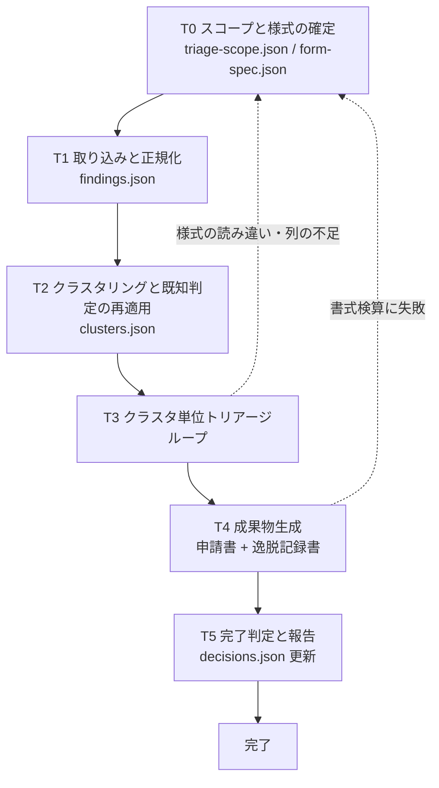

# 静的解析指摘のトリアージ

CodeSonar / Helix QAC が数百〜数千件出す指摘を、毎回同じ基準で「修正 / 逸脱 / 誤検知」に仕分け、社内様式の申請書と逸脱記録書まで落とすためのスキル。

設計上の勘所は4つ。(1) **時間を食っているのは指摘の総数ではなく、同種の指摘を何度も読み直すこと** — ルールIDとコードパターンのフィンガープリントで束ね、代表1件を判断して横展開する。(2) **判定は資産として蓄える** — 過去の判定を判定DB (`decisions.json`) に保存し、次回の解析結果へ自動再適用する。回すほど手動判断が減る。(3) **「誤検知」は最も楽な逃げ道** — ツールの解析限界のどの類型に当たるかを分類コードで書かせ、書けないものは誤検知にしない。(4) **横展開してよいクラスタと、してはいけないクラスタを区別する** — 文脈依存のルール（ヌル参照、値域、並行性）を一括判定すると事故になる。

---

## ワークフロー



| # | フェーズ | 入力 | 出力 |
|---|---|---|---|
| 0 | スコープと様式の確定 | 申請書 xlsx、対象規格、ツール | `work/triage-scope.json`, `work/form-spec.json` |
| 1 | 取り込みと正規化 | 申請書の指摘一覧シート | `work/findings.json` |
| 2 | クラスタリングと既知判定の再適用 | `findings.json`, 判定DB | `work/clusters.json` |
| 3 | クラスタ単位トリアージループ | `clusters.json` | 判定が入った `clusters.json` |
| 4 | 成果物生成 | 判定済み `clusters.json` | `out/` 配下の申請書と逸脱記録書 |
| 5 | 完了判定と報告 | 全成果物 | 集計報告、更新された判定DB |

**T3 のループ単位はクラスタ**。指摘の件数ではなくクラスタ数で進捗を測る。進捗は `work/clusters.json` の `clusters[].status` に持つ。**state 専用のファイルを増やさない。**

### T3 のループ

```
for クラスタ in 未判定クラスタ（推定件数の多い順）:
    uniformity を確認する（uniform なら代表1件、individual なら全メンバーを見る）
    根拠となるソースコードを読む
    判定を付ける（fix / deviate / false_positive / deferred）
    誤検知なら FP コード、逸脱なら DV コードと根拠を必ず書く
    status を done に更新する
    if 3クラスタ連続で判定に必要な情報がそろわない:
        個別に粘らず、残りを deferred にして T5 へ抜け、ユーザーに相談する
```

- **成功条件**: 全クラスタの `status` が `done` で、`verdict` が空でないこと
- **上限**: クラスタ単位のループに周回上限はない（各クラスタは1回ずつ判定する）。ただし**判断に迷って情報を集め直すのは1クラスタあたり2回まで**。3回目に入る前に `deferred` にする
- **諦め条件**: 3クラスタ連続で情報不足になったら、入力か様式の理解が間違っている可能性が高い。ループを止めて T0 に戻るかユーザーに相談する

---

## 手順

### T0: スコープと様式の確定

1. 作業開始時に `work/triage-scope.json` の有無を確認する。存在する場合は「作業の再開」の節に従い、無い場合はこのまま続ける。
2. `references/excel-forms.md` を読む。様式定義の書き方と openpyxl の制約がここにある。
3. 入力となる申請書 xlsx のパスを確認する。**読み取れなければ推測せず尋ねる。** 対象規格（AUTOSAR C++14 / MISRA C++ など）とツール（CodeSonar / Helix QAC）も確認する。
4. ブックの構造だけを取り出す。**この時点でセルの中身を全件読まない。** 数千行を会話に載せるとコンテキストが尽きる。

   ```
   python scripts/read_findings.py --inspect <申請書.xlsx>
   ```

   シート名、ヘッダ行の候補、列名、データ行数だけが出る。
5. `assets/templates/form-spec.json.template` をコピーして `work/form-spec.json` を作り、列名と論理項目の対応を埋める。**列名をスクリプトに埋め込まない。** 様式が変わったらこのファイルだけを直せる状態にする。
6. `assets/templates/triage-scope.json.template` をコピーして `work/triage-scope.json` を作り、判定DBの場所を決める。**判定DBはワークスペースの外**（プロジェクトで永続化する場所）に置く。`work/` に置くと作業のたびに消えて資産にならない。
7. 次をユーザーに提示し、**取り込み範囲の合意を得る**。
   - シート名、ヘッダ行、データ行数
   - 列の対応（どの列を rule_id / file / line / message として読むか）
   - 判定DBのパスと、既存の判定件数（無ければ「新規」と明記）

**完了条件**: `work/form-spec.json` と `work/triage-scope.json` が作られ、必須項目（`rule_id` / `file` / `message`）の列が特定でき、取り込み範囲の合意が取れていること。
**戻り条件**: `--inspect` で指摘一覧シートが特定できない、または必須列が見つからない場合は、対象シートと列をユーザーに確認して止まる。**それらしい列を推測で割り当てない。**

### T1: 取り込みと正規化

1. 指摘を読み出す。

   ```
   python scripts/read_findings.py --form-spec work/form-spec.json -o work/findings.json
   ```

2. 出力された件数と、正規化で落ちた行（空行、ヘッダ再掲、必須列が空）の件数を確認する。**落ちた行が全体の5%を超えたら様式の読み違いを疑い、T0 に戻る。**
3. 件数をユーザーに報告する。**この時点で指摘の中身を1件ずつ会話に載せない。**

**完了条件**: `read_findings.py` が終了コード 0 で終わり、`work/findings.json` に1件以上の指摘があること。
**戻り条件**: 終了コード 1（様式の不整合）の場合、`work/form-spec.json` の列対応が誤っている。T0 に戻って `--inspect` の出力と突き合わせる。

### T2: クラスタリングと既知判定の再適用

1. `references/clustering.md` を読む。フィンガープリントの作り方と、横展開してよいルールの見分け方がここにある。
2. クラスタリングと判定DBの再適用を実行する。

   ```
   python scripts/cluster_findings.py --findings work/findings.json --scope work/triage-scope.json -o work/clusters.json
   ```

3. 出力を確認する。見るのは次の4つ。
   - クラスタ数と、自動再適用された件数（`auto_applied`）
   - `uniformity` が `individual` のクラスタ数（ここが手作業の本体になる）
   - `uniformity` が `unknown` のクラスタ数（T3 で人が決める）
   - 外部提供コードのクラスタ（`cluster_id` に `@external` が付く）。`triage-scope.json` の `external_paths` に基づいて自動で分離される。**分離されていない場合は `external_paths` の設定漏れ**なので T0 に戻る
4. **自動再適用の抜き取り確認をする。** `auto_applied` のクラスタから3件（3件未満なら全件）を選び、コードを読んで判定が今回のコードにも妥当か確認する。**1件でも妥当でなければ、そのルールIDの自動再適用をすべて解除して T3 で判定し直す。** 判定DBは資産だが、コードが変われば前提も変わる。
5. 圧縮率（指摘件数 → クラスタ数）をユーザーに報告する。

**完了条件**: `work/clusters.json` が生成され、全指摘がいずれかのクラスタに属し、抜き取り確認3件（または全件）が済んでいること。
**戻り条件**: クラスタ数が指摘件数の8割を超える（ほとんど束ねられていない）場合、フィンガープリントの材料が足りない。`work/form-spec.json` にコード断片や関数名の列を追加できないか T0 に戻って確認する。

### T3: クラスタ単位トリアージループ

**ここがこのスキルの本体**。スクリプトの出力を眺めるだけで終えてはならない。

1. `references/triage-criteria.md` と `references/tool-messages.md` を読む。判定基準、FP コード（誤検知の解析限界類型）、DV コード（逸脱理由の類型）がここにある。
2. 未判定クラスタを**メンバー数の多い順**に処理する。件数の多いクラスタから片付けると、残作業が最も速く減る。
3. 各クラスタで次を行う。

   | uniformity | 見る範囲 | 判定の付け方 |
   |---|---|---|
   | `uniform` | 代表1件のソースコード | クラスタ全体に同一判定を付ける |
   | `individual` | 全メンバーのソースコード | メンバーごとに判定を付ける。一括で付けない |
   | `unknown` | 代表1件を見て、まず uniformity を決める | 決めてから上の2行に従う |

   `uniformity` を自分で決めた（または推定を覆した）ら、`uniformity_source` を `manual` に書き換える。**`unknown` が残っていると T5 のゲートを通らない。**

   `individual` のクラスタに `previous_decision` が入っていることがある。過去に同じ字面で下した判定だが、文脈依存の判定を字面で引き継ぐのは危険なので**自動適用されていない**。参考として読み、今回のコードで改めて判断する。

4. 判定値は次の4つ。**この4つ以外を使わない。**

   | verdict | 意味 | 必須項目 |
   |---|---|---|
   | `fix` | コードを修正する | 修正方針（1行） |
   | `deviate` | 規約から逸脱する。申請と記録が要る | DV コード + 根拠 + 代替措置 |
   | `false_positive` | ツールの誤検知 | FP コード + なぜツールが誤ったか |
   | `deferred` | 判断できない。保留 | 何が足りないか |

5. **`false_positive` は FP コードを付けられるときだけ使う。** 「見た限り問題ない」は誤検知の根拠にならない。ツールがどの解析限界で誤ったかを言えないなら `deferred` にする。
6. **逸脱を自分で承認しない。** `deviate` は「申請する」という判定であって、承認ではない。承認はユーザーと組織の仕事。
7. クラスタを判定し終えたら、その場で `work/clusters.json` の `status` を `done` に更新する。**まとめて最後に書かない。** 中断されたときに何も残らない。

**完了条件**: 全クラスタの `status` が `done` で、`verdict` が付いており、`false_positive` に FP コード、`deviate` に DV コードと根拠が入っていること。
**戻り条件**: 判定に申請書外の情報（設計書、ハードウェア仕様、他モジュールのコード）が必要になったら、そのクラスタを `deferred` にして先に進む。**推測で判定を埋めない。** 3クラスタ連続で情報不足になったら T0 に戻る。

### T4: 成果物生成

1. 申請書への書き戻しと逸脱記録書の生成を実行する。

   ```
   python scripts/write_forms.py --clusters work/clusters.json --form-spec work/form-spec.json --out-dir out
   ```

2. スクリプトは**原本を直接開かない**。`out/` にコピーしてから書き、書き込み後に書式検算（シート名の集合、行数、書き込み対象外セルの値の一致）を行う。検算に失敗した場合はコピーを破棄して終了コード 1 を返す。
3. 生成物を確認する。
   - 申請書: 判定列・理由列が全行埋まっているか
   - 逸脱記録書: `deviate` の件数と行数が一致しているか
4. **`deferred` が残っている場合、成果物にその旨を明記する。** 伏せて提出しない。

**完了条件**: `write_forms.py` が終了コード 0 で終わり、`out/` に申請書と（`deviate` が1件以上ある場合は）逸脱記録書が生成され、書式検算が通っていること。
**戻り条件**: 終了コード 1（書式検算の失敗、または書き込み先の列が見つからない）の場合、`work/form-spec.json` の書き込み側の定義を T0 に戻って直す。**検算を無効化して押し通すことは禁止する。**

### T5: 完了判定と報告

1. 未判定と根拠欠落を機械判定する。

   ```
   python scripts/check_triage.py work/clusters.json
   ```

2. 判定DBを更新する。

   ```
   python scripts/cluster_findings.py --clusters work/clusters.json --scope work/triage-scope.json --save-decisions
   ```

   `deferred` は判定DBに保存しない。判断していないものを次回に引き継ぐと、判断済みに見えてしまう。
3. ユーザーに次を提示する。**都合の悪い項目を省かない。**
   - 指摘の総件数、クラスタ数、圧縮率
   - 判定の内訳（`fix` / `deviate` / `false_positive` / `deferred` の件数）
   - **`deferred` は全件を個別に列挙し、何が足りないかを添える**
   - 自動再適用された件数と、抜き取り確認の結果
   - `deviate` のルールID別内訳（同じルールで逸脱が積み上がっているなら、規約の運用そのものを見直す材料になる）
   - 生成した成果物のパス
4. 逸脱の**承認**はユーザーに委ねる。このスキルは申請書と記録書を作るところまでを担う。

**完了条件**: `check_triage.py` が終了コード 0 で終わり、判定DBが更新され、報告をユーザーに提示して確認を得ていること。
**戻り条件**: 終了コード 1（未判定または根拠欠落）の場合は T3 に戻る。**未判定を残したまま完了として報告することは禁止する。** `deferred` は「判定済み（保留と判断した）」として扱うが、報告では必ず列挙する。

---

## 作業の再開

進捗は `work/clusters.json` の `clusters[].status`（`pending` / `done`）に持つ。

作業開始時に `work/triage-scope.json` が既に存在した場合:

1. `work/clusters.json` の総数・`done` 数・更新時刻をユーザーに提示し、続きから再開してよいか確認する
2. `done` のクラスタは再判定しない。ただし `verdict` が実際に入っているかを確認し、空なら `pending` に戻す
3. `work/findings.json` が無い、または入力 xlsx の更新時刻より古い場合は T1 から再実行する。**入力が差し替わっている可能性がある**
4. `work/form-spec.json` が無い場合は T0 からやり直す

---

## 禁止事項

- **クラスタリングを飛ばして指摘を1件ずつ処理すること。** 時間が溶ける原因そのものである。
- **`uniformity` が `individual` のクラスタを一括判定すること。** 文脈依存のルールで事故になる。
- **FP コードを付けられないものを `false_positive` にすること。** 根拠が書けないなら `deferred`。
- **自動再適用された判定を抜き取り確認せずに採用すること。** コードが変われば前提も変わる。
- **逸脱を自分で承認すること。** `deviate` は申請までで、承認はユーザーの判断。
- **申請書の原本を直接開いて保存すること。** 必ず `out/` のコピーに書く。
- **書式検算を無効化して書き込みを押し通すこと。**
- **`deferred` を伏せて完了報告すること。**
- **指摘のついでにコードを直すこと。** このスキルは仕分けであって修正ではない。修正は判定後、ユーザーの依頼を受けてから行う。

---

## 参照ファイル

必要になったときに読む。全部読む必要はない。

| ファイル | 読むタイミング |
|---|---|
| `references/excel-forms.md` | T0 の直前（毎回）。様式定義の書き方、openpyxl の制約、書式を壊さないための決まり |
| `references/clustering.md` | T2 の直前（毎回）。フィンガープリント設計、横展開可否の判断基準 |
| `references/triage-criteria.md` | T3 の直前（毎回）。修正 / 逸脱 / 誤検知の判定基準と DV コード |
| `references/tool-messages.md` | T3 の直前（毎回）。CodeSonar / QAC のメッセージ類型と FP コード |

## スクリプト

| スクリプト | 使うフェーズ |
|---|---|
| `scripts/read_findings.py` | T0（`--inspect`）・T1。様式定義に従って指摘一覧を読み出す |
| `scripts/cluster_findings.py` | T2・T5。フィンガープリント生成、クラスタ化、判定DBの再適用と保存 |
| `scripts/write_forms.py` | T4。申請書への書き戻しと逸脱記録書の生成、書式検算 |
| `scripts/check_triage.py` | T5。未判定・根拠欠落の機械判定 |

引数・終了コード・出力形式は `references/excel-forms.md` の「スクリプトの使い方」にまとめてある。

**依存**: `read_findings.py` と `write_forms.py` は `openpyxl` を必要とする。他の2本は標準ライブラリのみで動く。`openpyxl` が無い環境では終了コード 2 で止まるので、`pip install openpyxl` を案内すること。

## テンプレート

| ファイル | 使うフェーズ |
|---|---|
| `assets/templates/form-spec.json.template` | T0。Excel 様式の列対応と書き込み先の定義 |
| `assets/templates/triage-scope.json.template` | T0。対象・規格・判定DBの場所。state としても使う |
