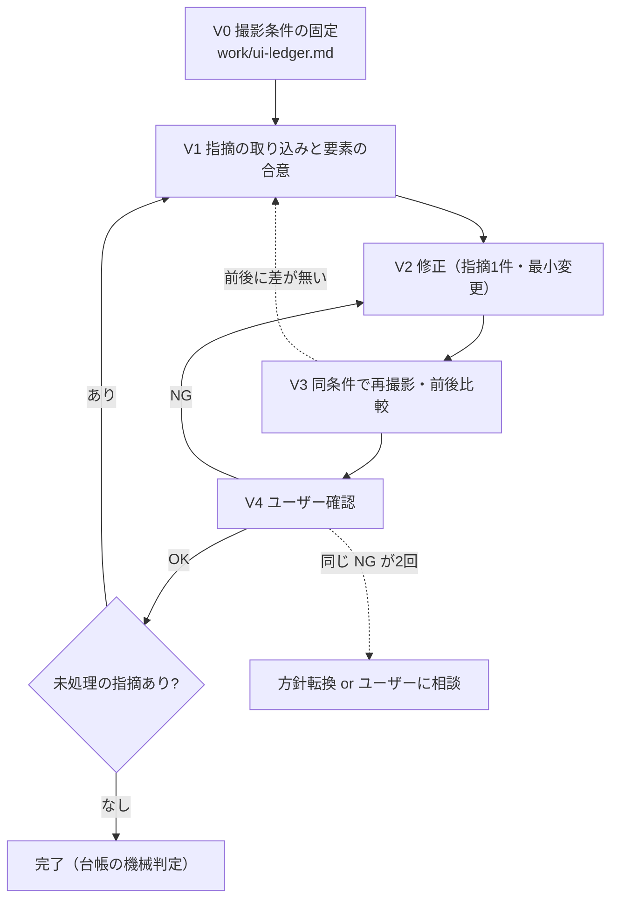

# Web 画面の見た目検証

「添付図のように崩れている」→ 直す → 「まだ変わっていない」の往復を止めるためのスキル。

往復が長引く原因は3つ。(1) **直す対象の要素を取り違えている**（ユーザーが指す場所と、エージェントが触った CSS が別物）。(2) **直したつもりで確認していない**（再撮影せずに「修正しました」と報告する）。(3) **撮影条件が毎回違う**（ビューポート幅・テーマ・ホバー状態が変わり、比較にならない）。このスキルは、指摘ごとに対象要素をユーザーと合意し、同じ条件で修正前後を撮り、その2枚を並べて確認を取る。

対象はブラウザで表示する画面（HTML/CSS/JS、フレームワーク不問）。デスクトップ GUI（PySide6 等）は撮影手段が別なので対象外。

---

## ワークフロー



指摘1件ごとに V1→V4 を回す。**複数の指摘をまとめて直して1回で撮る、はしない。** どれが効いたか分からなくなる。

```
for 指摘 in 台帳の open:
    V1 で対象要素を合意する
    for 周回 in 1..3:
        V2 修正 → V3 再撮影・前後比較
        if 前後に差が無い: 修正が効いていない。触った箇所が違う。V1 に戻り要素を再確認
        V4 でユーザーに前後2枚を見せる
        if OK: closed にして break
        if 同じ NG が2回続いた: 同じ直し方をやめる。show --annotate で指摘を取り直すか、
                            条件（幅・テーマ・状態）の違いを疑ってユーザーに相談する
    else:
        3周で閉じなければ deferred にし、試したことと残る差分を台帳に書いて次の指摘へ
```

---

## 手順

### V0: 撮影条件の固定

1. `work/ui-ledger.md` が既にあれば「作業の再開」を見る。無ければ `assets/templates/ui-ledger.md` をコピーして作る。
2. 次を確定して台帳の冒頭に書く。**分からない項目は推測せずユーザーに聞く。**

   | 項目 | 例 | 決めないと何が起きるか |
   |---|---|---|
   | 対象 URL | `http://localhost:50000` | 開発サーバーが起動していないと撮れない。起動コマンドも書く |
   | ビューポート | `1280x800` | 幅が違うと折り返し位置が変わり、見切れの再現が変わる |
   | テーマ・状態 | ダークモード、ログイン済み、モーダル開 | 状態が違うと同じ要素が別の見た目になる |
   | ユーザーの環境 | 実ブラウザの幅、ズーム | ユーザーの画面と撮影条件がずれると「変わっていない」が起きる |

3. playwright-cli を用意する。導入・起動・撮影の具体的なコマンドは `references/playwright-cli-cheatsheet.md` を読む。ブラウザを開いて対象 URL へ移動し、ビューポートを設定し、全体を `work/ui/baseline.png` に撮る。
4. **完了条件**: 台帳の冒頭4項目が埋まり、`work/ui/baseline.png` が存在すること。

### V1: 指摘の取り込みと要素の合意

**ここを飛ばして直し始めない。** 往復の大半は要素の取り違えで起きる。

1. 指摘を台帳に1行ずつ登録する。ID は `UI-<連番3桁>`。振り直さない。1行に書くのは「何が」「どう」「どうあるべきか」の3つ。「見にくい」だけなら「何が」「どうあるべきか」を聞く。
2. 対象要素を特定する。取り込み方は2通り。

   | 入力 | やること |
   |---|---|
   | ユーザーがスクリーンショットや言葉で指す | `snapshot --boxes` と `find` で候補を絞り、`highlight <ref>` で赤枠を付けて撮影し、**「この要素で合っているか」をユーザーに確認する** |
   | ユーザーが画面上で直接指したい / 上の方法で2回外した | `show --annotate` を起動してユーザーに画面上で囲んでもらう。注釈付き画像・スナップショット・メモが返るので、その ref を対象にする |

3. 合意した要素の ref と、`eval` で取った現在の計測値（色・サイズ・位置・overflow など、指摘に関係するもの）を台帳の「対象」と「修正前の計測」に書く。**「見た目」の指摘を数値に落とすのがこの工程の本体。** 数値にできない指摘（「もっと格好よく」）は、ユーザーに具体例か基準を出してもらうまで open のまま進めない。
4. 修正前の要素スクリーンショットを `work/ui/UI-<ID>-before.png` に撮る。

**完了条件**: 台帳のその行に、ユーザーが合意した ref、修正前の計測値、before 画像のパスが揃っていること。

### V2: 修正

1. 指摘1件に対する最小の変更を入れる。**触ったファイルと行を台帳の「変更」に書く。**
2. 他の指摘や、指摘されていない箇所を「ついでに」直さない。別の指摘として台帳に足す。
3. 変更が反映される手順（リロードで足りるか、ビルドが要るか）を確認して実行する。

### V3: 同条件で再撮影・前後比較

1. V0 と同じ URL・ビューポート・テーマ・状態にする。状態が変わっていたら戻す。
2. 同じ要素を `work/ui/UI-<ID>-after.png` に撮り、V1 と同じ `eval` で計測値を取り直す。
3. 台帳に「修正後の計測」を書き、before/after の差分を**数値で**確認する。
   - 計測値が変わっていない → 修正が効いていない。触った箇所か反映手順が違う。V1 に戻る
   - 計測値は変わったが期待に届かない → V2 に戻る（周回を1つ進める）
   - 期待どおり → V4 へ
4. 全体スクリーンショットも撮り、**指摘箇所以外が崩れていないか**を baseline と見比べる。崩れていたら新しい指摘として台帳に足す（この周回では直さない）。

**完了条件**: 台帳のその行に after 画像のパスと修正後の計測値があり、期待との差が数値で説明できること。

### V4: ユーザー確認

1. before と after の2枚、変更したファイルと行、計測値の前後を並べて提示する。**「修正しました」だけで終えない。**
2. ユーザーの回答を台帳に反映する。
   - OK → `closed`
   - NG → 何が違うかを聞き、台帳の「指摘」を更新して V2 へ。**同じ NG が2回続いたら同じ直し方を繰り返さない。** `show --annotate` で指摘を取り直すか、撮影条件とユーザーの環境の差（幅・ズーム・キャッシュ・ビルド未反映）を確認する
3. 3周で閉じない指摘は `deferred` にし、試した変更と残る差分を台帳に書いて次の指摘へ進む。**黙って closed にしない。**

### 完了

台帳の全行が `closed` または理由付き `deferred` であることを機械判定する。

```
python scripts/check_ui_ledger.py work/ui-ledger.md
```

終了コード 0 で完了。`deferred` が残る場合は、その一覧を最終報告に含める。最後に `work/ui/` の全体スクリーンショットを1枚撮り、baseline と並べて報告する。

---

## 作業の再開

進捗は `work/ui-ledger.md` の状態列に持つ。state ファイルを増やさない。

- 作業開始時に台帳があれば、冒頭の撮影条件と `open` / `fixed` の行をユーザーに提示し、続きから始めてよいか確認する
- `fixed`（再撮影済み・ユーザー未確認）の行は V4 から再開する
- 開発サーバーやブラウザは前回のまま残っていない前提で V0 の3を再実行する。**撮影条件は台帳の値を使い、変えない**

---

## 禁止事項

- **対象要素の合意を取らずに修正すること。** 往復の原因そのもの
- **再撮影せずに「修正しました」と報告すること。** after 画像と計測値が無い報告は禁止
- **撮影条件を周回の途中で変えること。** 変える必要が出たら台帳を更新し、baseline を撮り直してから続ける
- **複数の指摘を1周回でまとめて直すこと**
- **指摘されていない箇所を「ついでに」直すこと。** 台帳に足して別件にする
- **`open` や `fixed` を残したまま完了として報告すること**
- **同じ NG に同じ直し方を3回当てること**

---

## 参照ファイル

| ファイル | 読むタイミング |
|---|---|
| `references/playwright-cli-cheatsheet.md` | V0 の前（毎回）。導入、撮影、要素特定、計測、annotate の具体的なコマンドと、playwright-cli が使えない環境での代替 |

## スクリプト

```
python scripts/check_ui_ledger.py work/ui-ledger.md
```

完了判定。台帳の各行を読み、`open` / `fixed` が残っていれば ERROR、`closed` なのに after 画像のパスが無い行も ERROR、`deferred` に理由が無ければ ERROR。終了コードは 0（合格）/ 1（ERROR あり）/ 2（引数の指定ミスやファイルが読めない）。依存は標準ライブラリのみ。

## テンプレート

| ファイル | 使うタイミング |
|---|---|
| `assets/templates/ui-ledger.md` | V0。撮影条件と指摘台帳の雛形。state としても使う |
