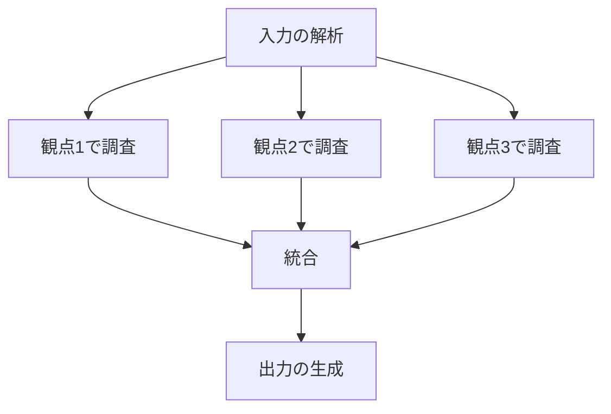
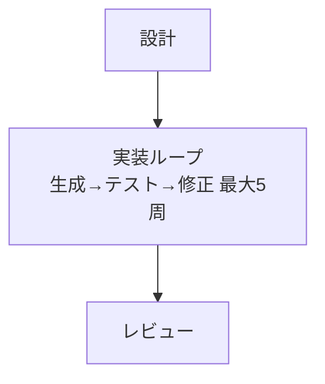

# グラフエンジニアリング

作業を複数のノードに分割し、依存関係を DAG として設計するときに読む。

## なぜグラフにするのか

長い手順を上から順に書くと、エージェントは「どこまでが1つの仕事か」「何が終わっていれば次に進めるか」を推測することになる。グラフにする目的は3つ:

- **並列化** — 依存のないノードは同時に進められる（サブエージェントがある環境で効く）
- **再開可能性** — ノード単位で完了を記録できるので、途中から再開できる
- **責務の明確化** — 入力と出力が決まっていれば、そのノードだけを差し替え・再実行できる

逆に言えば、この3つが不要なら分割しなくていい。

## ノードの定義

**1ノード = 入力と出力が明示された1つの責務。** 目安は「一度に読み込める情報量で完結する作業」。

- 細かすぎる（10個以上のノード、1ノードが1コマンド）→ 受け渡しのオーバーヘッドが本体を上回る
- 粗すぎる（1ノードが「調査して設計して実装する」）→ 分割の意味がない

各ノードは、スキルルートの `assets/templates/node-contract.md` の形式で定義する:

```
### ノード: extract-requirements
- 目的: 入力文書から要件を構造化して抜き出す
- 入力: workspace/inputs/*.md
- 出力: workspace/work/01-requirements.json（スキーマは data-contracts.md 参照）
- 前提: 入力が空でないこと
- 失敗時: 要件が0件なら status="empty" で出力し、後続をスキップ
```

## エッジは「データ依存」で引く

エッジを引く基準は、**後続ノードが前ノードの出力を実際に必要とするか**。「なんとなくこの順番」で引かないこと。順序の都合で引いたエッジは並列化の機会を潰す。

判定法: 「ノードBは、ノードAの出力ファイルを読むか？」読まないなら、エッジは不要で並列に置ける。

## fan-out / fan-in



**fan-out** で重要なのは、各枝が**重複しない担当範囲**を持つこと。「観点1〜3で調べて」だけだと同じことを3回調べる。各枝に「何を担当し、何を担当しないか」を書く。

**fan-in（統合ノード）** で重要なのは、**統合ルールを事前に決めておく**こと。ここを書かないと、エージェントは全部の出力を単純に連結する。決めておくこと:

- 矛盾があったときどちらを優先するか
- 重複をどう畳むか
- 一部の枝が失敗した場合に続行するか中止するか

## 条件分岐

分岐は「どの条件でどの枝に行くか」を表で書く。曖昧な自然言語だとエージェントごとに判断がぶれる。

| 条件 | 次のノード |
|---|---|
| 入力がコードファイル | analyze-code |
| 入力が仕様書 | analyze-spec |
| どちらでもない | ユーザーに確認 |

「どちらでもない」の行を必ず用意すること。想定外の入力で止まれるようにしておかないと、エージェントは無理やりどちらかに寄せる。

## サイクルはループとして切り出す

DAG に循環があるように見えたら、それはループなので、グラフのノードとして囲い込み、内部を `loop-engineering.md` に従って設計する。グラフの中に暗黙の巻き戻り（「問題があればステップ2に戻る」）を書くと、何周したのかを誰も管理しなくなる。



## サブエージェントに割り当てるとき

ノードをサブエージェントに渡す場合、渡す指示には必ず含める:

- タスクの説明（何をするか）
- 読むべき入力のパス（会話の文脈は引き継がれない前提で書く）
- 出力先のパスと形式
- **やらないこと**（範囲外の作業に踏み込ませない）

サブエージェントは呼び出し元の会話履歴を持たない。「さっき決めた方針で」は通じない。方針そのものをファイルに書いて、そのパスを渡す。

サブエージェントが使えない環境では、グラフは並列実行ではなく**トポロジカル順の逐次実行**として使う。設計としてのグラフは無駄にならない（依存関係と再開可能性の恩恵は残る）。スキルにはどちらの環境でも動くよう「並列に実行できる場合は並列で、できない場合は依存順に逐次で」と書いておく。

## SKILL.md への書き方

グラフは mermaid で図示したうえで、ノード一覧を表にする。図だけだと入出力が読めず、表だけだと全体像が見えない。

| ノード | 依存 | 入力 | 出力 |
|---|---|---|---|
| parse-input | — | inputs/ | work/01-parsed.json |
| research-a | parse-input | work/01-parsed.json | work/02a-research.json |
| research-b | parse-input | work/01-parsed.json | work/02b-research.json |
| merge | research-a, research-b | work/02*.json | work/03-merged.json |
